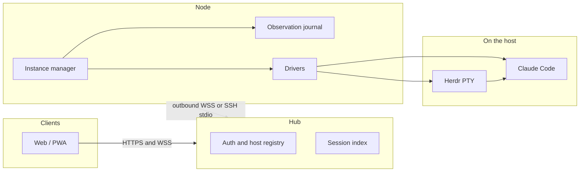

# Remuda

Remuda is a **unified remote agent runtime**. It hosts **native** agent
processes on one or more machines and gives people a shared Web/PWA control
surface. It is **not** an agent harness and does **not** implement an agent
loop.

Claude Code is first-class. Codex and Grok are secondary drivers. Native
loops, Workflows, hooks, skills, MCP, and session storage stay with those
CLIs. Remuda owns process hosting, input, observation, interaction, credential
materialization, and the remote UI.

- **PTY carrier:** a per-host [Herdr](https://github.com/herdrdev/herdr)
  headless server (`agent.*` plus `terminal session observe/control`). Remuda
  does not copy Herdr’s server, expose its socket, or treat pane idle as task
  success.
- **Multi-host:** Nodes join a Hub over **outbound WSS**, or over **SSH stdio**
  (`ssh <host> remuda node --stdio`, honoring the operator’s OpenSSH config).
- **Mixed models (optional):** an Anthropic-Messages compatible gateway can
  back Claude. Cross-model work goes through Claude dynamic Workflow
  `agent(prompt, {model})`, not ordinary Agent/Task `model`.

## Status

**Pre-alpha. Milestone M0 is in progress.** Libraries, protocol types, wire
adapters, a Web skeleton, and deploy *templates* exist. They are not a
shipped product.

Honest gaps:

- `remuda hub`, `remuda node`, and `remuda dev` still print placeholders and
  do not start services.
- No production Hub, enrollment, or bot dispatcher.
- Interaction broker, fleet placement, and Codex/Grok promotion are later
  milestones.
- Wire v1 is an implementation draft, not a released protocol.

Do not point a phone or a bot at this tree yet.

## Architecture



Native session state is the authority for resume. Remuda’s journal is the
authority for what every device has already observed. Commands carry a stable
`commandId` and are not replayed when an ACK is missing.

A longer, sanitized overview is in [docs/architecture.md](docs/architecture.md).

## Workspace

One Cargo workspace, one intended production binary (`remuda`). Rust is pinned
to **1.94.1** (`rust-toolchain.toml`). Edition 2024.

| Path | Role |
| --- | --- |
| `crates/remuda-protocol` | Versioned entities, commands, observations, Hub–Node envelopes |
| `crates/remuda-claude-wire` | Claude `-p` stream-json framing and control protocol |
| `crates/remuda-acp-wire` | Grok ACP client (stdio / serve WebSocket) |
| `crates/remuda-herdr` | Herdr JSON-RPC client and terminal observe/control bridge |
| `crates/remuda-driver` | Driver trait, launch materializer, Claude print/pty/bg |
| `crates/remuda-journal` | Append-only observation journal and blob store |
| `crates/remuda-node` | Node instance manager, local HTTP/WSS, outbound link |
| `crates/remuda-hub` | Hub HTTP/WSS, auth, host registry, embedded Web |
| `crates/remuda-testing` | `fake-claude` / `fake-herdr` and captured fixtures |
| `crates/remuda` | Composition root: `remuda hub\|node\|dev\|version` |
| `web/` | React + TypeScript + Vite PWA |
| `deploy/` | Dockerfile, compose, Caddy, cloudflared, Node unit |
| `scripts/` | Acceptance and CI helpers |
| `docs/design/` | Decisions, protocol, plan, UI spec |

## Quick start (developers)

Needs a Rust 1.94.1 toolchain (the pin in `rust-toolchain.toml`) and, for the
frontend, [pnpm](https://pnpm.io/). [just](https://github.com/casey/just) is
optional; the recipes wrap the same commands.

```bash
just build          # cargo build --workspace --locked
just test           # cargo test --workspace --locked
just lint           # clippy -D warnings + rustfmt --check

just web-install    # pnpm install in web/
just web-build      # pnpm build in web/
pnpm --dir web test
pnpm --dir web lint

cargo run --locked -p remuda -- version
just dev            # placeholder; does not start Hub+Node yet

just accept-m0      # fake-claude NDJSON stub (no live model)
just secret-scan
```

Without `just`:

```bash
cargo build --workspace --locked
cargo test --workspace --locked
cargo clippy --workspace --all-targets --locked -- -D warnings
cargo fmt --all -- --check
pnpm --dir web install
pnpm --dir web test && pnpm --dir web lint && pnpm --dir web build
```

Live model calls are not part of the default loop. Isolated Herdr tests are
`#[ignore]` and need a local `herdr` binary.

Linux Node artifacts (macOS: `cargo-zigbuild` + Zig 0.13): `just linux-musl`
and `just linux-gnu`.

## Design docs

| Doc | What it is |
| --- | --- |
| [docs/architecture.md](docs/architecture.md) | Public overview |
| [docs/design/decisions.md](docs/design/decisions.md) | ADRs (authoritative) |
| [docs/design/protocol.md](docs/design/protocol.md) | Wire types and invariants |
| [docs/design/plan-phase0.md](docs/design/plan-phase0.md) | M0–M4 implementation plan |
| [docs/design/proposal.md](docs/design/proposal.md) | Product shape |
| [docs/design/ui-spec.md](docs/design/ui-spec.md) | Web/PWA information architecture |

## License

[MIT](LICENSE). Apache-2.0 and MIT attributions for imported or rewritten
third-party code are in [NOTICE](NOTICE). See [CONTRIBUTING.md](CONTRIBUTING.md).
