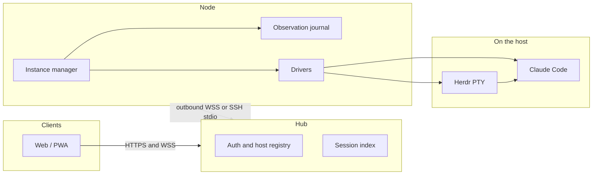

# Remuda

Remuda is a **unified remote agent runtime**. It hosts **native** agent
processes on one or more machines and gives people a shared Web/PWA control
surface. It is **not** an agent harness and does **not** implement an agent
loop.

Claude Code is first-class. Codex and Grok are secondary drivers. Native
loops, Workflows, hooks, skills, MCP, and session storage stay with those
CLIs. Remuda owns process hosting, input, observation, interaction, credential
materialization, and the remote UI.

- **PTY carrier:** a per-host [Herdr](https://github.com/herdrdev/herdr)
  headless server (`agent.*` plus `terminal session observe/control`). Remuda
  does not copy Herdr’s server, expose its socket, or treat pane idle as task
  success.
- **Multi-host:** Nodes join a Hub over **outbound WSS**, or over **SSH stdio**
  (`ssh <host> remuda node --stdio`, honoring the operator’s OpenSSH config).
- **Mixed models (optional):** an Anthropic-Messages compatible gateway can
  back Claude. Cross-model work goes through Claude dynamic Workflow
  `agent(prompt, {model})`, not ordinary Agent/Task `model`.

## Status

**Pre-alpha, but the runtime runs.** `remuda dev` starts a loopback Hub and a
local native Node that share one access code; `remuda hub` and `remuda node`
start the standalone services. The coordinator verbs are implemented —
`project`, `task`, `own`, `profile`, `dispatch`, `watch`, `worker`, `report`,
`retire`, and `brief` — and `gate` / `land` verify and merge through a
per-project lane on a Node (D-034). A Feishu dispatcher routes owner messages
to workers. The React/PWA surface renders live structured sessions, a workflow
tree, effort tiers, permission modes, in-session model switch, context-usage
popover, file attachments, and steer/queue on the composer. This is developer
plumbing under active change, not a shipped product.

Honest gaps:

- Public-internet exposure is still pending (D-031). The intranet Caddy config
  under `deploy/` is the only supported reachability path.
- The Feishu dispatcher runs and routes, but the owner-facing card flow
  (placement / outcome cards, in-card approvals) is a later batch.
- Codex and Grok remain secondary drivers; native Claude is the promoted
  carrier and `claude-print` is now an explicit-only diagnostic (D-035).
- Wire v1 is an implementation draft, not a released protocol.

Do not point a phone or a bot at a public address yet.

## Architecture



Native session state is the authority for resume. Remuda’s journal is the
authority for what every device has already observed. Commands carry a stable
`commandId` and are not replayed when an ACK is missing.

A longer, sanitized overview is in [docs/architecture.md](docs/architecture.md).

## Web UI

The React/PWA surface ships with two themes (Night Corral and Ledger), an IBM
Plex type scale, and 44 px touch targets throughout the phone layouts. The
settings page (`/settings`) is organised into deep-linkable anchor groups —
外观与输入、通知、连接与登录 — local appearance preferences apply
immediately while text fields save explicitly, each change reporting
保存中 / 已保存 / 失败 (a failed field rolling back to its last valid
value). Local-only preferences are labelled as browser-local; Passkeys and
provider management keep their existing sections.


Screenshots in the design evidence are generated from synthetic fixtures only;
see [docs/design/evidence/workbench-f-settings-1.md](docs/design/evidence/workbench-f-settings-1.md).

## Workspace

One Cargo workspace, one intended production binary (`remuda`). Rust is pinned
to **1.94.1** (`rust-toolchain.toml`). Edition 2024.

| Path | Role |
| --- | --- |
| `crates/remuda-protocol` | Versioned entities (Project, Task, gate), commands, observations, Hub–Node envelopes |
| `crates/remuda-claude-wire` | Claude `-p` stream-json framing and control protocol |
| `crates/remuda-codex-wire` | Codex app-server JSON-RPC client (stdio NDJSON) |
| `crates/remuda-acp-wire` | Grok ACP client (stdio newline-delimited JSON-RPC) |
| `crates/remuda-herdr` | Herdr JSON-RPC client and terminal observe/control bridge |
| `crates/remuda-screen` | Screen signatures, dialog parsers, PTY terminal emulator |
| `crates/remuda-signal` | Harness signal adapters (hook/file/OSC/screen ranking) |
| `crates/remuda-rules` | Screen-signal rule engine for agent-state detection |
| `crates/remuda-driver` | Driver trait, launch materializer, Claude print/pty/bg, `shell-pty` |
| `crates/remuda-journal` | Append-only observation journal and blob store |
| `crates/remuda-node` | Node instance manager, local HTTP/WSS, outbound link, gate lane runner |
| `crates/remuda-hub` | Hub HTTP/WSS, auth, host registry, projects/tasks/supply/gate queue, embedded Web |
| `crates/remuda-hub-client` | Device-authenticated Hub HTTP/WS client |
| `crates/remuda-ssh` | SSH remote transport via the system `ssh` binary |
| `crates/remuda-push` | Web Push notifications for the Hub |
| `crates/remuda-feishu` | Feishu channel adapter and dispatcher |
| `crates/remuda-testing` | `fake-claude` / `fake-harness` / `fake-herdr` and captured fixtures |
| `crates/remuda` | Composition root: `hub`, `node`, `dev`, coordinator and gate verbs |
| `web/` | React + TypeScript + Vite PWA |
| `deploy/` | Dockerfile, compose, intranet Caddy, Node unit; public exposure pending (D-031) |
| `scripts/` | Acceptance and CI helpers |
| `docs/design/` | Decisions, protocol, plan, UI spec |

## Quick start (developers)

Needs a Rust 1.94.1 toolchain (the pin in `rust-toolchain.toml`) and, for the
frontend, [pnpm](https://pnpm.io/). [just](https://github.com/casey/just) is
optional; the recipes wrap the same commands.

```bash
just build          # cargo build --workspace --locked
just test           # cargo test --workspace --locked
just lint           # clippy -D warnings + rustfmt --check

just web-install    # pnpm install in web/
just web-build      # pnpm build in web/
pnpm --dir web test
pnpm --dir web lint

cargo run --locked -p remuda -- version
just dev            # loopback Hub + local native Node, shared access code

just accept-m0      # fake-claude NDJSON stub (no live model)
just secret-scan
```

Without `just`:

```bash
cargo build --workspace --locked
cargo test --workspace --locked
cargo clippy --workspace --all-targets --locked -- -D warnings
cargo fmt --all -- --check
pnpm --dir web install
pnpm --dir web test && pnpm --dir web lint && pnpm --dir web build
```

Live model calls are not part of the default loop. Isolated Herdr tests are
`#[ignore]` and need a local `herdr` binary.

Linux Node artifacts (macOS: `cargo-zigbuild` + Zig 0.13): `just linux-musl`
and `just linux-gnu`.

## Design docs

| Doc | What it is |
| --- | --- |
| [docs/architecture.md](docs/architecture.md) | Public overview |
| [docs/design/decisions.md](docs/design/decisions.md) | ADRs (authoritative) |
| [docs/design/protocol.md](docs/design/protocol.md) | Wire types and invariants |
| [docs/design/plan-phase0.md](docs/design/plan-phase0.md) | M0–M4 implementation plan |
| [docs/design/proposal.md](docs/design/proposal.md) | Product shape |
| [docs/design/ui-spec.md](docs/design/ui-spec.md) | Web/PWA information architecture |

## License

[MIT](LICENSE). Apache-2.0 and MIT attributions for imported or rewritten
third-party code are in [NOTICE](NOTICE). See [CONTRIBUTING.md](CONTRIBUTING.md).
