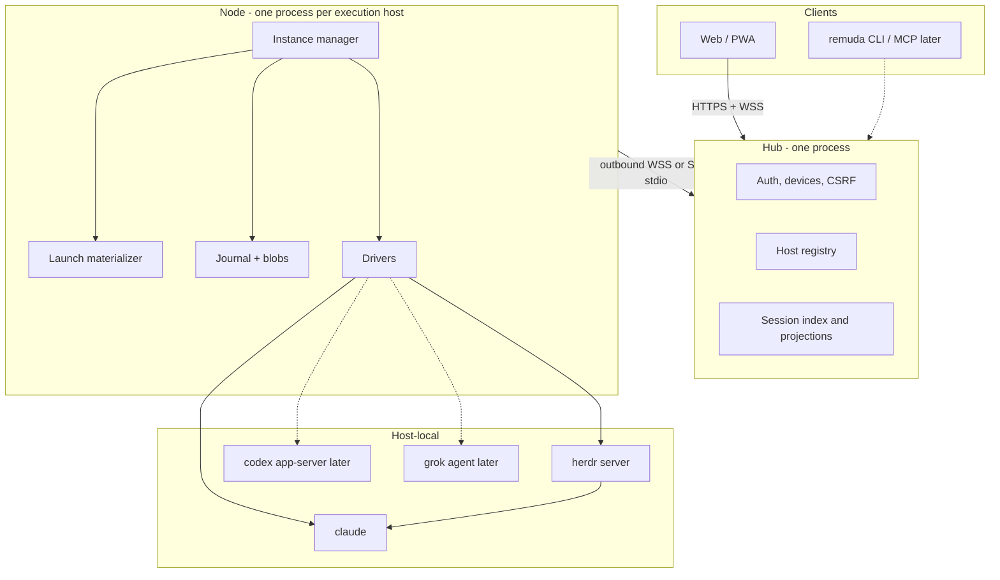

# Architecture (public overview)

Sanitized from [proposal.md](design/proposal.md) and
[protocol.md](design/protocol.md). No private hostnames, internal domains, or
personal paths. If this page disagrees with
[decisions.md](design/decisions.md) or [protocol.md](design/protocol.md), those
win.

## What Remuda is

A self-hosted runtime that **hosts native agent CLIs** (Claude Code first;
Codex and Grok secondary) on operator machines and exposes a unified instance
lifecycle plus a Web/PWA. People drive agents from a laptop or a phone; the
work runs where the CLIs and files already live.

Remuda does **not** invent an agent loop, a workflow engine, or a replacement
for Claude/Codex/Grok session storage. Native Workflow, hooks, skills, MCP,
and compaction stay inside those processes.

## Layers

| Layer | Job | Does not |
| --- | --- | --- |
| **Clients** | Render transcript / TTY, submit commands, answer interactions | Own native session files |
| **Hub** | Auth, host registry, durable inbox, searchable projection, later bots | Exec native CLIs or decide tool allow/deny |
| **Node** | Spawn/observe/stop, journal, Interaction CAS, outbound link | Reconstruct model history from observations |
| **Native CLI** | Reasoning, tools, Workflow, hooks, MCP, resume | Talk to the Hub |

Hub SQLite and Node SQLite are separate files. Large payloads are
content-addressed blobs; the DB stores a digest (`RawRef`).

## Three authorities

1. **Native session** (Claude JSONL / Codex thread / ACP session) is the
   authority for *continue / resume*.
2. **Node observation journal** (monotonic `seq`, source, native ids,
   completeness) is the authority for *what every device has already seen*.
3. **Command ledgers** (Hub inbox + Node receipt/intent) record delivery.
   **The Node is the only judge of native dispatch and Interaction answers.**
   Hub indexes are rebuildable copies.

Reconnect **follows** from a watermark. It does not resend a prompt, a
permission decision, or a TTY write whose ACK is unknown.

## Claude drivers

Three mutually exclusive carriers. An instance does not hot-swap them.

| Kind | Native process | Structured facts | TTY |
| --- | --- | --- | --- |
| `claude-print` | `claude -p` stream-json duplex | stdout NDJSON + transcript + Workflow journal | none |
| `claude-pty` | Interactive `claude` TUI | JSONL tail (and hooks as side channel) | Herdr rendered ANSI |
| `claude-bg` | `claude --bg` | JSONL / `agents --json` | Only after an explicit “open terminal” command runs `claude attach` |

Never pass `--bare`, `--safe-mode`, or `--no-session-persistence`. Pin the
absolute binary path and version. Herdr pane ids are not instance ids; Herdr
`idle` is not Run success. Do not scrape the screen for tools, Workflow, or
completion.

## Hosts and transports

A Node never needs an inbound port for production:

- **outbound WSS** — Node dials the Hub (always-on hosts).
- **SSH stdio** — Hub or a laptop runs `ssh <alias> remuda node --stdio`,
  using the operator’s OpenSSH config (ProxyJump, ControlMaster). Useful when
  two private networks cannot reach each other except through the operator.
- **local** — Hub and Node on the same machine (`remuda dev`, when it exists).

The Hub does not hold a long-lived SSH key as the production control plane.
Phones talk only to the Hub’s HTTPS name, never to RFC1918 addresses.

## Provider profiles

Thin records: protocol, base URL, secret *ref*, model list, health, policy.
Default **delegation is none**: each CLI uses its own login (Claude
subscription, ChatGPT, xAI, …). Optional **gateway** mode points Claude at an
Anthropic-Messages compatible endpoint; mixed models then go through Claude
Workflow `agent(prompt, {model})`. Gateway IDs must not be stuffed into
ordinary Agent/Task `model`. Artifact / official Remote Control stay on a
native-login profile when they work at all.

Secrets stay in 0600 files or an OS store. Launch recipes persist refs and
digests, never token values or prompt bodies.

## Commands, interactions, TTY

- Commands (`prompt`, approve, cancel, TTY write) use a client-stable
  `commandId`. States: queued → accepted (native) → settled.
- Missing ACK ⇒ `unknown`, not automatic retry of the native action.
- Permission prompts and AskUserQuestion share one Interaction broker
  (first writer wins). Bots never bypass. M0 still carries a temporary
  `dontAsk` debt for isolated demos only.
- TTY is a 32-byte binary frame + rendered ANSI for xterm. Multi-viewer,
  single writer lease. Browser reload is read-only attach; it must not
  spawn `claude attach`.

## What is not in this tree yet

Libraries and fixtures for protocol, wire, journal, drivers, Hub/Node HTTP,
and the PWA shell are landing under M0. The `remuda` binary does not yet
compose them into running `hub` / `node` / `dev` processes. Later milestones
cover production auth, outbound WSS enrollment, Feishu dispatcher, production
terminal, backup/restore, and promoting Codex/Grok.

Phase 0 still will not: write a custom inference loop, manage a gateway’s
account pool, do multi-tenant RBAC, ship Telegram, Gemini/agy ingress, a
desktop shell, an online plugin market, or Hub federation.

## See also

- [decisions.md](design/decisions.md) — ADRs
- [protocol.md](design/protocol.md) — wire types
- [plan-phase0.md](design/plan-phase0.md) — M0–M4 PR list
- [ui-spec.md](design/ui-spec.md) — Web/PWA
- [deploy-runbook.md](design/deploy-runbook.md) — edge wiring (templates)
