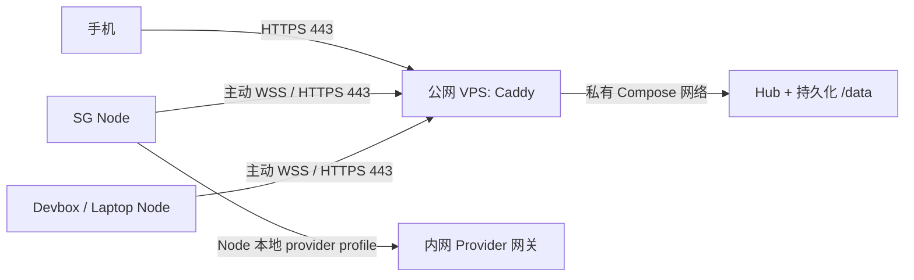

# D-020：公网 Hub，Node 主动出站

公网暴露：待定；禁止隧道工具（D-031）。当前唯一支持路径是内网 Caddy；
以下公网 VPS 设计保留为历史方案，不构成部署授权。

优先级调整：当前先按 [内网 runbook](./deploy-runbook.md) 准备 SG Hub，
等待 Caddy 重启批准（`awaiting-caddy-restart-approval`）；
复用现有 Caddy 的 DNS-01 和独立内网域名；以下公网方案保留为后续变体，
不表示已部署。公网设计是 [deploy/public](../../deploy/public/README.md)：在公网 VPS
（relay server）运行 Hub 和独立 Caddy，手机通过 HTTPS 访问；SG 宿主机、
devbox 和笔记本作为 Node 主动发起 WSS/HTTPS。这里的 relay server 承载完整
Hub，包括鉴权、registry 和持久化，并非只有转发功能。

## 决策依据与边界

用户提供的部署约束是：SG 宿主机没有公网 IP，已有 Caddy/网关域名解析到
内网地址。旧 D-006/M1 的公网暴露路径已废止，以 D-031 为准。已有内网网关保持
内网服务，不通过公网 Hub 代理。此约束依据用户确认；当前内网实施结果见
[证据记录](./evidence/intranet-hub-1.md)，不作为此公网变体的部署证据。

Node 执行模型调用、CLI 和工作区操作；Hub 保存控制面状态以及收到的会话事件。
这意味着主方案的 Hub 数据位于公网 VPS。内网 provider 的 endpoint、凭证与
登录态由各 Node 保管，公网 Hub 无需内网 DNS、网关凭证或到内网的路由。

## 接入与公网边界

- D-019 主模式：常驻 Node daemon，D-018 一次性 enroll token 换取该主机的
  持久凭证。c-daemon 的 `remuda node install --hub 'https://<hub-host>'
  --enroll-token '<one-shot>'` 合入后使用该入口；过渡步骤和当前准确参数见
  [NODES.md](../../deploy/public/NODES.md)。SSH stdio 不是本部署包的接入路径。
- VPS 为专用 Hub 名称 `<hub-host>` 在 `<zone>` 建立指向 `<vps>` 公网地址的
  DNS A 记录；公开 TCP 80/443。此包的 preflight 要求仅 A 记录，拒绝尚未验证的
  AAAA 路径。Caddy 默认通过 HTTP-01 获取证书并重定向 HTTPS；DNS-01 是可选
  人工扩展，需要相应 Caddy DNS 模块与只提供给 Caddy 的凭证。
- Compose 仅 Caddy 发布端口。Hub `/data`、Caddy 证书和配置使用命名卷；Hub
  数据卷后端目录权限为 0700。`/v1`、`/node/v1`、`/v1/follow` 和
  `/node/v1/connect` 通过 Caddy 原样转发，支持 WebSocket 长连接。
- `REMUDA_PUBLIC_ORIGIN=https://<hub-host>` 固定浏览器公开 origin，HTTPS
  使用 Secure、HttpOnly、SameSite cookie。`REMUDA_TRUSTED_PROXIES` 仅包含
  Caddy 的专用 Compose IP；未受信任客户端提供的 X-Forwarded-Proto /
  X-Forwarded-For 不可改变请求身份。代理后的登录限流使用可信 Caddy 传入的
  真实客户端 IP。

## 公网暴露与执行边界

公网暴露：待定；禁止隧道工具（D-031）。原自定义 relay 备选也不再作为实施路径。

此公网变体的部署执行、证书签发、DNS 修改及手机/Node 验收留待后续操作员执行。
CI 的内部证书 smoke 只证明本地容器路径，不证明公网可达或生产就绪。
