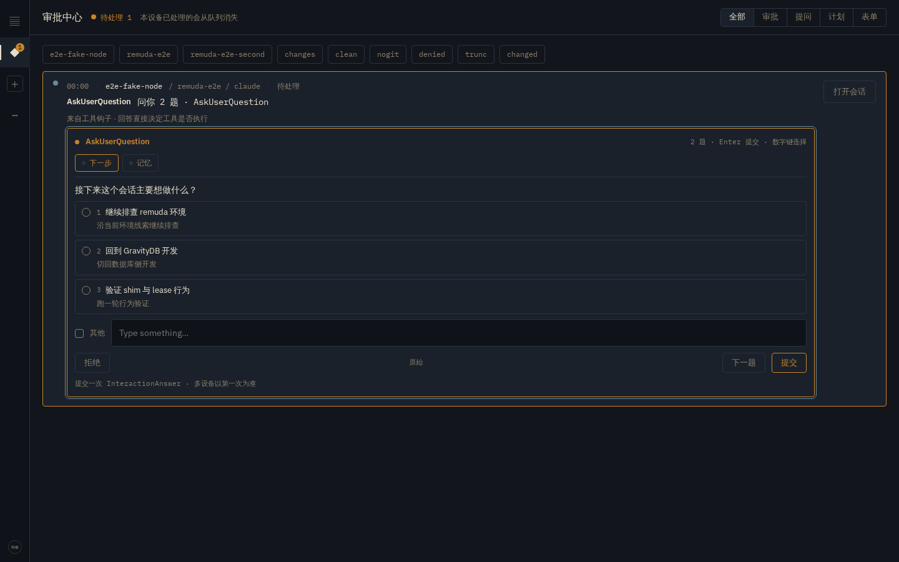
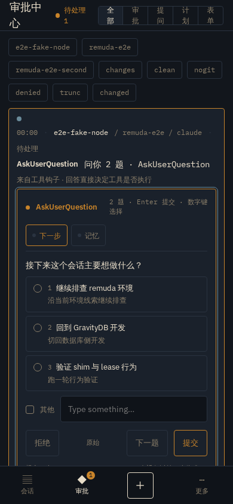

# ask-user-question-1 · AskUserQuestion 走 hook 裁决的选项卡与终端回填

日期：2026-09-16 · 主机 `devbox-sg` · `claude` **2.1.272**
范围：D-028 P5 的 hook 裁决在 `AskUserQuestion` 上的形状；问题卡 UI；终端自答后的生命周期回收
方法：真 `claude` 跑在真 PTY 里（`pty.fork`，140×48），throwaway settings overlay
把 `PermissionRequest` / `PreToolUse` / `PostToolUse` 指到录制脚本；脚本把 stdin
逐字存盘，并用 `updatedInput.answers` 回答。自动化证据来自 hub e2e
（`web/tests/e2e/ux-question.hub.spec.ts`，fake node
`crates/remuda-hub/examples/hub_e2e.rs`）。工作目录全部在 `/tmp/remuda-aq/` 与
临时 e2e 目录，不写用户配置。

> 本页每一条机器结论都来自下列运行之一；没跑到的标 **[U]**。

---

## 0 一句话结论

`AskUserQuestion` 在交互式 TUI 里触发的就是普通 **`PermissionRequest` hook**
（`tool_name: "AskUserQuestion"`，`tool_input.questions[]`）。它可以被 hook 直接
回答，回复沿用 P5 的嵌套裁决，外加 `updatedInput.answers`：

```json
{"hookSpecificOutput":{"hookEventName":"PermissionRequest","decision":{
  "behavior":"allow",
  "updatedInput":{ …原 tool_input…,
    "answers":{"<问题原文>":"<label>",
               "<多选问题原文>":["<label1>","<label2>"]}}}}}
```

因此 Remuda 不再把它误建成「审批 · Allow/Deny + 原始 JSON」卡，而是建成与 TUI
同构的**问题卡**（每题一个 tab、radio/checkbox + 描述、其他自由文本、一次提交），
空回答走次级的「拒绝」。hook 没赶上、人在 TUI 自己答完时，`PostToolUse` 带回
`answers`，Remuda 用它把交互以 **terminal 来源**结单、把结构化工具行从「运行中」
收成答案，并清掉「等待操作」横幅。

---

## 1 环境

| 项 | 值 |
|---|---|
| claude | 2.1.272（`claude --version`） |
| 载体 | 真 PTY，140×48，`TERM=xterm-256color` |
| overlay | `/tmp/remuda-aq/settings.json`，仅注册三个事件 |
| 权限模式 | `default` |
| 清理 | 每轮新 workdir `/tmp/remuda-aq/w{n}`、`h{n}`，清空 `captures/` |

headless `-p` 与 native-pty-5 §1.1 的结论一致：要看到交互表单必须开真 PTY。

---

## 2 `PermissionRequest` 实机 payload（2.1.272）

逐字段形状（去敏后的录制件：
`crates/remuda-signal/fixtures/askuser/permission-request.json`）：

```json
{
  "hook_event_name": "PermissionRequest",
  "tool_name": "AskUserQuestion",
  "permission_mode": "default",
  "tool_input": {"questions": [
    {"question": "接下来这一步你想怎么走？", "header": "下一步",
     "multiSelect": false,
     "options": [
       {"label": "继续排查", "description": "沿着当前线索继续深入定位问题根因。"},
       {"label": "回到GravityDB", "description": "切回 GravityDB …"},
       {"label": "验证shim", "description": "…"}]},
    {"question": "需要把哪些内容保存到记忆里？", "header": "记忆",
     "multiSelect": true,
     "options": [
       {"label": "保存端口", "description": "…"},
       {"label": "保存环境变量", "description": "…"}]}
  ]}
}
```

要点：

1. **[V] 字段与 TUI 一致**：`header` 是 tab 标题；`question` 是题目；`options`
   同时有 `label` 和 `description`；`multiSelect` 区分单选/多选。
2. **[V] 与 Write 审批同族**：外层仍是 `PermissionRequest`，没有新事件名；
   Remuda 只靠 `tool_name == "AskUserQuestion"` 分流。
3. **[V] TUI 在 hook pending 期间会先画自己的表单**（沿用 native-pty-5 §5.1）：
   hook 回复够快时表单不停留，屏幕直接出现 `Allowed by PermissionRequest hook`。

TUI 实际渲染（去 ANSI）：顶部 tab `☐ 下一步  ☐ 记忆  ✔ Submit`，单选项
`❯1.… 2.… 3.… 4. Type something. 5. Chat about this`，多选项是
`[ ] …` 且另有一行 `[ ] Type something`；提交后还有一道
`Review your answers · 1. Submit answers 2. Cancel` 确认。

---

## 3 hook 回答：`updatedInput.answers`，按问题原文做键

### 3.1 [V] 单选 = label 字符串；多选 = label 数组

hook 对上面的两题回：

```json
"answers": {
  "接下来这一步你想怎么走？": "继续排查",
  "需要把哪些内容保存到记忆里？": ["保存端口", "保存环境变量"]
}
```

随后的 `PostToolUse` 原样带回（`tool_input.answers` 与 `tool_response.answers`
两处都有）；transcript 的 user 记录是：

```json
{"type":"tool_result","tool_use_id":"toolu_…",
 "content":"Your questions have been answered: \"接下来…\"=\"继续排查\", \"需要…\"=[\"保存端口\",\"保存环境变量\"]. …"}
```

（去敏录制件：`post-tool-use.json`、`transcript-tool-use.json`、
`transcript-tool-result.json`。）

### 3.2 [V] 多选也接受 `", "` 拼接的字符串

另一轮把多选答成 `"保存端口, 保存环境变量"`，harness 同样接受，
`tool_response.answers` 回显的就是这个拼接字符串。Remuda 对外**只发数组**
（TUI 的原生形状），回填解析两种都认。

### 3.3 [V] 自由文本逐字通过

回一个不在 options 里的任意字符串（实测 `"FREE-FROM-HOOK"`），harness 接受：
transcript 变为 `The user answered: "…"="FREE-FROM-HOOK". Read the answers
carefully …`。这就是 TUI「Type something」走的通道。

### 3.4 键名与 id 约定

- answers 对象的键是 **`question` 原文**，不是 header；同题重问时问题文本会变，
  只能按当次 `tool_input.questions` 做关联。
- 卡片选项 id 直接用 **label**（与 claude-control 既有路径一致），回答时无需
  查表；字段 id 是载荷顺序的 `q0/q1/…`。
- 空 answers（卡片的「拒绝」）映射成 `decision.behavior = "deny"`，不会带着空
  answers 去 allow。

---

## 4 Web 卡片

审批中心与会话页横幅同一个组件（`web/src/features/approvals/QuestionForm.tsx`）：

- 每题一个 **tab（header 即标题）**，已答题带实心点；单选 radio、多选 checkbox，
  选项下显示 description；每题一行「其他 / Type something…」。
- 单一 **提交** 一次回答整批；次级 **拒绝**；数字键 1–9 选选项、Enter 提交
  （IME 组词期间不拦截）。
- 原始协议 JSON 只在「**原始**」 disclosure 后面，默认不可见——不再把
  `{"questions":[…]}` 直接糊在审批卡上。
- 390 / 1440 px、night / ledger 四态截图（本页同名 `*-card-*.png`，
  `REMUDA_EVIDENCE=1` 由 `ux-question.hub.spec.ts` 实拍）：




普通 Elicitation（MCP form/url）用同一套 hook 事件但 schema 不同，单独有
`ElicitationCard`（Accept/Decline/Cancel + 可选 JSON content），不再显示成
Allow/Deny 或空白。

---

## 5 终端自答后的生命周期（addendum）

实测顺序：`PermissionRequest` 到达 → Remuda 发卡、hook 继续等 → 人在 TUI 完成
表单 → **`PostToolUse(AskUserQuestion)` 带 `answers`** 到达，turn 继续。

Remuda 的处理（`remuda-signal`）：

1. 发卡时把该问登记在 `open_questions`（与 parked hook 同 key）。
2. 收到带 answers 的 PostToolUse 时，按问题文本**内容匹配**到打开的卡
   （PermissionRequest 没有自己的关联 id），把答案重建成
   `QuestionFieldAnswer`（label→option，其他→text，拼接串可拆）。
3. 发出 `interaction` 实体生命周期：`state=resolved`、
   `reason_code=terminal-answered`、actor 是 **human 且 deviceId=null**、
   resolution reason=`answered`，答案进 journal；同时撤掉 parked hook
   （fail-closed deny 结束等待），保证随后的设备答案只会得到 Abandoned
   （第一答案赢，D-025/D-028）。
4. 同一 PostToolUse 在 live 层往 AskUserQuestion 工具节点折一个
   **Final ToolResult**，文本块是 TUI review 的形状 `header → label`
   （多选 `", "` 拼接、自由文本逐字），行离开「运行中」。
5. Web 的 pending 列表按 `state` 投影，实体一到，横幅/审批行消失（本机 2 s
   轮询；其它设备同理，第一答案赢后对端显示「已在其它设备处理」）。

hub e2e `a question answered in the terminal …` 用 fake node 的
`ask-question-terminal` 场景（harness 1.2 s 后自发结单）断言：无人点卡，
`question-form` 与审批行在 live 预算内消失、composer 重新可用、journal 里有
`terminal-answered` 与所选 label。

---

## 6 落到实现的对应关系

| 证据 | 代码 | 测试 |
|---|---|---|
| §2 hook 载荷形状 | `remuda-signal/fixtures/askuser/*.json`、`question::question_request` | `question::tests::the_recorded_request_builds_a_two_field_question_card` |
| §3 updatedInput.answers 形状 | `question::question_decision`、`bus::resolve_answer` | `a_device_question_answer_reaches_the_hook_as_updated_input_answers`、`free_text_travels_verbatim…`、`an_empty_question_answer_denies_the_hook` |
| §3.2/3.3 回填两种多选/自由文本 | `question::answer_from_harness` | `terminal_answers_are_reconstructed…`、`a_terminal_free_text_answer…` |
| §4 卡片/tab/数字键/原始折叠 | `web/…/QuestionForm.tsx` | `QuestionForm.test.tsx`（10 项）、`ux-question.hub.spec.ts` |
| §5 终端结单 | `bus::close_terminal_answered`、`question::resolved_in_terminal` | `a_terminal_answer_resolves_the_card_and_clears_the_wait`、hub e2e 同名用例 |
| §5 工具行收成答案 | `live::question_answer_blocks` | hub e2e journal 断言 |
| §4 Elicitation | `ElicitationCard.tsx`、`approval::elicitation_interaction` | 既有 bus elicitation 测试 |

## 7 复现

```bash
# 真 TTY 录制（脚本在 /tmp/remuda-aq，不入仓）
REMUDA_AQ_STYLE=join python3 /tmp/remuda-aq/drive.py \
  "请调用 AskUserQuestion 工具问两个问题：…"
# hub e2e
HUB_E2E_LISTEN=127.0.0.1:57280 HUB_E2E_WEB_PORT=57289 \
PW_CHANNEL=chromium PW_TEST_CONNECT_WS_ENDPOINT=ws://127.0.0.1:3177/ \
VITE_NO_WATCH=1 CHOKIDAR_USEPOLLING=1 \
pnpm --dir web exec playwright test -c web/playwright.hub.config.ts \
  tests/e2e/ux-question.hub.spec.ts
```

**[U]** 本机 MCP `Elicitation` 仍无实机触发源（沿用 native-pty-5 §6），
其 hook 回复形状按二进制读取端实现，未实机宣称打通。
