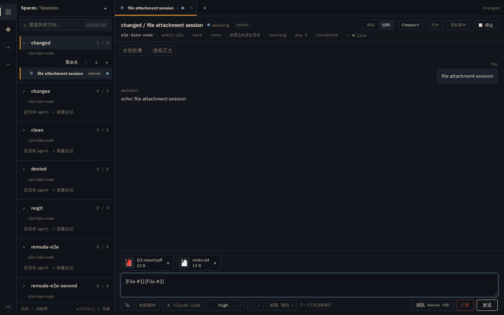
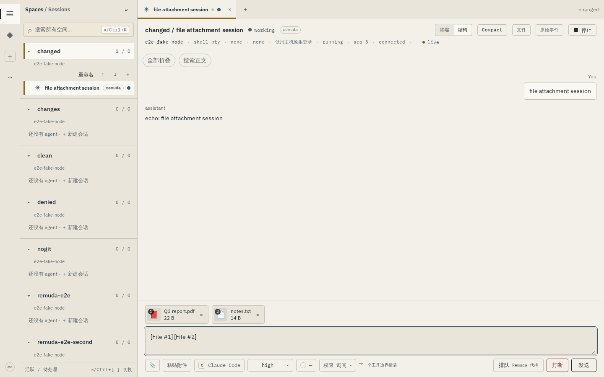
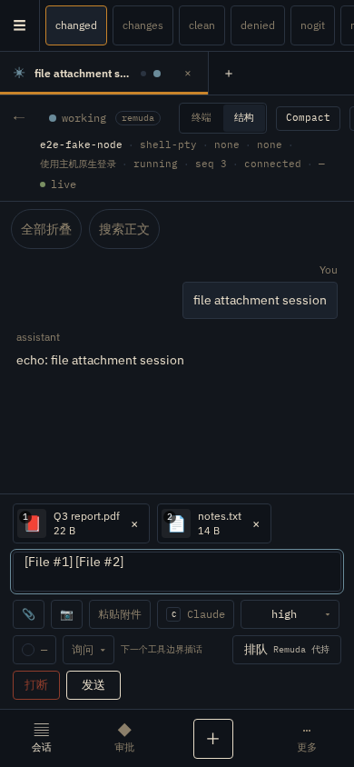
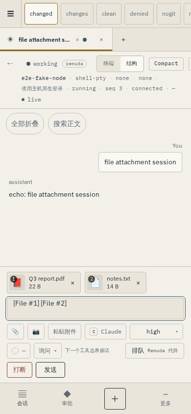
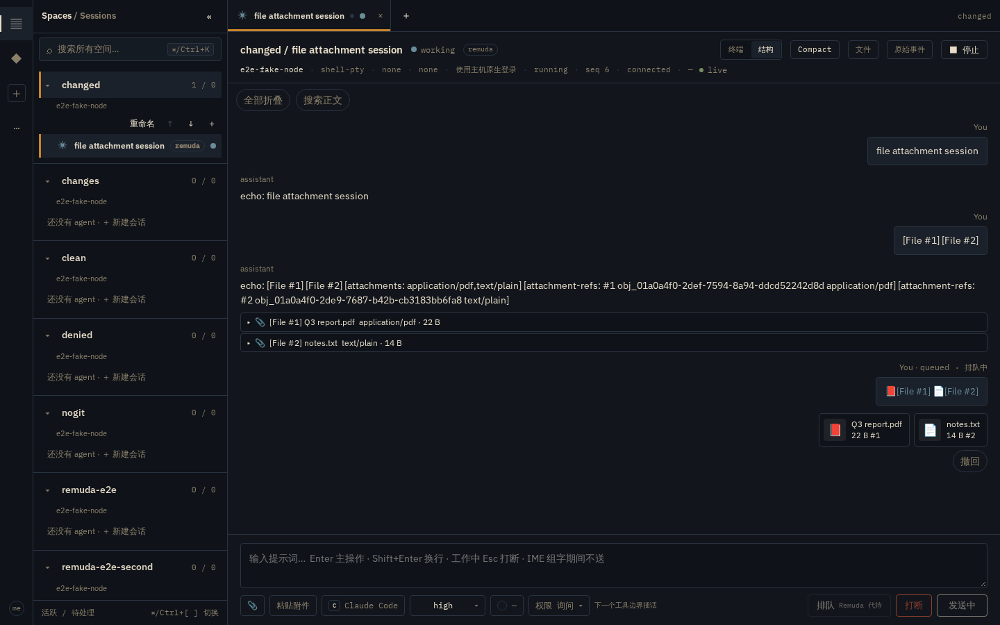
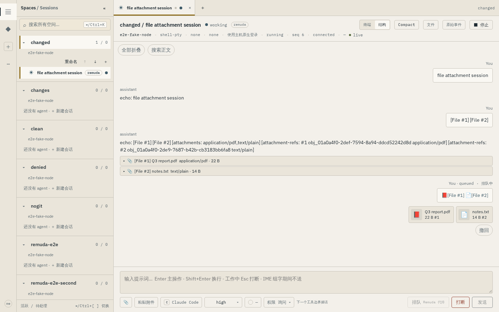
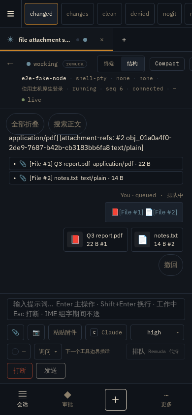
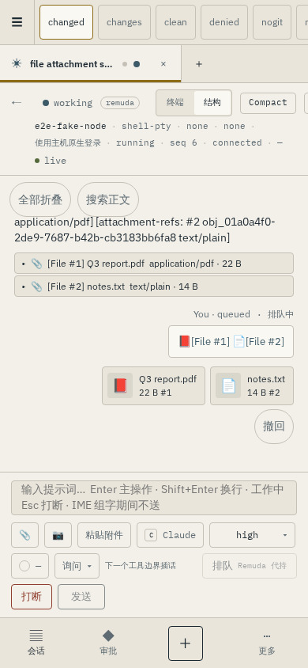

# 任意文件附件（D-027b，2026-09-15）

工作树 `wt/r-files/any-file-attachments`（从 `origin/main`），2026-09-15。
本轮是 **实现 + 自动化证据**：净化/分类是纯函数单测，落盘/投递是 Rust 单测，
端到端是 hub-backed Playwright（假 node 真回拉），全部可重放，没有真机
claude / codex / grok 会话（三家对**文件**路径的既有能力在
[clipboard-images.md §5.3.1](../clipboard-images.md) 诚实标注）。

用户原话（owner nit）：

> 现在上传附件竟然只支持图片吗，应该各种文件都支持

D-027 的三段架构（浏览器→Hub 暂存→Node 回拉→driver 投递）与「字节只走
HTTP、命令帧只带 metadata」全部保留，放宽的是类型、名称与上限：

- 图片（PNG/JPEG/GIF/WebP）仍 magic-byte 嗅探、浏览器侧 canvas 剥 EXIF；
- 任意其他文件原样上传，**永不内联、永不执行**，只作为宿主机上的可读
  路径引用交付给 harness；
- 单文件上限 5 MiB → **25 MiB**（`attachmentMaxBytes` /
  `REMUDA_ATTACHMENT_MAX_BYTES`），单条消息 4 → **8** 个。

## 复核命令

```
# Rust：协议净化/分类、Hub 类型校验与上限、Node 落盘/碰撞/校验和、driver 展开行
cargo test -p remuda-protocol hubnode
cargo test -p remuda-hub --lib objects
cargo test -p remuda-node --lib attachments
cargo test -p remuda-node --test attachments
cargo test -p remuda-driver --lib attachment

# Web：锚点、manifest、chip/anchor 渲染、折叠行
pnpm --dir web vitest run \
  src/lib/attachments.test.ts \
  src/lib/imageAnchors.test.ts \
  src/features/session/AttachmentChips.test.tsx \
  src/features/session/AnchorText.test.tsx \
  src/features/session/ComposerAttachments.test.tsx \
  src/components/MarkdownText.test.tsx

# 端到端（假 node：回拉对象 + 净化名落盘 + 碰撞后缀 + 回显展开行）
PW_CHANNEL=chromium \
PW_TEST_CONNECT_WS_ENDPOINT=ws://127.0.0.1:3177/ \
HUB_E2E_LISTEN=127.0.0.1:57980 HUB_E2E_WEB_PORT=57989 \
HUB_E2E_UPSTREAM_LISTEN=127.0.0.1:57981 \
VITE_E2E_UPSTREAM=http://127.0.0.1:57981 \
HUB_E2E_ATTACHMENT_MAX_BYTES=2097152 \
pnpm --dir web exec playwright test -c playwright.hub.config.ts ux-attach-files.hub.spec.ts
```

`HUB_E2E_ATTACHMENT_MAX_BYTES` 只把例子 Hub 的上限调小，让 size-cap 用例不必
推 26 MiB；生产默认仍为 25 MiB。

## 交付行为（clipboard-images.md §5.3.1 的实现）

每个非图片附件在用户文本**之前**展开为固定一行，三个 PTY 驱动共用：

```
[File #n] <原始文件名> (<mime>, <人类可读大小>) saved at <宿主机绝对路径>
```

- `claude-print`：图片 base64 内联（>3.5 MiB 退化路径）；文件行作为 text
  block 前置，Claude 用 Read 打开；
- `claude-pty` / `generic_pty(codex)`：同样的展开行前置，靠各自文件工具；
- `generic_pty(grok)`：文件路径不触发「不支持读图」徽标（那是图片专属）；
- `shell-pty`：shell-quoted 路径追加。

结构化 transcript 把 harness 回显的这一行折叠成可展开的
`file-mention` 行（摘要=📎 名字 + mime·大小，展开=绝对路径）。

## 截图（REMUDA_EVIDENCE=1 刷新，普通运行不写 docs/）

草稿 chip（类型图标代替缩略图，文件名 + 人类可读大小，编号徽标）与
`[File #n]` token，390 / 1440 × night / ledger 四帧，均断言无横向溢出：






已发送消息：文件是指向 Hub 对象的下载 chip（attachment disposition +
nosniff），图片仍是缩略图：






## 安全要点

- 原始文件名经服务端净化（无 `/`、`\`、控制字符，trim 首尾空白与点，
  ≤255 字节）；Node 落盘前**再净化一遍**，纵深防御；净化后为空则回退
  `<obj_id>.<ext>`；
- 同目录重名（同批次或历史落盘）一律 `<stem>-<n>.<ext>` 数字后缀，
  已存在的 `-1` 也会被跳过；
- 回拉后校验 sha256，与 manifest 不符即整条 send 失败；
- 非图片 GET 固定 `Content-Disposition: attachment`（净化文件名）+
  `X-Content-Type-Options: nosniff`；声明 `image/*` 但嗅不出图片魔数的
  内容降级为 `application/octet-stream`，浏览器不会把它当图片/HTML 渲染；
- 文件 0600、目录 0700，落在实例 attachments 目录而非 workspace，永不执行。
