# Composer computer-use report 1

**Overall: FAIL for full requested acceptance.** Rendering, native tier menus, remapping, session-row names and the terminal/navigation smoke checks pass. The live run did not demonstrate an effort command in the journal or a real approval card. Grok has three collapsed chips, not the four requested in the brief; that matches the implementation's documented capability gating.

## Environment and method

- Tested on 2026-09-13, approximately 05:58–06:10 Asia/Shanghai (2026-09-12 21:58–22:10 UTC).
- Target: `http://127.0.0.1:18080/`. Login used the supplied demo access code and device name `cu-tester`; no credential is reproduced here.
- Real headless Google Chrome `152.0.7977.84`, controlled with the project's Playwright `1.63.0`, installed through `pnpm install --frozen-lockfile --ignore-scripts` from `web/`. No mock mode, request interception, injected events, or synthetic approval cards.
- Viewports: desktop **1440 × 900**, mobile **390 × 844**, device scale factor 1. Mobile means responsive Chrome viewport coverage, not physical-device/Safari/keyboard coverage.
- Worktree test baseline: `9c3a1e076e181da6e9dc01afdc6434f903199fd2`. The brief identifies the service as main `9c3a1e0+`; the UI exposes no immutable server build identity, so that deployed SHA was not independently attested. Initial live assets: `index-BVxLlKjU.js`, `index-xYREBWo6.css`.
- References: [implementation evidence and testids](./composer-1.md), [written spec](../ui-spec.md), [visual spec](../claude-design/Remuda%20UI%20Spec%20v0.2.dc.html). Board 1b links to 1k, but this HTML has no board with `id="1k"`; the expanded effort specification is on 1h. The written spec still lists only three New Session permission modes.
- Actions used visible controls/routes; screenshots came directly from the browser. DOM geometry and the same journal response fetched by the UI supplement visual inspection. Images crop out workspace selectors/native terminal headers containing personal paths. No blur, masks, altered page content, or generated imagery. Cropped dimensions are smaller than the tested viewport.
- Only this report and its PNGs are deliverables. No application source, test source, dependency manifest or lockfile was changed.

## Results

`E0` means no browser console error, uncaught page exception, failed request or HTTP status ≥400 observed for the check in the instrumented run. It does **not** mean a queued command executed. `W1` is the terminal warning described below. `Q1` is HTTP 200 with a queued command and unknown resolution. FAIL for an unavailable prerequisite means the requested assertion remains unproved, not that overlap was visually observed.

| ID | Check | 1440 | 390 | Observed evidence / scope | Console/network | Screenshots |
|---|---|---|---|---|---|---|
| N1 | Each permission label stays on one horizontal line | PASS | PASS | 询问 / 可改文件 / 全自动 / 绕过全部; all four also fit on one row at both widths | E0 | [desktop](./composer-cu-1-new-1440-claude.png), [mobile](./composer-cu-1-new-390-claude.png) |
| N2 | YOLO warning aligned below permission row | PASS | PASS | Select Claude + 绕过全部; warning has same left edge as chips; checkbox stays inside warning | E0 | [desktop](./composer-cu-1-new-1440-claude.png), [mobile](./composer-cu-1-new-390-claude.png) |
| N3 | Claude / Codex / Grok / agy runtime controls | PASS | PASS | All render and can be selected; Terminal is also offered | E0 | [desktop](./composer-cu-1-new-1440-claude.png), [mobile](./composer-cu-1-new-390-claude.png) |
| N4 | Claude native tiers and amber top tier | PASS | PASS | default / think / think-hard / ultracode | E0 | [desktop](./composer-cu-1-new-1440-claude.png), [mobile](./composer-cu-1-new-390-claude.png) |
| N5 | Codex native tiers and amber top tier | PASS | PASS | low / medium / high / ultra | E0 | [desktop](./composer-cu-1-new-1440-codex.png), [mobile](./composer-cu-1-new-390-codex.png) |
| N6 | Grok native tiers and amber top tier | PASS | PASS | quick / standard / max | E0 | [desktop](./composer-cu-1-new-1440-grok.png), [mobile](./composer-cu-1-new-390-grok.png) |
| N7 | agy effort row | PASS | PASS | Single default tier, amber; implementation treats the only tier as top | E0 | [desktop](./composer-cu-1-new-1440-agy.png), [mobile](./composer-cu-1-new-390-agy.png) |
| N8 | Runtime switch remaps effort | PASS | PASS | ultracode → ultra → max → agy default; think-hard → Grok standard → Claude think-hard. Nearest normalized position, not an unchanged integer index | E0 | [desktop](./composer-cu-1-remap-1440.png), [mobile](./composer-cu-1-remap-390.png); N4–N7 show top-tier sequence |
| C1 | Four collapsed chips on Grok under input | **FAIL** | **FAIL** | Three: harness, model+effort, context. Permission is absent. Documented Claude-only gating; see F1 | E0 | [desktop](./composer-cu-1-bar-1440.png), [mobile](./composer-cu-1-bar-390.png) |
| C2 | Claude four-chip layout | PASS | PASS | Claude / model+effort / context / 询问 are present in the created Claude session | E0 | [desktop](./composer-cu-1-approval-pending-1440.png), [mobile](./composer-cu-1-approval-pending-390.png) |
| C3 | Context percentage specifically | **FAIL** | **FAIL** | Chip renders `—`; no usage journal event. This is the documented unknown-usage fallback, so a numerical percentage was not exercised | E0 | [desktop](./composer-cu-1-bar-1440.png), [mobile](./composer-cu-1-bar-390.png) |
| C4 | Effort popover header, native rows, descriptions, footer | PASS | PASS | Complete Grok and Claude menus readable; highest rows amber; exact copy below | E0 | [Grok desktop](./composer-cu-1-effort-1440.png), [Grok mobile](./composer-cu-1-effort-390.png), [Claude desktop](./composer-cu-1-claude-effort-1440.png), [Claude mobile](./composer-cu-1-claude-effort-390.png) |
| C5 | Selecting a tier closes menu and updates chip | PASS | PASS | Desktop standard → max; mobile max → quick; max chip becomes amber | E0 / Q1 | [desktop](./composer-cu-1-selected-1440.png), [mobile](./composer-cu-1-selected-390.png) |
| C6 | Selection sends an effort command | PASS | PASS | Browser POST `instance.configure` with the native name/index; HTTP submission evidence below | E0 / Q1 | [desktop updated state](./composer-cu-1-selected-1440.png), [mobile updated state](./composer-cu-1-selected-390.png); images show UI consequence, not native ACK |
| C7 | Corresponding command visible in 原始事件 | **FAIL** | **FAIL** | No configure/effort command event in the 19-event journal; only create accepted/settled command entities. Native application is unverified; F2 | E0 / Q1 | [desktop journal](./composer-cu-1-journal-1440.png), [mobile journal](./composer-cu-1-journal-390.png) |
| C8 | Effort menu does not cover a real approval card | **FAIL** | **FAIL** | Prerequisite unavailable: Claude print + 询问 stayed requested/seq 0; zero approval cards. No overlap assertion can be made; F3 | E0 / Q1 | [desktop](./composer-cu-1-approval-pending-1440.png), [mobile](./composer-cu-1-approval-pending-390.png) |
| L1 | Session/run rows use native tier names | PASS | PASS | Claude think and Grok standard observed; actual running Grok row captured. No live Codex/agy row was available or created | E0 | [desktop list](./composer-cu-1-sessions-1440.png), [mobile list](./composer-cu-1-sessions-390.png), [running desktop](./composer-cu-1-running-1440.png), [running mobile](./composer-cu-1-running-390.png) |
| R1 | PTY Terminal tab regression | PASS | PASS | Live rendered PTY, existing desktop PONG output, resize/reflow and mobile local input editing. Fresh command execution was not used as the pass criterion | E0 / W1 | [desktop output](./composer-cu-1-terminal-1440.png), [mobile output](./composer-cu-1-terminal-390.png), [desktop controls](./composer-cu-1-terminal-controls-1440.png), [mobile controls](./composer-cu-1-terminal-controls-390.png) |
| R2 | Providers page loads | PASS | PASS | Native login profile, no secret configured, add-gateway action visible | E0 | [desktop](./composer-cu-1-providers-1440.png), [mobile](./composer-cu-1-providers-390.png) |
| R3 | Hosts page loads | PASS | PASS | One online host, installed harness versions and stale-host toggle visible | E0 | [desktop](./composer-cu-1-hosts-1440.png), [mobile](./composer-cu-1-hosts-390.png) |
| X1 | Changed effort survives navigation/reload | **FAIL** | **FAIL** | After max then quick submissions, reload shows standard again; session rows also show standard. Additional finding, F2 | E0 / Q1 | [desktop](./composer-cu-1-reload-1440.png), [mobile](./composer-cu-1-reload-390.png) |
| X2 | Hosts header stays horizontal (incidental) | PASS | **FAIL** | Mobile 主机 stacks vertically; 添加主机 wraps with its last character against the lower border. Page-load R3 still passes | E0 | [desktop](./composer-cu-1-hosts-1440.png), [mobile](./composer-cu-1-hosts-390.png) |

### Layout and menu details

Permission chip heights were 36 px at desktop and 44 px at mobile; all computed `white-space: nowrap` and `writing-mode: horizontal-tb`. Desktop row bottom 597.625, warning top 604.625; mobile row bottom 397.375, warning top 404.375: a 7 px gap in both cases. Warning/chip left edges were 381 px desktop and 16 px mobile. The checkbox was 16 × 16 px and entirely within each warning box. Mobile hides the English mode subtitles, leaving the Chinese label intact.

The selected highest tiers use text and border `rgb(201, 132, 42)` (`#c9842a`) and `data-ember="1"`. Screenshots disable animations for stable capture; animation timing/reduced-motion behavior was not part of this check.

Popover header: `EFFORT · 本回合生效，发 Command 不只改本地`.

- Grok: quick — 不额外思考; standard — 默认档; max — 最高档 · 慢且贵.
- Claude: default — 不额外思考; think — 默认档; think-hard — 跨文件重构、长任务; ultracode — 最高档 · 慢且贵.
- Footer: `切换只影响后续回合，不重写已发出的 prompt`.

The visual spec describes nearest mapping between native tables. The observed interior mapping is consistent with `round(oldIndex / (oldLength - 1) * (newLength - 1))`; it does not preserve the literal integer for tables of unequal lengths. Going through agy's single default tier resets the position to zero on the next harness.

## Failures and exact reproduction

### F1 — Grok does not meet the literal four-chip/percentage acceptance

1. Log in and open running Grok session `ins_01a0979d-3eca-735e-81e5-065f35b334c3` (title `coord smoke`, driver `generic-pty`).
2. Select **结构**, because PTY sessions initially open **终端**.
3. At 1440 × 900 or 390 × 844, inspect the row under the composer input.
4. Actual: Grok, `grok-4 standard`, and `—`; no permission chip and no numerical context percentage.

This is a discrepancy between the brief and documented implementation, not evidence of accidental wrapping or a broken hidden control. `composer-1.md` expressly makes permission Claude-only and permits `—` without usage. The requested numerical context case needs a session with a real usage event. The same demo's Claude composer shows all four chips.

### F2 — Configure submission is observable, but journal confirmation and persistence fail

1. Open the same Grok session's **结构** view at 1440 × 900.
2. Click `model-effort-chip`, then **max**. Observe `grok-4 max` and amber chip.
3. Change viewport to 390 × 844; open the menu and select **quick**. Observe `grok-4 quick`.
4. Inspect the browser network response and then **原始事件**. Scroll the event list to the end; reload the structured view and reopen the journal.
5. Actual: HTTP 200 queued/unknown responses, no configure command event, and the chip returns to `grok-4 standard` after navigation/reload. Both widths show the same behavior.

Desktop request:

```json
{"operation":"instance.configure","payload":{"permissionMode":"manual","effort":{"index":2,"name":"max","kind":"grok"}}}
```

Mobile request:

```json
{"operation":"instance.configure","payload":{"permissionMode":"manual","effort":{"index":0,"name":"quick","kind":"grok"}}}
```

The mobile response at `2026-09-12T22:03:07.905Z` identified command `cmd_01a097a5-4d01-75d3-a57d-07f7687b6cfc`, with `forwarded: true`, `state: queued`, `resolution: unknown`, `replayed: false`. The endpoint was `/v1/instances/ins_01a0979d-3eca-735e-81e5-065f35b334c3/commands`. An HTTP success establishes submission, not native acceptance or effective reasoning level.

The journal fetched by the UI contained 19 events: 18 lifecycle, 1 message, 0 usage. Its only command entity transitions were `instance.create` accepted (seq 1) and settled (seq 7); zero `instance.configure` command entities. A textual `model-switch` occurrence is capability metadata marked unsupported, not a switch command. The metadata also contains `driverVersion: fake` and fixture capability reasons alongside subsequent PTY screen events, so native command support must not be inferred from the session title or rendered PONG.

The native terminal caption still showed `Grok 4.6 (xhigh) · always-approve`, while the UI chip used `grok-4`. These are observed strings, not proof of which effort the CLI applied. This report does not diagnose the server/driver root cause or claim that queued commands were rejected.

### F3 — Approval prerequisite cannot be produced through the live creation flow

1. Open **新建会话** at desktop width.
2. Prompt: `Use Bash to run exactly: printf CU_APPROVAL_ONLY > /tmp/remuda-cu-approval-1.txt . Do not use another tool. Request permission through the tool mechanism if required.`
3. Choose the online host; set cwd `/tmp`, runtime **Claude**, model `haiku`, permission **询问**, native login/provider none.
4. Expand **高级 · 驱动**, select **结构化 print**, set max budget `0.3`, and name `cu-composer-approval`. Click **开始**.
5. Open the created session, then the effort menu at both widths. Recheck after more than four minutes.
6. Actual: lifecycle `requested`, seq 0, blank transcript, zero `approval-card` elements. The menu opens, but there is no card against which to measure overlap.

Created instance: `ins_01a097a6-1100-72f3-a442-7eb9f86e6037`. The create response at `2026-09-12T22:03:58.080Z` was HTTP 200, command `cmd_01a097a6-1100-72f3-a442-7ebb2487037d`, `forwarded: true`, `state: queued`, `resolution: unknown`. The request explicitly contained `driver: claude-print`, `permissionMode: manual`, model `haiku`, max budget `0.3` and the prompt above. On later reload, the UI model chip fell back to `opus`; that does not establish a different native launch, since launch itself was not confirmed.

A separate Grok create attempt named `cu-composer-grok`, cwd `/tmp`, prompt `Reply with exactly PONG`, also remained requested: instance `ins_01a097a2-87a5-735f-bbb0-ad509138c385`. The existing running Grok session was therefore used for composer and terminal testing. Creation was not repeatedly submitted to work around a timeout.

The no-overlap requirement remains **unverified**. No fabricated approval, mock event, pre-existing mock screenshot or empty-space bounding box is presented as a pass.

### F4 — Incidental mobile Hosts header wrapping

Open `/hosts` at 390 × 844. The title 主机 renders as 主 above 机, and 添加主机 wraps with the final 机 at the lower border of its button. At 1440 × 900 the header is horizontal. This is a visible responsive-layout issue outside the New Session permission chips; it does not prevent the requested Hosts page-load smoke check from passing. Both states are captured in the Hosts screenshots.

## Console, network and terminal observations

- The instrumented live browser run recorded no console errors, uncaught page exceptions, failed HTTP requests or HTTP ≥400 responses for the tested controls/routes. Browser logs contained one warning: **W1** `task queue exceeded allotted deadline by 25ms`, during initial PTY attachment. It did not recur in the captured sequence.
- **Q1:** HTTP 200 commands can remain queued with unknown resolution. This occurred for effort configuration, instance creation and cleanup. These are the material runtime failures even though no transport error appeared.
- Native Grok output showed `session_start`, `user_prompt_submit` and `stop` hook failures because `ORCA_PANE_KEY` was unset. They were labeled ignored by the CLI. These are terminal content, not JavaScript console/network errors.
- The live journal response, instance/host/worktree/interactions reads and creation/configuration responses inspected through browser traffic returned HTTP 200. No secret/header/cookie values are included in this report.
- A transient narrow desktop terminal image immediately after changing from 390 px recovered once resize/render settled. Rechecked desktop → mobile → desktop; settled toolbar sizes included `156×45` desktop and `46×24` mobile. It is not reported as a persistent regression.
- Mobile local input accepted `CU local input`, then was cleared without sending. Screenshots show native output and usable input/key controls. The prior PONG was already present when this test opened the session; this report does not claim a new model response was generated by the tester.
- Automation had three local timeout/reset incidents (waiting for a structured composer on the default terminal route, selecting a link as a button, and selecting Stop by visible text despite its accessible name). Each was reconciled by reopening the session list before further action. They are tester harness errors, not application console/network errors; there was no continuous log coverage during those reset gaps. New Session checks were subsequently repeated in the instrumented run.

## Test-state cleanup and residual state

At 22:09 UTC, the tester clicked Stop (accessible name `Stop`) on only the two test-created instances. Both returned HTTP 200 `instance.close`, forwarded/queued/unknown:

- Claude: `cmd_01a097aa-c9c8-7018-8988-ee7c71f85be3`.
- Grok: `cmd_01a097aa-ce79-733d-a0a4-db20b5fc0069`.

The existing Grok session's original `standard` effort was requested again via the composer at `22:09:57.857Z`: `cmd_01a097ab-8e61-75a7-99b5-b716899b9f96`, also forwarded/queued/unknown. Native restoration, cancellation and process cleanup were **not confirmed**. No test-created session was resubmitted after an unknown result, no existing session was stopped, and no approval was granted.

## Screenshot gallery

Each image below is an original browser capture or a direct browser screenshot clip. Full viewport widths are stated in the filenames even when the saved image crops private-path regions.

### New Session — runtime, permission and native tiers

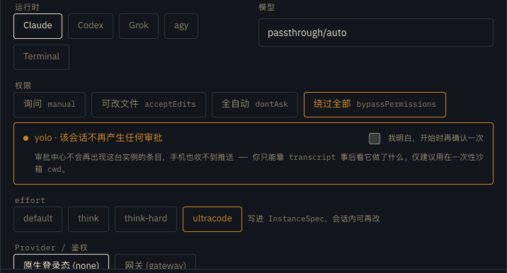

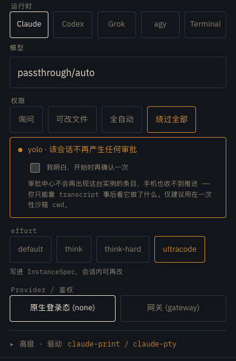

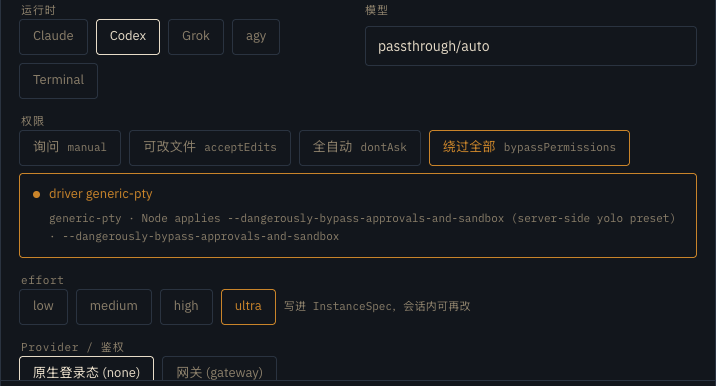

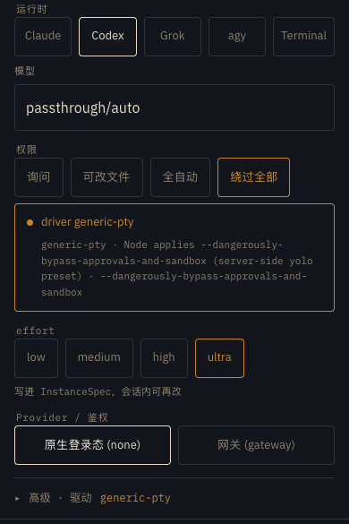

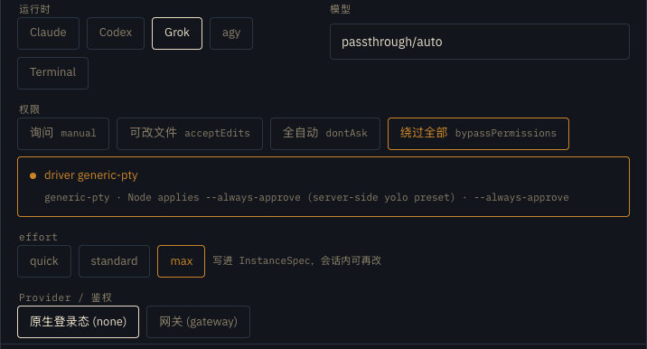

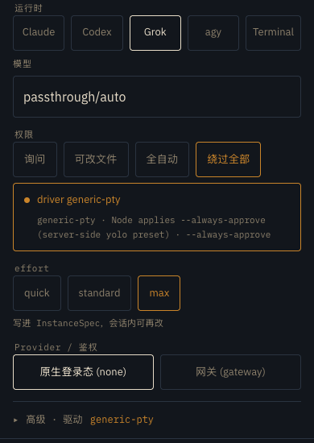

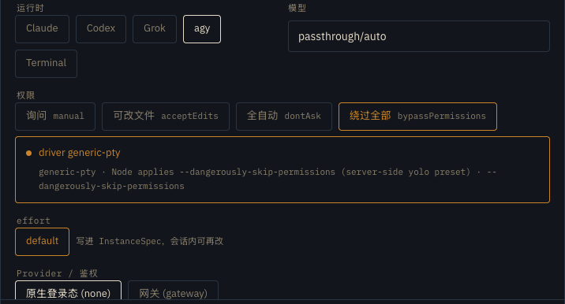

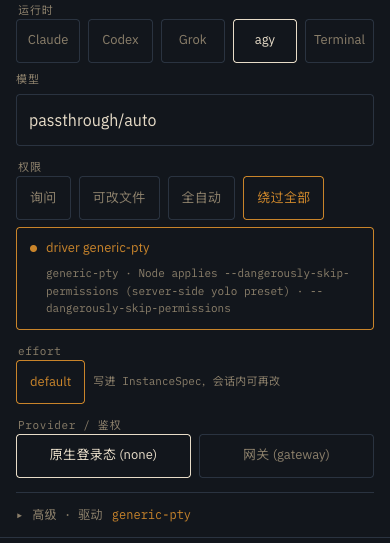

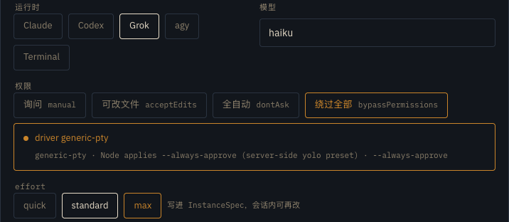

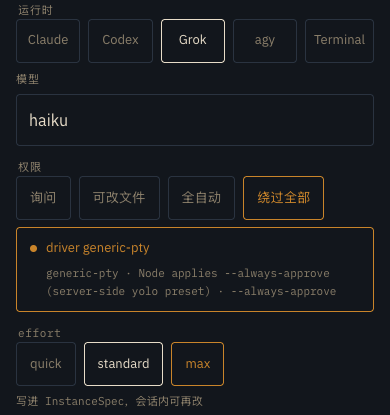

### Composer — Grok

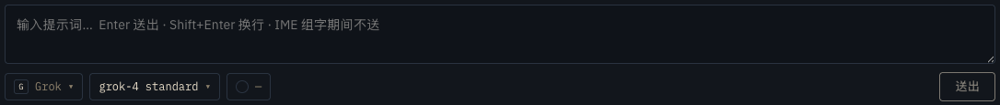

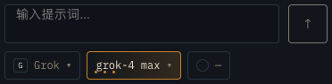

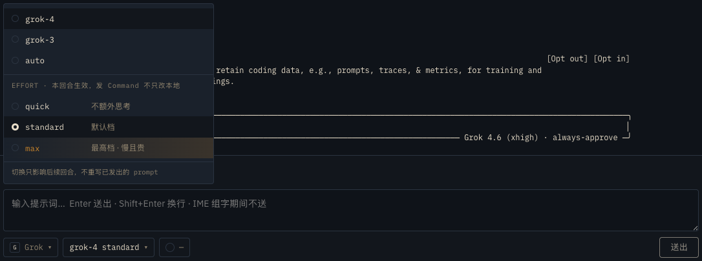

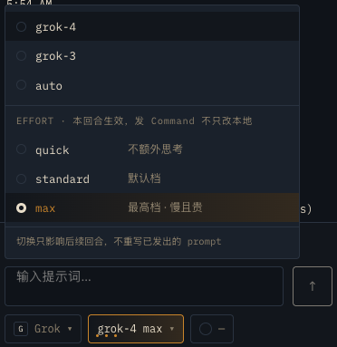

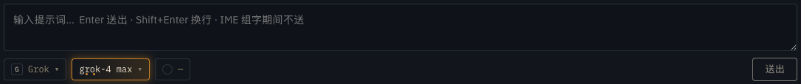

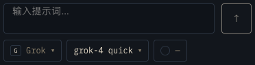


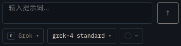

### Journal and unavailable approval prerequisite

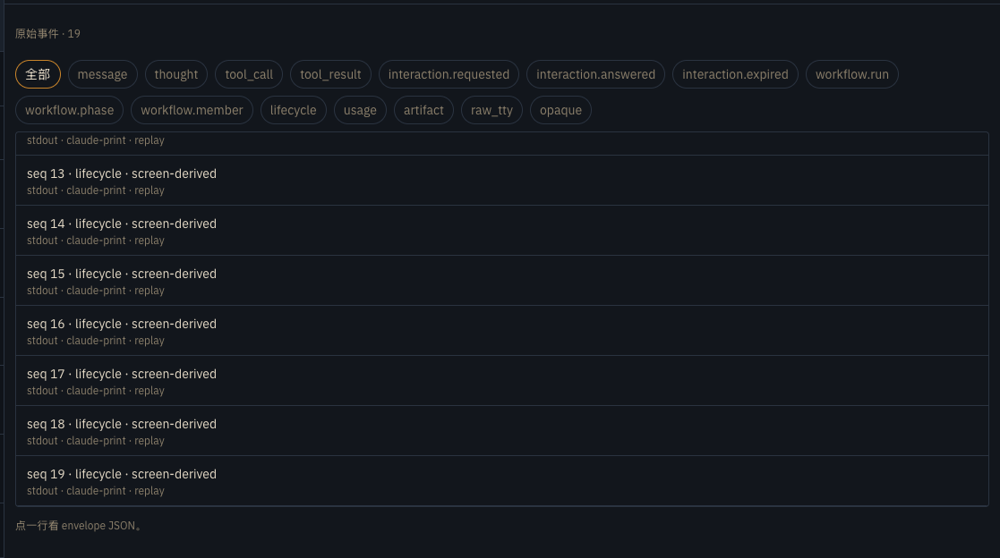

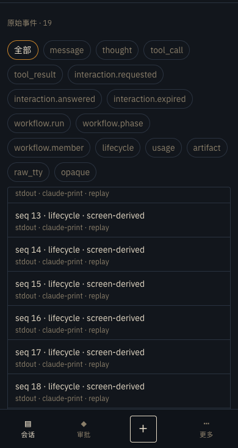

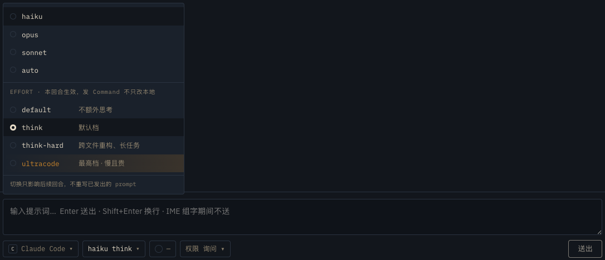

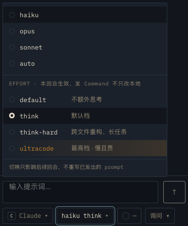

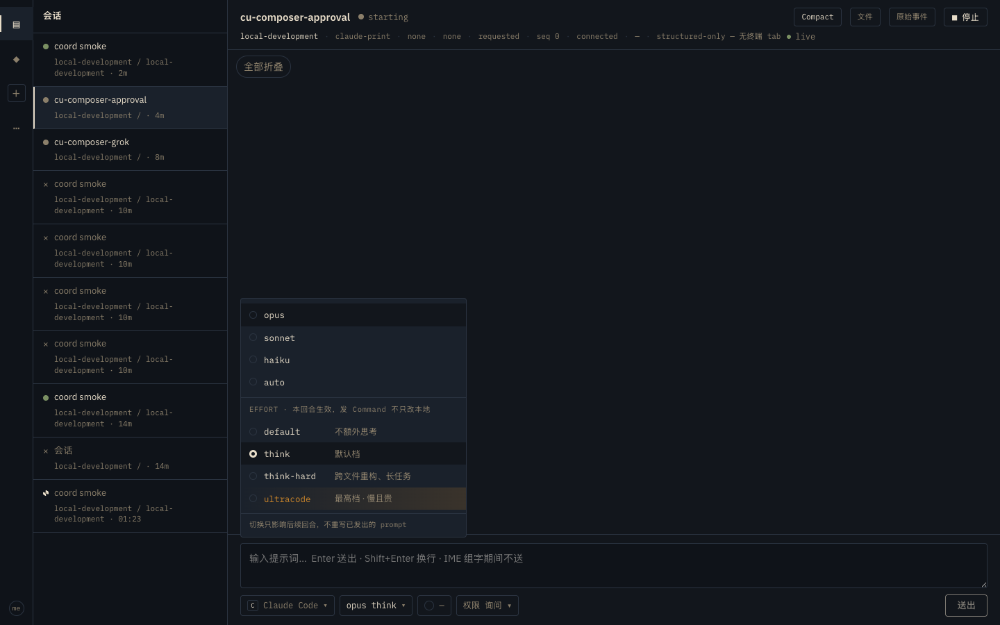

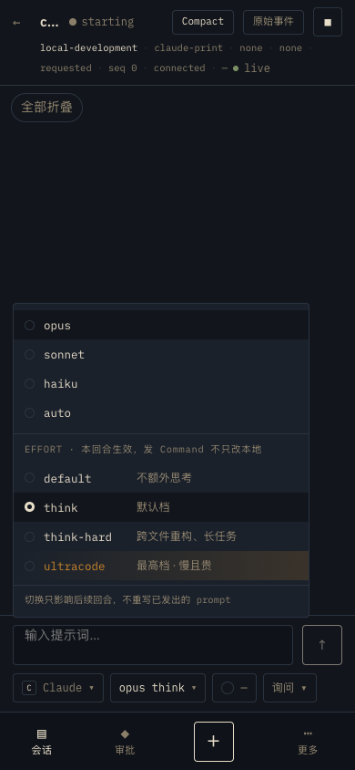

### Sessions and terminal

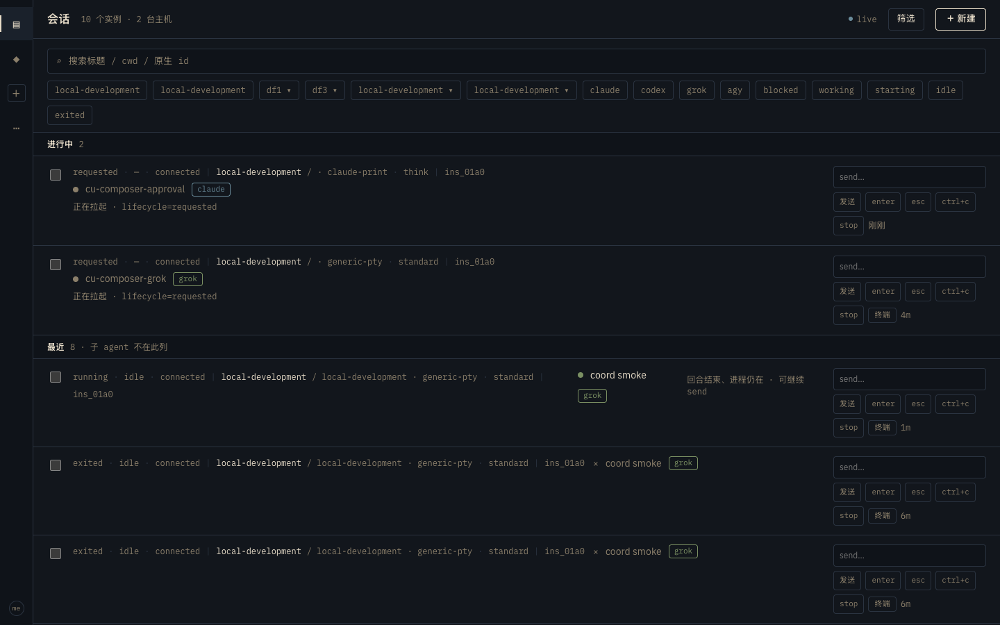

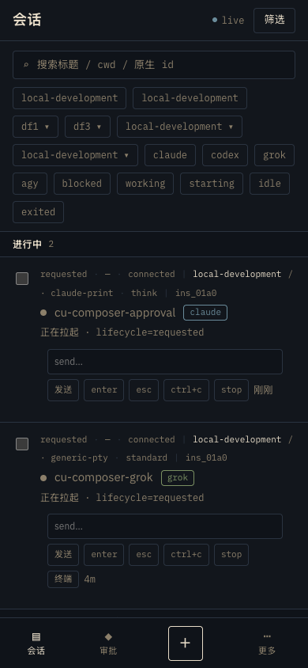

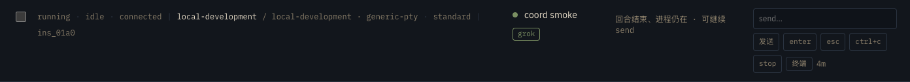

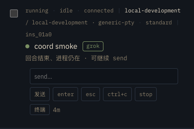

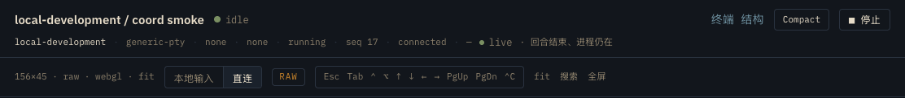

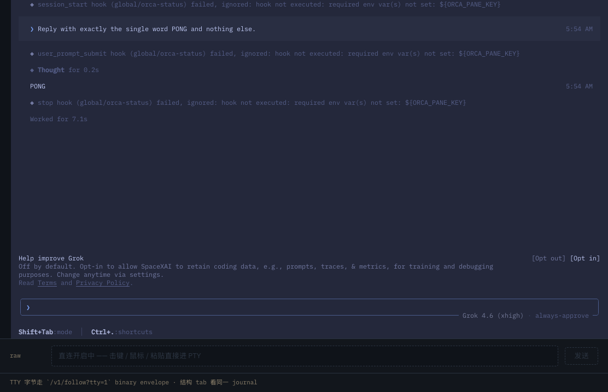

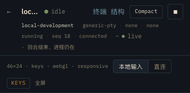

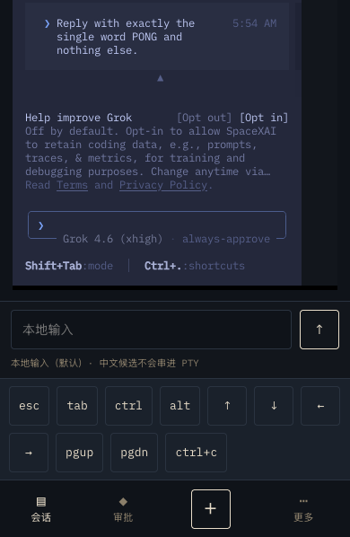

### Providers and Hosts

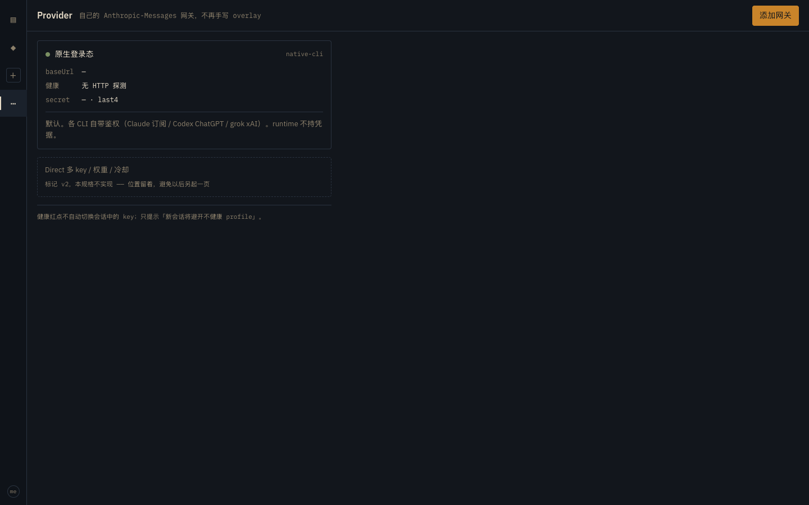

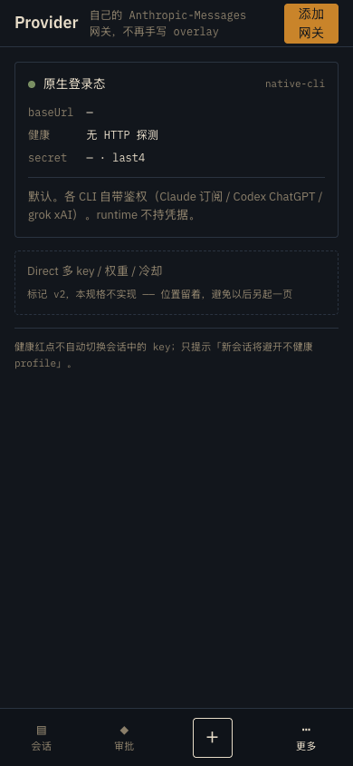

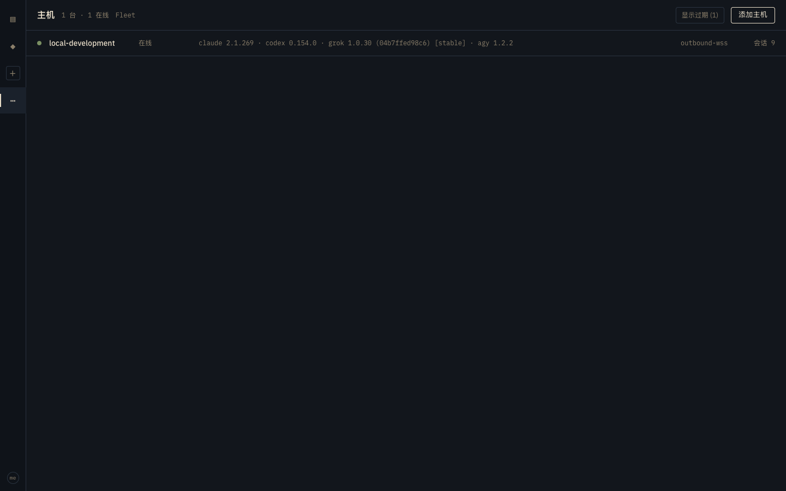

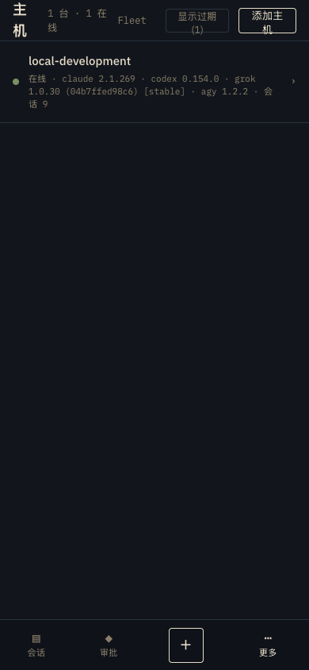

## Artifact validation

- All screenshot links resolve to PNGs in this directory; every committed PNG is embedded above.
- Report and screenshots visually checked for personal paths and secrets; path-bearing workspace/terminal regions are cropped out.
- Documentation-only validation passed: `./scripts/ci/secret-scan.sh`, `git diff --cached --check`, link/PNG integrity checks and explicit-path staged-diff review. Application build/unit tests were not rerun for a report-only change; live browser checks above are the task verification.
