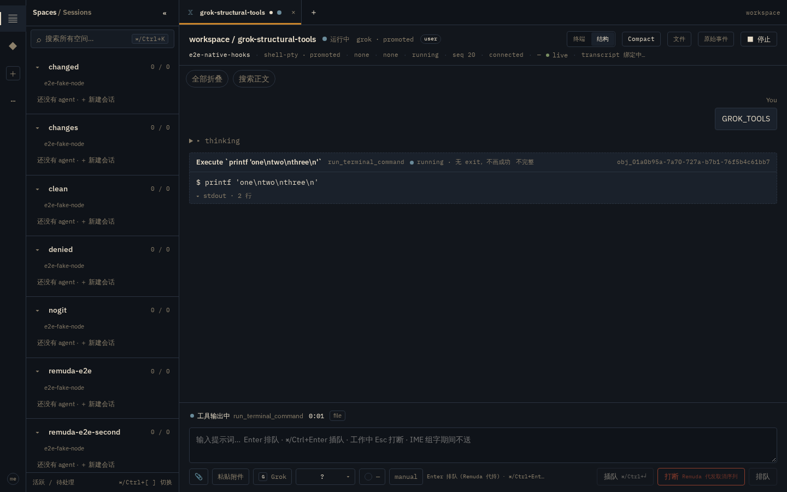
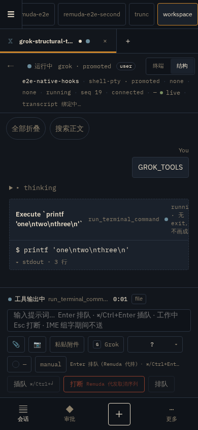
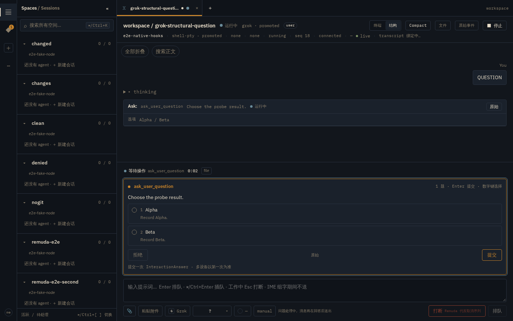
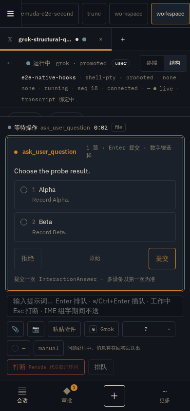

# grok-structural-1 — the grok structural chain end to end over a real PTY

Evidence for task **c-grok-e2e** (plan `grok-structural.md` (coordinator
briefs, not in the repo) (B) task 6; design
[grok-structural-translation.md](../grok-structural-translation.md),
[D-043](../decisions.md#d-043), ui-spec.md grok card rules).

- **When:** 2026-09-19 (UTC), c-grok-e2e.
- **Where:** the shared dev box; everything runs in a per-test temp dir and a
  per-test shadow `GROK_HOME`; the operator's real `~/.grok` is never read or
  written.
- **Spec:** [`web/tests/e2e/grok-structural.hub.spec.ts`](../../../web/tests/e2e/grok-structural.hub.spec.ts)
  (two tests, one fake-harness session each).
- **Method:** the production native Node (`native_hub_e2e`) enrolls against the
  hub e2e fixture and opens a real terminal session. The fake harness is
  installed as **`grok` on PATH**; a hand-typed `grok …` line in that PTY is
  detected by the production D-025 promoted-process path, and the production
  grok file adapter (plain frame translator wrapped by the file-tier
  `GrokLive` projection) tails the shadow home's ACP
  `updates.jsonl` / `events.jsonl` at its normal 250 ms cadence. No journal
  rows are injected: every assertion is a projection of that session.

## Commit set

| Layer | Commit / branch |
|---|---|
| tool identity / Running / content (D-043) | `c-grok-toolid`, merged to main as `de070d91` |
| fake-harness grok frames + scenarios | `c-grok-fake`, merged to main as `74c0e518` |
| file-tier `turn.live` phases + question interactions | `c-grok-live`, merged to main as `f5063df0` |
| grok-native tool cards + file decided-by | `c-grok-web`, merged to main as `993c1286` |
| terminal-log live stdout partials | `c-grok-stdout`, merged to main as `2e8981c7` |
| this e2e + evidence | `c-grok-e2e` (`wt/c-grok-e2e/b-grok-e2e-md`) |

## Command lines

```
cargo build --locked -p remuda --bin remuda \
  -p remuda-testing --bin fake-harness \
  -p remuda-node --example native_hub_e2e \
  -p remuda-hub --example hub_e2e

HUB_E2E_LISTEN=127.0.0.1:59090 \
HUB_E2E_WEB_PORT=59099 \
HUB_E2E_UPSTREAM_LISTEN=127.0.0.1:59091 \
PW_CHANNEL=chromium PW_TEST_CONNECT_WS_ENDPOINT=ws://127.0.0.1:3177/ \
  pnpm exec playwright test -c playwright.hub.config.ts grok-structural
```

Evidence screenshots are written only under `REMUDA_EVIDENCE=1`; default runs
stay git-clean.

## Scenario: committed fixtures with duration-only overrides

Each test loads one of the committed fake-harness scenarios, parses it, and
writes a patched copy under the test temp dir pointing `--script` at that
copy. **Only two fields are overridden**; every tool name, input payload,
match prefix, thinking text, result text and answer label comes byte-for-byte
from the fixture:

- `duration_ms` for the named tool, so the live Running / pending window is
  observable (the committed 900 ms / 20 ms values finish too fast);
- `quit_after_turns` → `0`, so the fake harness stays alive after the turn.
  The committed value (`1`) exits the process at turn end, which tears down
  the D-025 promotion and reverts the session to a plain terminal screen —
  after that no post-turn structured card could be observed. The test stops
  the node in teardown.

- tool test ←
  [`grok-tools.json`](../../../crates/remuda-testing/fixtures/fake-harness/scenarios/grok-tools.json):
  the `Bash` call's 900 ms becomes 30 000 ms so the Running window covers
  every Running-window assertion (card text, the strip elapsed tick, the
  stdout-partial and tool-started polls, the one-shot no-exit-code check, and
  both running-card screenshots). Prompt
  prefix `GROK_TOOLS`; stdout the fixture's three lines
  (`one` / `two` / `three`).
- question test ←
  [`grok-question.json`](../../../crates/remuda-testing/fixtures/fake-harness/scenarios/grok-question.json):
  the `ask_user_question` call's 20 ms becomes 30 000 ms so the pending
  interaction stays live through the form/blocked checks, the interactions
  read, the `/approvals` visit, the route-back form check and both evidence
  captures.
  Prompt prefix `QUESTION`; options Alpha/Beta, answered by the harness with
  `rawOutput.UserAnswered = Alpha`.

The committed short durations are correct for the fast Rust parity tests but
cannot hold a web-observable state; the override is the minimum deviation that
keeps the committed fixtures themselves under test.

## Observed phase sequence

Ground truth is the harness `--events-out` JSONL (`turn_start` / `turn_end`
with `wallMs`); the phase assertions use the durable journal REST snapshot and
the painted strip, never the strip's own clock as timing ground truth.

Tool test, on the journal (file tier, `tier=file`, `provision=native`):

```
prompt-accepted → thinking → tool-started → tool-output → tool-finished → text-streaming → turn-ended
```

`tool-started` rides a `turn.live` native lifecycle emitted immediately
before its Proposed `ToolCall`; the Pending and Running ACP frames can land in
one 250 ms adapter poll, so the DOM strip may paint `tool-started` folded
straight into `tool-output` — the spec therefore asserts `tool-started` in the
journal and does not make a point-in-time painted-phase assertion. The
activity fold ignores `turn.live` (only `turn_started` / `turn_ended`
match), so Working/Idle still come from the events-file boundaries.

Turn 1 journal excerpt from a representative run (kind · channel ·
nativeName · phase · state):

```
 lifecycle file turn.live        prompt-accepted
 message   file                   (user)
 lifecycle file turn.live        thinking
 thought   file …
 lifecycle file turn_started     (activity boundary, untagged)
 lifecycle file turn.live        tool-started
 tool_call file                  proposed   run_terminal_command
 lifecycle file turn.live        tool-output
 tool_call file                  running    run_terminal_command
 lifecycle file turn.live        tool-finished
 tool_result file                (Final, exit 0)
 lifecycle file turn.live        text-streaming
 lifecycle file turn_ended       turn-ended (tier=file)
 usage      file
```

## Assertions (all end to end)

### Tool test

1. **Named grok tool card at both widths.** While the shell call runs, the
   card shows the human ACP title (``Execute `printf …` ``) and the stable
   native name `run_terminal_command` in its muted secondary label
   (`tool-native-name`); both are asserted visible at 1440 px and 390 px,
   along with zero horizontal overflow. No raw JSON is shown and no exit code
   is painted before the Final result.
2. **Live elapsed ticks; the card-local elapsed gap is pinned.** The turn
   strip's turn-anchored elapsed (`live-elapsed`, local 1 Hz) shows `m:ss` and
   advances to a strictly different reading while the ground-truth turn is
   open. The spec additionally asserts `tool-elapsed` count 0 on the card:
   today the card-local bridge does not mount for grok — see "Known product
   gaps". This is a deliberate pin, not a workaround.
3. **Live stdout partials, then an exactly-once Final.** Before the Final
   frame, the card contains the first fixture stdout line (the
   `terminal/<callId>.log` tail as a Partial result). After the turn ends and
   the compact fold is expanded, the card shows `exit 0` and no running
   marker, and every fixture stdout line appears **exactly once** as a whole
   line in the settled stdout block — the c-grok-stdout regression class
   (partial bytes concatenated into the Final).
4. **Native thinking (journal + transcript; no painted assertion).** The
   durable instance journal carries the file-tier `thinking` phase (asserted
   via the journal REST snapshot), and the transcript shows a streaming
   `thought` row with the fixture's thinking text. The painted strip is
   deliberately **not** asserted for `thinking`: with one thought chunk, the
   thought, Pending and Running frames land microseconds apart and one 250 ms
   adapter poll can fold them, the same coalescing that hides
   `tool-started`.
5. **File-decided turn end.** After the ground-truth `turn_end`, the strip
   paints `data-phase="turn-ended"` and the decided-by chip reads
   `data-decided-by="file"` / `data-channel="file"` — no hook channel exists
   in this run, so the end is never credited to `hook`.

### Question test

6. **Unanswerable question entity.** The dock renders the `question-form`
   card with the fixture's Alpha/Beta options; the interaction read back from
   `/v1/interactions` is `state=pending`, `answerable=false`,
   `carrier=native-tty`, with the option labels intact.
7. **Waiting strip.** While the form is up the strip paints
   `data-phase="blocked"` — derived from the pending interaction
   (turnEnd precedence 1), not a file-tier `blocked` phase. The
   blocked-is-screen-only rule is a ui-spec.md live-strip rule, not a D-043
   one: D-043 (see decisions.md) covers only the grok frame translation, and
   explicitly leaves the file-tier turn.live phases and the question
   interaction to the later live/question work.
8. **Approvals queue renders the native-tty surface.** Visiting
   `/approvals` while the question is pending, the row shows
   `来自终端屏幕 · 回答会发送按键` and `请打开会话查看完整终端提示`, and mounts
   **no** inline `question-form` (the dock owns the full terminal prompt).
9. **Resolution and end.** After the ground-truth `turn_end`, the node no
   longer reports a pending question (asserted on `/v1/interactions`), the
   dock row clears on the next list poll, and the turn ends file-decided.
   Alpha/Beta visibility of the pending form and no horizontal overflow are
   asserted at both widths.

## Screenshots

Redacted evidence captures at 1440 px and 390 px (night theme), taken while
the states were genuinely live. Before capture the spec walks the rendered
DOM and replaces every temp/workspace path with `$TEST_DIR`, so the images
carry no browser identifiers, hostnames, home paths or tokens:






## Known product gaps (follow-ups filed, not worked around here)

- **Per-card elapsed does not mount for grok.** The card-local `tool-elapsed`
  bridge keys anchors by a content fingerprint of `tool_name + input`
  (`web/src/features/session/live/phase.ts` `toolAnchors`). Grok's statusless
  Running frame **normalizes `rawInput`** (adds `variant`, matching the real
  1.0.30 fixture frames 5→7), so the assembled running card's fingerprint no
  longer equals the anchor keyed off the Proposed frame. The turn-anchored
  strip elapsed works; an id-based join (`toolCallId` is carried by both the
  phase tags and the payloads) is the follow-up.
- **Partial marker lingers on the settled card.** With the stdout tail
  enabled, the tool node is marked `completeness=partial` while the log
  streams; after the structured Final result the assembled card still shows
  the muted 不完整 tag even though `exit 0` and the complete stdout are
  present (`assemble.ts` sets partial on a Partial result but never resets the
  node's completeness on a structured Final). Cosmetic; the Final text itself
  is correct and not duplicated (asserted exactly-once above).
- **390 px running card clips inside the card head.** In
  `grok-structural-1-tool-390.png` the running status column wraps and is cut
  off inside the Bash card head — `runni`, `无`, `exit`, `不画成` are
  truncated, and the 不完整 marker and the trailing call-id column drop out of
  view. The document-level `scrollWidth − clientWidth <= 1` guard cannot see
  this, because the clip is inside the card rather than page overflow. The
  card still renders the title and the native-name label at 390 px (asserted
  visible), but the in-card head needs a responsive layout follow-up.
- **The session dock never consults `answerable`.** The dock mounts
  `QuestionForm` for every pending question
  (`SessionPage.tsx` question branch; `QuestionForm.tsx` derives `disabled`
  from busy/state only, never from `answerable`), so a native-tty question
  shows an enabled answer form in the session even though the entity is
  `answerable=false` — only `/approvals` renders the
  `来自终端屏幕 · 回答会发送按键` / `请打开会话查看完整终端提示` notes and
  suppresses the inline form. The dock should disable or replace the form on
  a non-answerable native-tty carrier. Product follow-up, not worked around
  in this spec.

## Not shown / out of scope

- **No `blocked` phase from the file tier.** Grok blocked comes from the
  screen tier only (ui-spec.md live-strip rules); the file adapter never
  emits it.
- **Subagent / workflow assertions** — deferred to the 1.0.34 recapture
  (PR7/PR8).
