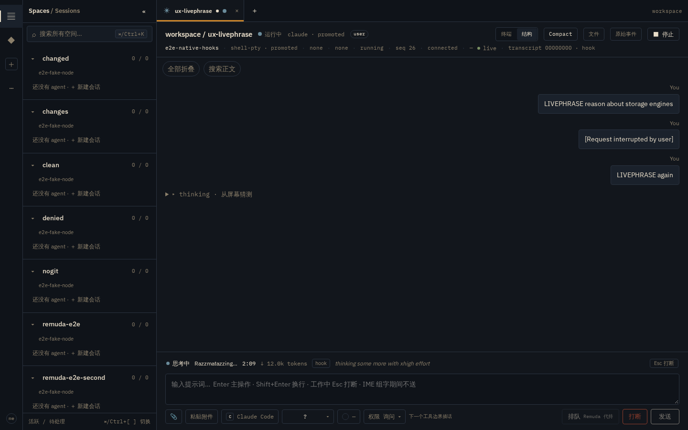
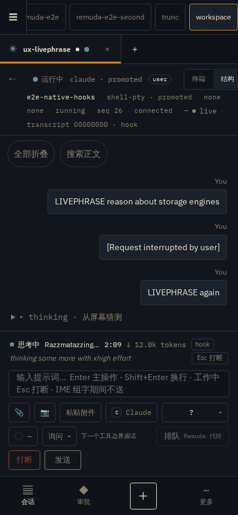
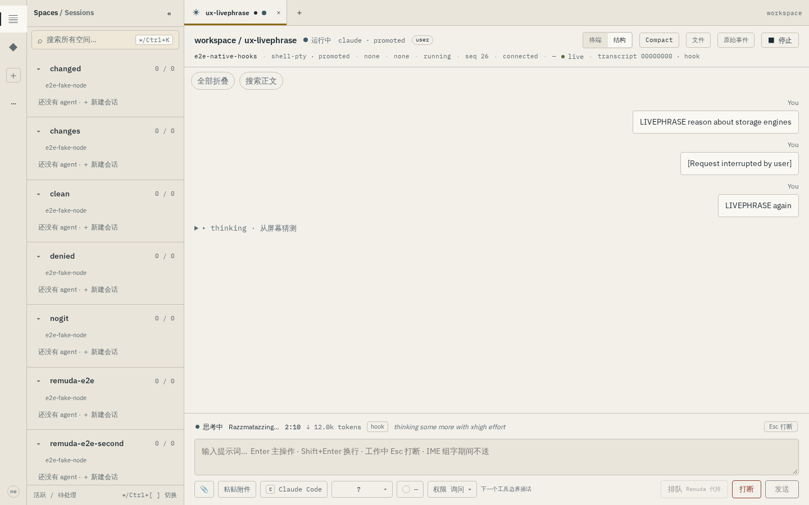
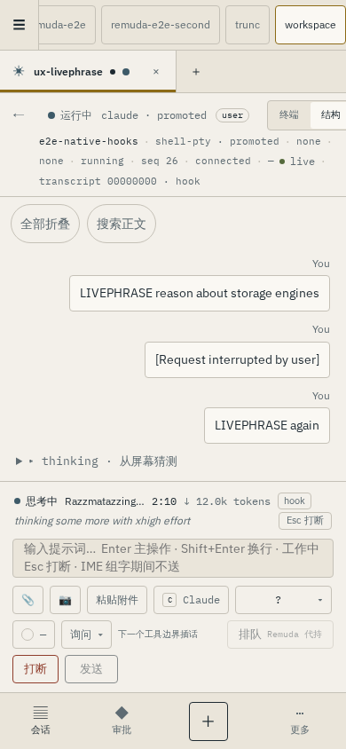

# live-phrase-1 — the structured strip shows the terminal's spinner status

Evidence for batch **c-livephrase**: the owner's terminal showed
`· Razzmatazzing… (49m 38s · ↓ 66.0k tokens · thinking some more with xhigh
effort)` while the structured strip showed only phase · elapsed · tier. The
screen tier was allowed a busy bit and a spinner phrase, but nothing parsed
the line's verb, streamed-token estimate, effort-qualified phrase, or the
interrupt hint.

- **When:** 2026-09-16/17 (UTC), branch `wt/c-livephrase/live-strip-thinking-and-work`.
- **Where:** this worktree on the shared dev box.
- **Captures:** real claude **2.1.272** PTY streams taken on this host
  (120×40 xterm-256color), replayed through the production `Emulator` as
  integration fixtures:
  [`cap2.bin`](../../crates/remuda-screen/tests/fixtures/cap2.bin) (short
  turn — `running UserPromptSubmit hook`, `running Stop hook`, the post-turn
  `Baked … done` row),
  [`tools2.bin`](../../crates/remuda-screen/tests/fixtures/tools2.bin) (Bash
  tool turn — `running PreToolUse hook · thinking with xhigh effort`, live
  `↓` token growth, `thought for Ns`),
  [`xhigh3.bin`](../../crates/remuda-screen/tests/fixtures/xhigh3.bin) (long
  xhigh reasoning turn, fullscreen `?1049` renderer, `4.5k` tokens,
  `1m 14s`, Stop hook at the end).
- **End-to-end:** `fake-harness --dialect-version modern` paints the exact
  captured status lines verbatim (new scenario `spinner.frames`) through a
  real PTY with `REMUDA_PTY_EMULATOR=1 REMUDA_PTY_HOOKS=1`; the hub spec is
  [`ux-livephrase.hub.spec.ts`](../../../web/tests/e2e/ux-livephrase.hub.spec.ts).

Nothing here is inferred from a mock. The parser is tested against both the
real 2.1.272 captures and the fake's 80-column fullscreen render; the e2e
runs production driver → node → hub → journal → page.

---

## 1 — What the real captures contain

Replayed one repaint (`ESC[H`) at a time — the spinner is repainted in place,
so fixed byte windows skip the short frames:

```
✻ Contemplating… (running UserPromptSubmit hook · 0s)
✻ Nebulizing…   (running Stop hook · 3s)
· Forging… (3s · thinking with xhigh effort)              # xhigh turn, no tokens yet
· Forging… (12s · ↓ 25 tokens · thinking with xhigh effort)
· Forging… (12s · ↓ 138 tokens · thought for 9s)
· Forging… (1m 14s · ↓ 4.5k tokens · running Stop hook)
* / · / ✢ / ✶ / ✻ / ✽  — glyphs rotate ~8 Hz and even differ mid-word
```

Field order varies (hook phrase first in the UserPromptSubmit variant,
elapsed first everywhere else), the glyph is often glued to the verb
(`·Befuddling…`), and the `esc to interrupt` hint is absent from modern
builds. The parser
([`statusline.rs`](../../crates/remuda-screen/src/statusline.rs)) therefore
recognises fields by shape — `↓ N[k|m] tokens` for the estimate,
`49m 38s`/`14s` unit tokens for elapsed, everything else is the phrase — and
splits the glyph off as a non-alphanumeric run rather than by codepoint.

The post-turn completion row (`✻ Baked for 3s · done 9:51 PM`) has no
ellipsis and never parses as live.

```
$ cargo test -p remuda-screen
… 62 unit, 4 real-capture integration tests (cap2/tools2/xhigh3 + latch churn)
```

## 2 — One observation per distinct reading, on both PTY carriers

`ScreenLiveLatch` folds the polled grid: a reading whose **tokens, phrase
or interrupt hint** changed → one `turn/live.status` native lifecycle
(`tier=screen`, `provision=emulated`). The cycling glyph and the ticking
elapsed are not transportable — an elapsed-only frame
(`✻ Grooving… (14s)`, the fake's 20 s tool interior) stays silent, which is
what keeps the existing quiet-window budget (`live_pipeline::
assert_quiet_tool_window`) green; a torn busy frame cannot clear the
reading; one clear (`liveStatus:"0"`) lands when the spinner genuinely
leaves the screen.

- native carrier: the promotion poller emits right after its existing
  `agent_status` transition, over the same `SourceChannel::Pty` /
  `ScreenDerived` envelope
  ([`promotion.rs`](../../crates/remuda-driver/src/shell_pty/promotion.rs));
- herdr carrier: `PtyInteractions` reads the viewport while Working (or until
  the clear), passing herdr's authoritative busy verdict into
  `observe_with` — the modern pane's own text carries no hint
  ([`pty_interaction.rs`](../../crates/remuda-driver/src/pty_interaction.rs)).

Elapsed is still owned by the browser's 1 Hz clock: the screen reading only
*re-anchors* it (`now − the elapsed the screen itself printed`).

## 3 — The strip now matches the terminal

Dock during the xhigh reasoning turn (1440 night):



`思考中 · Razzmatazzing… · 49:38 · ↓ 66.0k tokens · hook · thinking some
more with xhigh effort · Esc 打断`:

- the phase label promotes to **思考中** while hooks only have
  prompt-accepted — hooks have no thinking channel on claude, the screen
  phrase is the one channel that does;
- **one** token count: real `usage` output tokens once they land, the screen
  estimate until then (`data-source="usage|screen"`), never both;
- the phrase renders muted and is never parsed beyond the thinking label;
- `Esc 打断` calls the existing `instance.cancel` keys path (raw ESC);
  blocked phases hide it (the dialog owns the keyboard);
- the collapsed **▸ thinking · 从屏幕猜测** transcript row — a screen-derived
  thought node, mounted from the live projection with one line in
  `assemble.ts` — is visible even scrolled away from the dock, and unmounts
  the instant real content or the clear arrives.

390 px (flex-wrap, no horizontal page scroll in either theme):





## 4 — End-to-end result

```
$ PW_CHANNEL=chromium PW_TEST_CONNECT_WS_ENDPOINT=ws://127.0.0.1:3177 \
  HUB_E2E_LISTEN=127.0.0.1:57380 HUB_E2E_WEB_PORT=57389 \
  pnpm exec playwright test -c playwright.hub.config.ts tests/e2e/ux-livephrase.hub.spec.ts
✓ screen spinner status: verb/tokens/phrase reach the strip and Esc interrupts (15.7s)
```

The spec asserts both scripted frames cross the wire (`12.0k` → `66.0k`),
the strip updates in place, the live thinking row mounts, the **Esc 打断**
click is followed by the harness's ground-truth `interrupt` event, the verb
and row clear afterwards, and the strip never overflows at 390/1440 in both
themes. The pre-existing `ux-live-view.hub.spec.ts` still passes
(1.3 min), and 965 web unit tests + the full Rust workspace (`cargo test`,
`cargo clippy --workspace --all-targets -- -D warnings`) are green.
