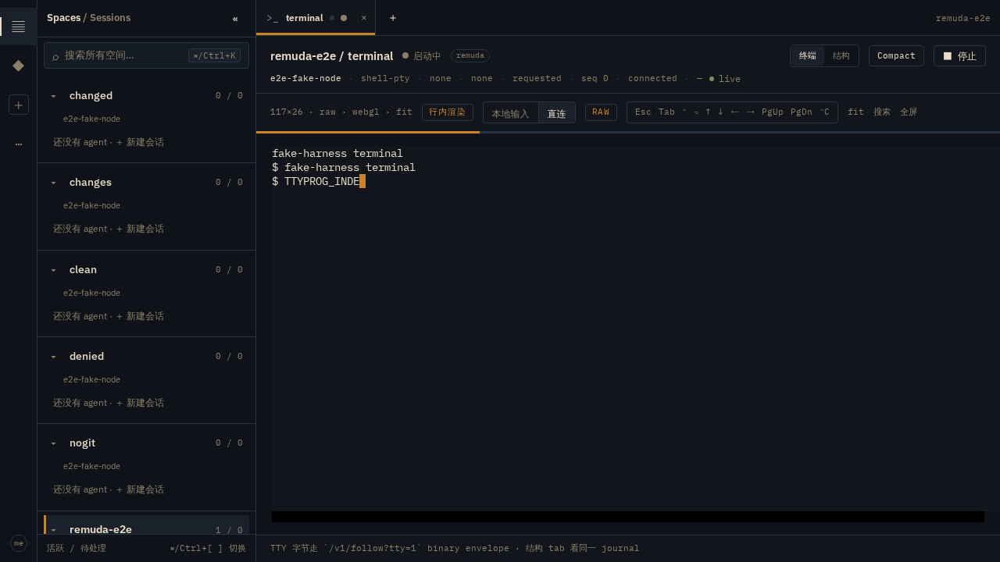
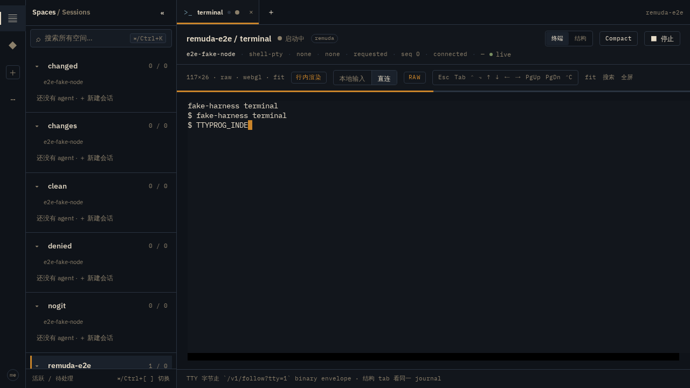
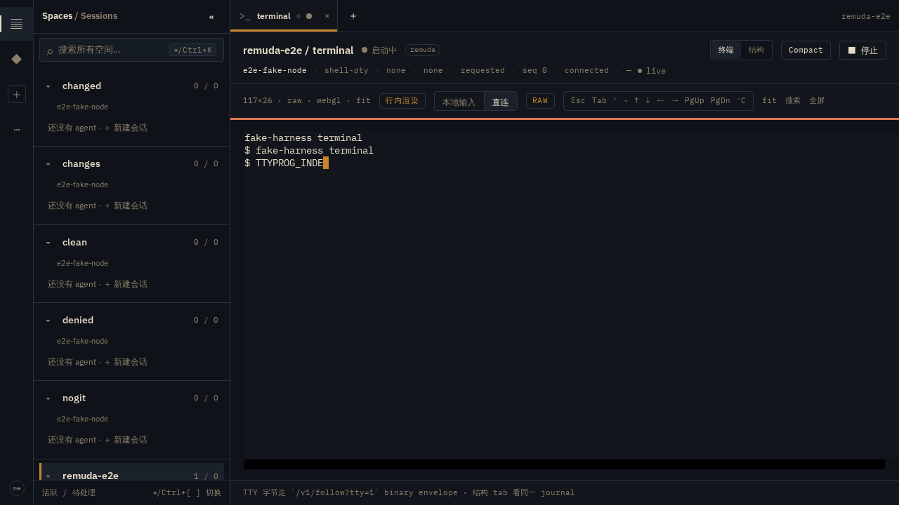

# native-config-1 实跑证据：原生载体下用户 settings 合并、网关模型透传、OSC 9;4 进度条

工作树 `wt/c-nativecfg`（分支 `wt/c-nativecfg/native-settings-merge-and-models`，from `origin/main`）。
宿主为任务指定的开发机，claude CLI 2.1.273。全部输出来自本机真实运行；凭据、
宿主路径、用户名、网关主机名均已脱敏。

对应 owner findings（macOS demo, claude 2.1.272）：

1. 原生 tty 模式的 `launch/settings.json` 没有把 gateway models 传过去；
2. 合成 config 时应当 merge 而非 replace —— `statusLine`、`enabledPlugins` 等用户级键丢失；
5. `terminalProgressBarEnabled=true` 被写入但没有任何东西渲染进度条。

---

## 1 复现与修复前行为

原生载体把 `CLAUDE_CONFIG_DIR` 钉在 Remuda 管理的 scoped native home
（`instances/<id>/native-home` 或 Node 级 `REMUDA_CLAUDE_CONFIG_DIR`），harness 的
user-settings 层因此指向一个空目录。修复前 `<instance>/launch/settings.json` 只包含：

```json
{
  "hooks": { "<Remuda relay events>": [ …relay-only matchers… ] },
  "tui": "default|fullscreen",
  "showStatusInTerminalTab": true,
  "terminalProgressBarEnabled": true
}
```

用户 `~/.claude/settings.json` 里的 `env`（`ANTHROPIC_BASE_URL` / `ANTHROPIC_AUTH_TOKEN` /
`ANTHROPIC_MODEL` / `ANTHROPIC_DEFAULT_*_MODEL` / `CLAUDE_CODE_ENABLE_GATEWAY_MODEL_DISCOVERY`）、
`model`、`modelSettings`、`statusLine`、`enabledPlugins`、`theme`、`permissions`、
`effortLevel`、用户自己的 hooks 全部丢失；`/model` 看不到网关模型。

## 2 修复：merge 而非 replace

优先级（低 → 高），文档同步写在 `overlay.rs` 与 `launch/user.rs` 模块注释：

```text
user settings.json
⊕ user settings.local.json        （Claude 的 user 层 precedence）
⊕ launch-request explicit --settings（operator/request overlay）
⊕ Remuda hooks（按 event 合并，relay 条目追加，用户 hooks 保留）
⊕ tui / showStatusInTerminalTab / terminalProgressBarEnabled 强制钉住
```

- 仅当载体钉的是 **Remuda 管理的** native home 时才复制用户 settings；继承宿主 home
  （`Delegation::None` 且无 explicit config dir）或调用方显式指定 `CLAUDE_CONFIG_DIR` 时
  不复制 —— 那种情形 CLI 自己读原目录，复制会让用户 hooks 双发。
- 凭据规则：网关凭据**只**从该宿主上启动用户自己的 settings 复制，Remuda 绝不注入、
  替换或合成；落盘仅在 0600 的 per-instance 文件里，不进 journal、不进 web；唯一的日志
  路径走 `redact_settings`（含 redaction 单测）。

### 2.1 修复后 settings diff（同机真实 launch，凭据脱敏）

| 顶层键 | 修复前 | 修复后 |
|---|---|---|
| `env`（10 个网关变量，含 `ANTHROPIC_AUTH_TOKEN`） | ❌ 丢失 | ✅ 透传，token=`[redacted]` |
| `model` (`ark/seed-evolving[1m]`) | ❌ | ✅ |
| `modelSettings` (`model_hub/es1_orange_o48` → effort xhigh) | ❌ | ✅ |
| `statusLine` | ❌ | ✅（用户脚本原样保留） |
| `permissions.defaultMode` | ❌ | ✅ |
| `effortLevel` / `theme` / `verbose` | ❌ | ✅ |
| `skipDangerousModePermissionPrompt` / `skipWorkflowUsageWarning` | ❌（bypass 除外） | ✅ |
| 用户自己的 hooks（herdr-agent-state、cat 包装等） | ❌ | ✅ 按 event 保留在前 |
| Remuda relay hooks | ✅ | ✅ 追加在用户 hooks 之后 |
| `tui` / 两个 OSC 开关 | ✅ | ✅（绑定后仅 tui 钉被释放） |

完整脱敏合并结果见文末附录。`SessionStart` 三个 matcher 依次是：用户的
`herdr-agent-state.sh`、用户的另一个包装 hook、Remuda relay —— 顺序与「用户在前、relay 追加」一致。

文件权限实测：

```text
-rw------- launch/settings.json
drwx------ launch/
```

## 3 网关模型 live 验证（本机真实 claude 2.1.273）

`cargo test -p remuda-driver --test shell_pty_native_live -- --ignored`
（新增 `scoped_home_lists_gateway_models_in_model_picker`）：scoped native home +
`user_settings_home=$HOME/.claude`，进 composer 后键入 `/model`，模拟器渲染的 picker
实测列出网关模型：

```text
Select model — Switch between Claude models.
1. Default (recommended)     Use the default model (currently model_hub/es1_orange_o48[1m])
2. model_hub/es1_orange_o48[1m]   Custom Opus model (1M context)
3. model_hub/es1_orange_o48[1m]   Custom Sonnet model (1M context)
4. model_hub/es1_orange_o48[1m]   Custom Haiku model (1M context)
5. model_hub/es1_orange_o48[1m] ✔ Custom model
```

顶部横幅同样显示 `model_hub/es1_orange_o48[1m] with xhigh effort`，与普通终端一致。
argv 里没有任何 token（credential 只在 0600 overlay 里）。

## 4 OSC 9;4 进度条打通

`terminalProgressBarEnabled` 之前被钉成 true 但链路在模拟器之后断掉。现在：

- `remuda-screen` 解析 ConEmu `OSC 9;4` →
  `ProgressBar::{Done, Percent, Error, Indeterminate, Paused}`，容忍 claude 的空 percent
  写法（`9;4;3;`）；
- node local-pty pump 边沿检测后发 `TtyEvent::Progress`，attach 快照带当前状态；
- 协议层 `TtyModeParams` 新增**可加**字段 `progress {state, percent?}`
  （`altScreen` 同步改为可选，progress-only 边沿不覆盖 alt-screen；老 Node/老客户端忽略）；
- hub 原样转发；web 在 tty header 正下方渲染 3px 细条：indeterminate 滑动动画、
  percent 填充（带 `aria-valuenow`）、error/paused 变色，state 0 / 显式 null 隐藏。

hub e2e（fake harness 新增 `TTYPROG_*` sentinel，脚本化原始 OSC 字节 + `tty.mode` notice，
与 node 本地模拟器 pump 行为一致）：`tests/e2e/native-progress.hub.spec.ts` 全绿；
另有 screen crate OSC parse 单测与 web client 单测覆盖各状态/畸形输入。

截图（`REMUDA_EVIDENCE=1` 提交）：





done 后 bar 消失（spec 断言 `data-tty-progress="hidden"` 且元素 count 0）。

## 5 测试清单

- `cargo test -p remuda-screen`：OSC 9;4 状态解析通过；
- `cargo test -p remuda-driver`（含 test-stub）：新增 settings merge / 凭据脱敏 /
  scoped-home 合并 / inherited-home 不复制 单测通过，既有 overlay merge 测试保持通过；
- `cargo test -p remuda-node -p remuda-hub -p remuda-protocol`：含 `TtyModeParams`
  progress 字段协议测试，全绿；
- `cargo clippy --workspace --all-targets -- -D warnings` 干净；
- web `pnpm typecheck / lint / test` 全绿；
- hub e2e：`native-progress.hub.spec.ts` 与既有 `ux-ttymode.hub.spec.ts` 均通过
  （`PW_CHANNEL=chromium` + 共享 ws endpoint + flock）。

## 附录：修复后 launch/settings.json（脱敏；hooks 仅列每事件 matcher 数与 SessionStart 全貌）

```json
{
  "env": {
    "ANTHROPIC_BASE_URL": "https://<gateway-host>",
    "ANTHROPIC_AUTH_TOKEN": "[redacted]",
    "ANTHROPIC_MODEL": "model_hub/es1_orange_o48[1m]",
    "ANTHROPIC_DEFAULT_OPUS_MODEL": "model_hub/es1_orange_o48[1m]",
    "ANTHROPIC_DEFAULT_SONNET_MODEL": "model_hub/es1_orange_o48[1m]",
    "ANTHROPIC_DEFAULT_HAIKU_MODEL": "model_hub/es1_orange_o48[1m]",
    "CLAUDE_CODE_SUBAGENT_MODEL": "model_hub/es1_orange_o48[1m]",
    "CLAUDE_CODE_MAX_CONTEXT_TOKENS": "1000000",
    "CLAUDE_CODE_ATTRIBUTION_HEADER": "0",
    "CLAUDE_CODE_ENABLE_GATEWAY_MODEL_DISCOVERY": "1"
  },
  "model": "ark/seed-evolving[1m]",
  "modelSettings": {
    "model_hub/es1_orange_o48": { "effortLevel": "xhigh" }
  },
  "statusLine": {
    "type": "command",
    "command": "<user statusline script, paths redacted to $HOME>"
  },
  "permissions": { "defaultMode": "auto" },
  "effortLevel": "xhigh",
  "theme": "auto",
  "verbose": false,
  "skipDangerousModePermissionPrompt": true,
  "skipWorkflowUsageWarning": true,
  "showStatusInTerminalTab": true,
  "terminalProgressBarEnabled": true,
  "hooks": {
    "_summary": "per-event matcher counts; the last matcher of every Remuda event is the relay, leading matchers are the user's own hooks",
    "matcherCounts": {
      "UserPromptSubmit": 2, "Stop": 2, "StopFailure": 2, "SubagentStart": 2,
      "SubagentStop": 2, "TeammateIdle": 1, "PreToolUse": 2, "PostToolUse": 2,
      "PostToolUseFailure": 1, "PermissionRequest": 2, "SessionStart": 3,
      "PostCompact": 1, "SessionEnd": 1, "Notification": 1, "PostToolBatch": 1,
      "MessageDisplay": 1, "Elicitation": 1
    },
    "SessionStart": [
      { "matcher": "*", "command": "bash '$HOME/.claude/hooks/herdr-agent-state.sh' session…" },
      { "matcher": null, "command": "if [ -z \"${HOME-}\" ]; then { command -p cat …" },
      { "matcher": null, "command": "exec '<worktree-target>/…/remuda' hook emit --socket '/tmp…" }
    ]
  }
}
```
