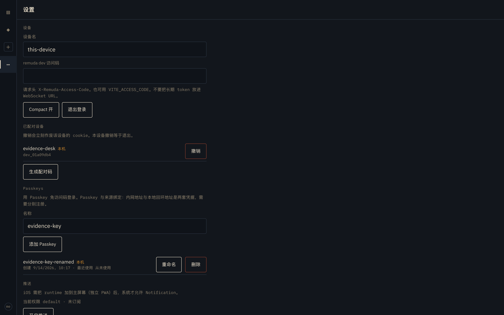
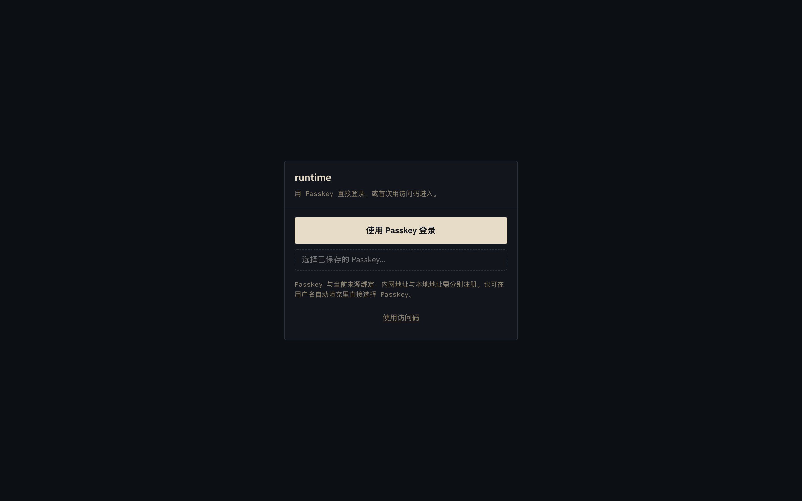
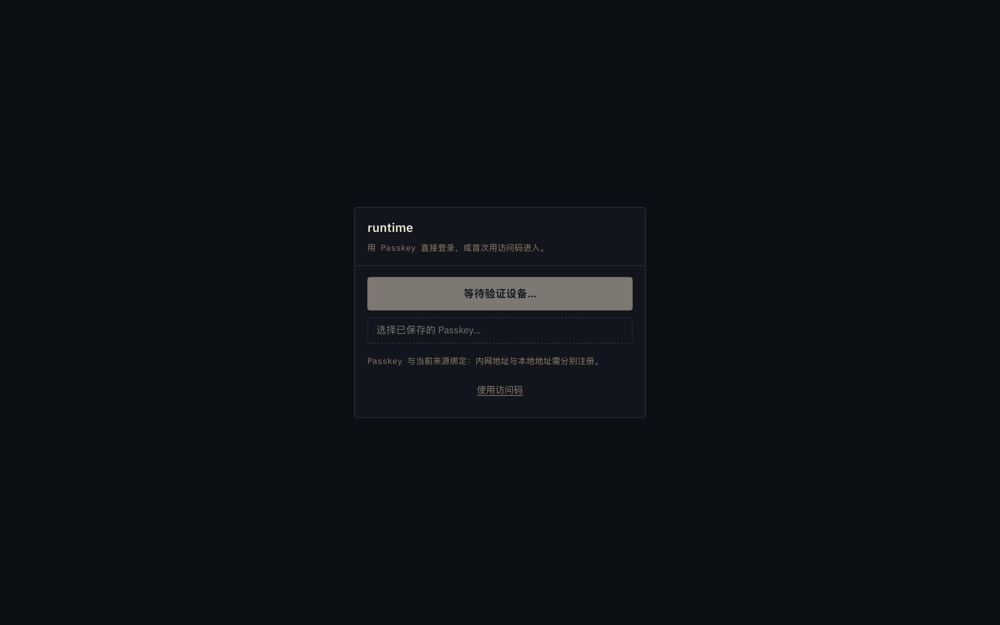

# D-029 Passkey 登录 · 真机证据

日期：2026-09-14（Asia/Shanghai；下文时间戳为 UTC）。分支 `wt/x-passkey/passkey-login`。
对应设计：[passkey-login.md](../passkey-login.md)、[D-029](../decisions.md)。

## 方法

- 自起隔离的 **`remuda dev`：Hub `127.0.0.1:62280` / Node `127.0.0.1:62287`**，
  数据目录与访问码文件均为 `/tmp` 下一次性目录（值不记录），`--access-code-file`
  提供访问码，`cookie_secure=false`（loopback dev 默认）。Hub 允许来源通过
  `REMUDA_ALLOWED_ORIGINS` 显式加入 `http://localhost:62299` 与
  `http://127.0.0.1:62299`。
- Web 走 Vite dev server：`VITE_MOCK=0 VITE_HUB_URL=http://127.0.0.1:62280 vite
  --port 62299`，浏览器实际访问 **`http://localhost:62299`**（Vite 绑定
  127.0.0.1，localhost 同样可达；`/v1`、`/healthz` 代理到 Hub）。
- 浏览器为本机 Chrome（channel=chrome，headless），由一次性 Playwright 脚本经
  CDP 挂 **虚拟 WebAuthn authenticator**（ctap2 / internal / residentKey /
  userVerification / automaticPresenceSimulation）驱动；未触碰 macOS 系统设置、
  未驱动系统 GUI，脚本与原始截图都在工作区未跟踪目录，仓库跟踪文件无改写。
- 另用 curl 直接抓取 Hub 线上报文字段作为旁证。

**为什么必须是 localhost**：Chrome 拒绝把 IP 字面量 `127.0.0.1` 当作 RP ID
（`navigator.credentials.create` 抛 `SecurityError: This is an invalid domain`），
loopback 上可注册的 RP 只能是 `localhost`。Hub 的 RP ID 取请求来源的完整 host，
因此 127.0.0.1 与 localhost 也是两套独立凭据。

## 结果一览（最终代码，全部通过）

| # | 步骤 | 结果 |
|---|---|---|
| 1 | 访问码首次登录 → 设置页注册 Passkey `evidence-key` | ✅ register/start+finish 200，列表出现行，标「本机」 |
| 2 | 重命名为 `evidence-key-renamed` | ✅ PATCH 200，新名立即可见 |
| 3 | 退出登录 → 登录页挂载即自动 conditional Passkey 登录 | ✅ login/finish **200，自动提交**，进入 /sessions |
| 4 | 再注册一个 `evidence-key-disposable` 并删除 | ✅ finish 200 → DELETE 200，列表回到 1 行 |
| 5 | 移除虚拟 authenticator 后点「使用 Passkey 登录」 | ✅ 停留在 /login，无会话建立（按钮转「等待验证设备…」） |
| 6 | 同一页面展开「使用访问码」回退登录 | ✅ 登录成功（回到 /settings） |
| 7 | 非允许来源 / 非 loopback 的 http 来源发起 ceremony | ✅ Hub 一律 403 |

## 证据过程中发现并修复的一个真实竞态（本次改动的一部分）

首版真机验证时，「退出登录后立刻自动发起的 conditional login/finish」**间歇性
401**（约一半概率）。逐层定位（在中间件和处理入口临时加日志，定位后已全部移除）：

1. 登录页一挂载就发起 `login/start` + conditional `credentials.get`；点「退出
   登录」后路由跳到 `/login`，这个自动 ceremony 与退出登录的 cookie 清理并发。
2. 浏览器在退出响应的 `Set-Cookie: remuda_device=; Max-Age=0` 生效**之前**发出
   `login/finish`，请求里仍带着刚被吊销的旧 `remuda_device` cookie。
3. Hub 的 agent-scope 中间件对「携带 presented token」的请求先调 `caller()`
   校验。豁免清单里有 `/v1/login`、`/v1/devices/pair`，却**漏了两条 passkey
   登录路由**。于是旧 cookie 解析到已删除设备 → `caller()` 在 passkey 处理函数
   运行之前就返回统一 401，合法断言根本没被验证。
4. 修复：把 `/v1/auth/passkeys/login/start`、`/v1/auth/passkeys/login/finish`
   加入与 `/v1/login` 相同的「建立会话」豁免（`is_auth_establishing`），因为这
   两条路由的凭证是请求体里的 WebAuthn 断言，任何 presented token 都不应被当作
   前置条件；注册路由仍要求既有设备会话，不在豁免内。
   - 单元回归：`agent_scope::tests::passkey_login_routes_are_auth_establishing_but_register_is_not`。
   - e2e 回归：`passkey-hub-live.spec.ts` 第一条用例现在断言退出后自动发起的
     `login/finish` 状态含 200 且**不含 401**。
5. 修复后重跑：连续两个「访问码登录→注册→退出→自动 Passkey 登录」整循环，
   finish 全部 200；最终证据脚本里 conditional **自动提交成功**
   （`autoSubmitted: true`），全程零 401。

这个 bug 在原先的 hub e2e 里被掩盖了：`expectPasskeySession` 容忍 4 秒内未自动
放行就回退到点按钮（新 ceremony 用新 challenge 故成功），因此偶发 401 不会让
断言失败。新增的状态码断言把它变成显式回归。

## 设置页：注册、重命名、本机标记



- 注册后 `GET /v1/auth/passkeys` 返回 `200 {"items":[…]}`，单元素字段恰为
  `createdAt, id, lastUsedAt, name, thisDevice`；id 前缀 `cred_`，
  `thisDevice: true`，未使用前 `lastUsedAt: null`。`thisDevice` 的语义是
  「该 passkey 由当前这台已登录设备创建」（`created_by == 当前 device id`），
  不是「凭据存在本机平台 authenticator 里」——后者浏览器本来也不告诉页面。
- 区段固定文案：「用 Passkey 免访问码登录。Passkey 与来源绑定：内网地址与本地
  回环地址是两套凭据，需要分别注册。」即部署到 `remuda.<zone>` 后需要在内网
  https 来源上重新注册一次，loopback 注册的凭据不会自动出现。

注册开始的请求/响应（curl 直打 Hub，仅排版折行）：

```jsonc
// POST /v1/auth/passkeys/register/start  { "name": "curl-shape-probe" }
{
  "challengeId": "04b39d…2a2ac",            // 一次性，120s
  "options": { "publicKey": {
    "rp": { "id": "localhost", "name": "Remuda" },
    "user": { "name": "operator", "displayName": "Remuda Operator",
              "id": "K9Tr-IWkWt2xjO_0vRShOg" },   // 固定 UUID v5 user handle
    "challenge": "-jeZUFIR…",               // 无填充 base64url
    "pubKeyAlg": [{"alg":-7,"type":"public-key"},{"alg":-257,"type":"public-key"}],
    "timeout": 120000,
    "attestation": "none",
    "authenticatorSelection": {
      "requireResidentKey": true, "residentKey": "required",
      "userVerification": "required"        // discoverable + UV，不降级
    },
    "excludeCredentials": [],
    "extensions": { "credProps": true, "uvm": true,
                    "credentialProtectionPolicy": "userVerificationRequired",
                    "enforceCredentialProtectionPolicy": false }
  }}
}
```

登录开始（`mediation:"conditional"` 时回包里带 `mediation` 字段）：

```jsonc
// POST /v1/auth/passkeys/login/start  { "mediation": "conditional" }
{ "challengeId": "00c2a6…bb29",
  "options": { "mediation": "conditional", "publicKey": {
    "rpId": "localhost", "challenge": "-Bnosnlr…",
    "allowCredentials": [],                  // discoverable，不枚举 id
    "userVerification": "required", "timeout": 120000,
    "extensions": { "uvm": true } } } }
```

## 登录页：Passkey 优先，访问码折叠



- 主按钮「使用 Passkey 登录」；其下是 `autocomplete="username webauthn"` 的
  conditional mediation 输入框（占位「选择已保存的 Passkey…」），可在用户名
  自动填充里直接选凭据；「使用访问码」折叠区保留 bootstrap token / 配对码两个
  标签页。本次 headless 运行中，退出登录后 conditional **由平台自动放行**，
  无需点按钮即进入（脚本观测 `autoSubmitted: true`）。
- 登录成功后的会话属性（Playwright 实测 cookie + localStorage）：
  `remuda_device` = `HttpOnly; SameSite=Strict; Path=/`（dev 下 `Secure=false`，
  https 部署为 true），与 `/v1/login` 走同一个 `device_cookie()` 助手
  （`crates/remuda-hub/src/passkeys.rs:505`）；`localStorage` 的
  `runtime.device-session` **不含 token 字段**，JS 读不到 cookie 值。
- 成功后再查列表，`lastUsedAt` 由 `null` 变为本次时间
  `2026-09-14T02:17:44.020Z`；passkey 行仍然存在（新会话是新设备，凭据是
  账户级）。

## 负例：authenticator 不存在时无法登录，访问码仍可回退



注册 `doomed-key` 后通过 CDP `removeVirtualAuthenticator` 移除整个虚拟器
（无可发现凭据残留）。退出登录后点「使用 Passkey 登录」：按钮进入
「等待验证设备…」，2.5s 后仍在 `http://localhost:62299/login`，
`session-list` 数量为 0，没有任何会话 cookie 产生。随后展开「使用访问码」，
bootstrap token 登录照常 200 成功并回到 `/settings`。

## 来源边界（curl 实测）

```text
POST /v1/auth/passkeys/login/start  Origin: http://evil.example:62299   → 403
POST /v1/auth/passkeys/login/start  Origin: http://host.example          → 403  (非 loopback 必须 https)
POST /v1/auth/passkeys/login/start  Origin: http://localhost:62299       → 200
```

loopback 来源在回源 Host 一致时自动放行；非 loopback 只有命中配置的
allowed_origins / public_origin（且必须 https）才放行。RP ID 恒为来源完整
host，内网 `remuda.<zone>` 与 loopback、127.0.0.1 与 localhost 各自独立。

## 结论

D-029 在真实 `remuda dev` + Chrome 上端到端成立：设置里注册/改名/删除
Passkey，退出后以 Passkey（conditional 自动填充与显式按钮两条路径）登录成功，
会话仍是原有 HttpOnly Strict cookie 设备会话；凭据缺失时无法被冒用，访问码
回退不受影响；来源与 RP 绑定、统一 401/403 错误面均符合设计。真机证据还抓到
一个「退出登录竞态下旧 cookie 顶掉 passkey finish」的中间件漏洞并修复、补上
单元与 e2e 回归。
