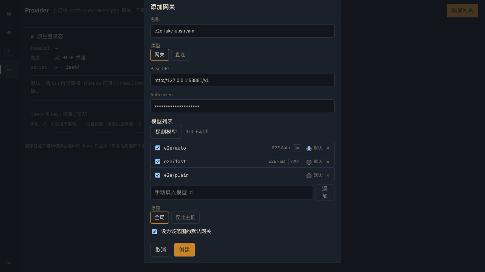
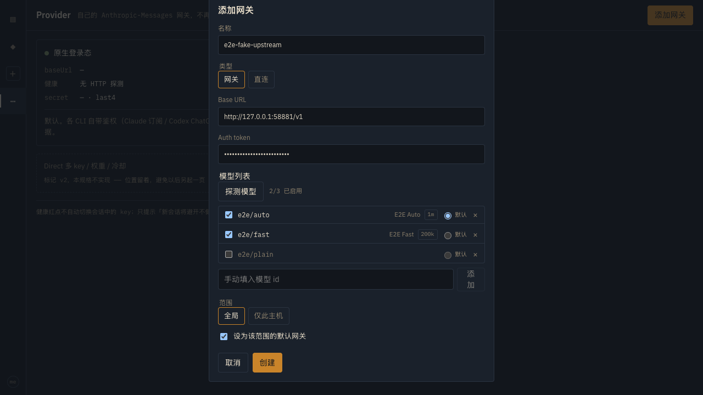
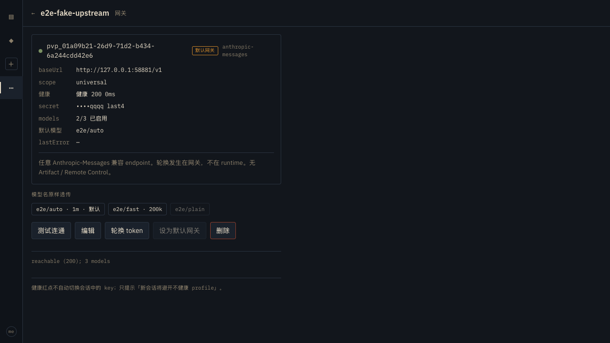
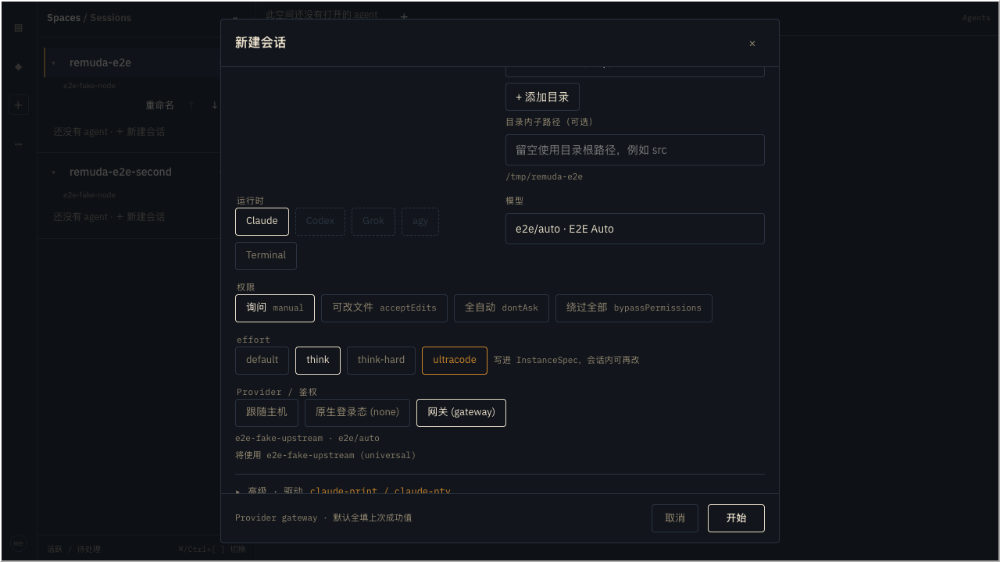
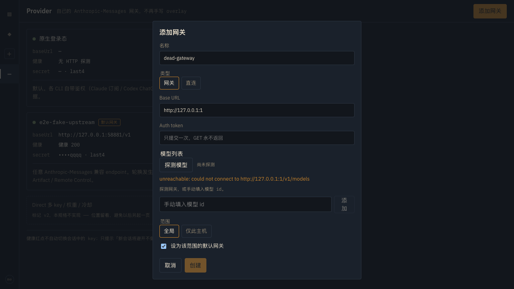

# Provider profiles 2 — model discovery

Date: 2026-09-13. Isolated `remuda-hub --example hub_e2e` on `127.0.0.1:58880` with the Playwright web server on `127.0.0.1:58889` (not the live demo ports). Data dir was a throwaway `tempfile` folder (not committed). No real gateway was contacted: the harness starts a **fake Anthropic-Messages upstream** on `127.0.0.1:58881` that serves a fixed `/v1/models` catalog. Every token below is a fake literal.

Follows up on [providers-1.md](./providers-1.md), which left the model list as a plain textarea. Feedback: 「模型列表应当支持探测，而且 list 不能是纯 text」.

## Fake upstream

`crates/remuda-hub/examples/hub_e2e.rs` serves, for `GET /v1/models` only:

```json
{"data":[
  {"type":"model","id":"e2e/auto","display_name":"E2E Auto","context_window":1048576},
  {"type":"model","id":"e2e/fast","display_name":"E2E Fast","context_window":200000},
  {"type":"model","id":"e2e/plain"}
]}
```

## Discovery before the profile exists

`POST /v1/providers/discover {baseUrl, token}` — no profile saved yet. The Hub probed the fake upstream, normalized the catalog, and returned `{ok: true, reachable: true, status: 200, models: [...]}`. The e2e asserts the response body does **not** contain the submitted token.



Each row shows the id, the gateway's display name, and a context chip (`1m` for the 1,048,576-token window, `200k` for 200,000). The Hub also tags a ≥1M window `1m`; the row renders that fact once rather than printing `1m` twice. A first probe badges nothing 新增 — "new" only means new relative to a catalog that already existed.

## Checklist, default, and manual entry

Unticking `e2e/plain` leaves it listed but dimmed and drops it from the enabled count (`2/3 已启用`). The radio marks `e2e/auto` as the default; a disabled model's radio is disabled, and unticking the current default hands it to the next enabled model. The chip input below the list adds an id by hand for gateways that list nothing (Enter adds a chip and does not submit the form).



Saved profile: `models` is a structured array, `defaultModel` is `e2e/auto`, and the detail page shows `2/3 已启用` with the disabled model dimmed. The token renders only as `••••qqqq`.



`POST /v1/providers/{id}/test` on the same profile reported `reachable (200); 3 models` — `/test` and `/discover` share one probe and return the same normalized shape.

## Re-probing an existing profile

**编辑** pre-checks the saved models. **探测模型** with no retyped token sends `{profileId}` instead, so the Hub reuses the stored secret. After the re-probe the count is still `2/3 已启用`, no row is badged 新增, and `e2e/plain` stays unticked — a re-probe never silently re-exposes what the operator hid.

## New Session consumes the enabled list

With `delegation=gateway`, the model field is a picker holding exactly the two enabled models (`e2e/plain` is absent), prefilled to the profile's `defaultModel`.



## Unreachable gateway

Probing `http://127.0.0.1:1` reports the failure inline under the button and leaves the list empty; nothing is saved.



## Legacy migration

Profiles written before this change stored `models` as `["id", …]`. Reads accept either shape, and opening the database rewrites legacy rows in place as `{id, enabled: true}` so old profiles keep working and migrate once. Covered by `a_legacy_string_catalog_migrates_to_structured_rows`, which writes the pre-migration string form straight into SQLite, reopens the Hub, and asserts both the REST view and the stored column.

## Tests

- Hub (`cargo test -p remuda-hub`, 109 passed): `discover_normalizes_both_upstream_shapes_without_echoing_the_token` (Anthropic + OpenAI shapes, `1m` tagging, token forwarded but never echoed), `discover_reuses_a_saved_profile_token_and_test_returns_the_same_shape`, `discover_requires_auth_a_base_url_and_reports_unreachable` (401 without a device, 400 on a bad/missing base URL, 400 when the token is smuggled into `headers`, 404 on an unknown profile, unreachable vs. reachable-but-401), `structured_models_round_trip_and_default_model_must_be_enabled`, `a_legacy_string_catalog_migrates_to_structured_rows`, plus 6 `provider_models` unit tests.
- Web (`pnpm test`, 220 passed): `ModelList`/`ProviderForm` discovery, checklist, inline error, edit-mode pre-check and new-model badge, manual chip input, default retargeting; `model.ts` normalization, legacy migration, `mergeDiscovered` and context chips.
- e2e (`pnpm run test:e2e:hub`, 10 passed / 1 skipped): `providers-discovery.spec.ts` (both tests above, against the real Hub and the fake upstream) plus the mock-mode flow in `providers-bots-settings.spec.ts`.
- `cargo fmt --all`, `cargo clippy --workspace --all-targets --locked -- -D warnings`, `pnpm lint` (4 pre-existing warnings, unchanged), `pnpm exec tsc -b`, `./scripts/ci/secret-scan.sh` — all clean.
