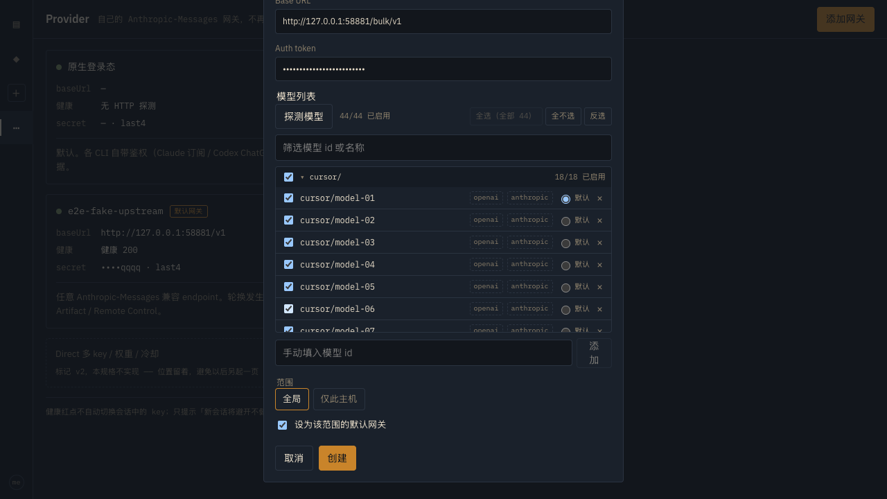
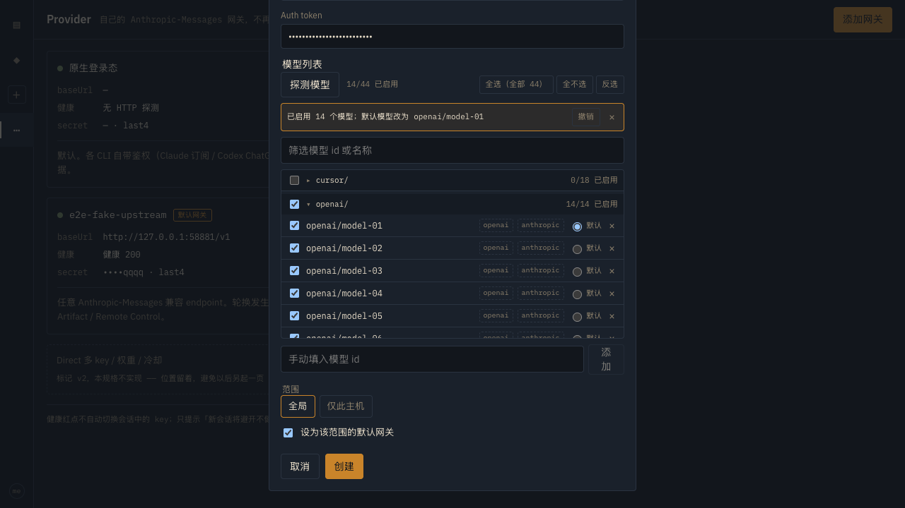
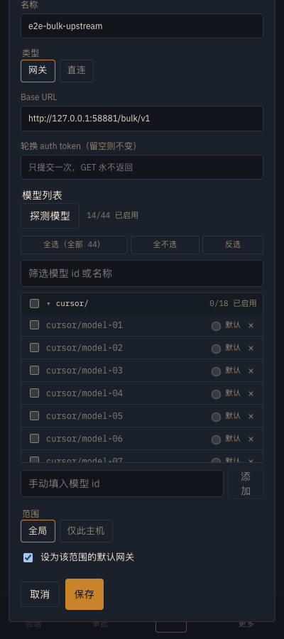

# Provider profiles 3 — bulk selection and prefix groups

Date: 2026-09-14. Isolated `remuda-hub --example hub_e2e` on `127.0.0.1:58880` with the Playwright web server on `127.0.0.1:58889` (not the live demo ports). Data dir was a throwaway `tempfile` folder (not committed). No real gateway was contacted: the harness's **fake Anthropic-Messages upstream** on `127.0.0.1:58881` now also answers `/bulk/v1/models` with a 44-id catalog. Every token below is a fake literal.

Follows up on [providers-2.md](./providers-2.md), which landed discovery, search and prefix groups. Feedback, with a screenshot of a 302-model list: 「这里我需要一个全选/全不选，和分组开启关闭的功能，300+个模型筛选起来太费劲了」. The same screenshot showed the second defect: on long ids the trailing `×` wrapped onto its own line.

## The 44-model fixture

`bulk_catalog()` in `crates/remuda-hub/examples/hub_e2e.rs` serves 18 `cursor/`, 14 `openai/` and 12 `anthropic/` ids under `/bulk/v1/models`. Both surfaces get the **same** body, unlike the 5-id `/v1/models` fixture — the union is then exactly those 44 in one order however the two concurrent probes interleave, which is what keeps the spec deterministic on the Linux runner (the failure mode x-prov3 hit in 26b1cc1). The original per-header fixture is untouched, so the providers-2 assertions still hold.

## Bulk controls



The header carries 全选 / 全不选 / 反选 beside the 「44/44 已启用」 counter. All three act on the **currently filtered** rows, and the select-all label says which set that is: 「全选（全部 44）」 unfiltered, 「全选（筛选结果 14）」 under a search. They are ordinary buttons, so Tab reaches them and Enter/Space fires them; a button whose action would change nothing (select-all with everything already on, anything at all with an empty result) is disabled rather than silently inert.

The e2e clears all 44, searches `openai/`, and selects the 14 matches: the count goes to `14/44`, `openai/` reads `all` and `cursor/` still reads `none`. A filtered select-all never reaches a row off screen.

## Group headers

Each prefix group gets a header row with a tri-state checkbox, the group key, a 「12/15 已启用」 count, and a collapse toggle. The box and the toggle are separate hit targets: one flips 18 models, the other only folds them away. `triState` reports `all` / `some` / `none`; `some` renders as the indeterminate box (a DOM property React cannot set from JSX, hence the small `TriBox` wrapper).

Under a search the group keeps its header but lists only matching rows, and **the count follows the filter** — a header must not claim rows the operator cannot see. Toggling a filtered group therefore touches only the matches: with `gpt` typed, `cursor/` reads `0/2`, and ticking it enables `cursor/gpt-5` and `cursor/gpt-5-mini` while `cursor/sonic` stays off.

A group of exactly one model *whose key is that model's id* renders as a plain row — a `1/1 solo` header over a single `solo` row is noise. A prefix group that happens to hold one model (`cursor/` with only `cursor/e2e-wide`) keeps its header, since more ids can arrive on the next probe.

Collapsed keys persist per profile in `localStorage` under `runtime.provider-model-groups` (`{profileId: [key, …]}`), read during render rather than in an effect so switching profiles never paints the wrong shape first. An unsaved profile uses the key `new`. Storage is cosmetic: a device that denies it still gets a working list with every group open.

## Undo



One undo entry covers the last bulk action — group toggle or header button, not row-by-row edits, which are cheap to reverse by hand. The notice names what happened (「已停用 cursor/ 的 18 个模型」) and, when the action moved the default, says so too: 「已启用 14 个模型；默认模型改为 openai/model-01」. 撤销 restores both the catalog and the default in one step.

## Row layout

The reported wrap is fixed: `.modelRow` is `flex-wrap: nowrap`, the id is the only flexible part, and 默认/× sit in a `flex: none` trailing group pinned right. The id is **middle**-truncated — the head ellipsizes, the last 10 characters always render — because ids in one family differ in their tail (`…seed-1-250918` vs `…-251120`); an end-truncated column would show identical prefixes. The full id is the row's `title`.



At ≤480px the human label and the surface chips are hidden and the bulk row wraps below the counter; the id, its checkbox, 默认 and × still fit one line. The e2e asserts row height <34px and `scrollWidth - clientWidth <= 0` at 400px — no sideways overflow.

## Saving and the default model

Bulk changes go through the **existing** save path: the catalog is form state, and 保存 sends one `PATCH /v1/providers/{id}` with the whole `models` array. No new endpoint, no per-model request, so no Hub change beyond the test fixture.

Every path that can disable a model — a row, a group box, a header button, a removal — settles the default through one `nextDefaultModel(models, current)`: keep the current default while it is still enabled, else the first enabled entry, else `""`. It is applied in the same commit as the catalog edit; doing the two separately is what previously let a disabled model survive as the default across a re-render. The e2e disables everything, re-enables `openai/` only, saves, and the detail page reports `14/44 已启用` with `openai/model-01` as the default. The Hub rejects a default naming a disabled model, so this is load-bearing, not cosmetic.

## Reproducing

```
cd web && pnpm run test:e2e:hub                     # verifies; writes nothing tracked
REMUDA_EVIDENCE=1 pnpm exec playwright test -c playwright.hub.config.ts providers-discovery
```

A default run writes its screenshots to the gitignored `web/test-results/providers-3/`. Only `REMUDA_EVIDENCE=1` rewrites the committed images here, so a plain e2e run leaves the worktree clean (verified with `git status` after both runs). The providers-2 images are re-captured in this commit because the same rows now carry the new controls.

## Tests

- Web (`pnpm test`, 336 passed / 62 files — was 309 / 61): 27 new.
  - `model.test.ts` — `triState` (all/some/none, and an empty set as `none`); `setEnabled` (flips only the named ids, preserves order, and keeps untouched entries referentially identical so a 300-row list does not remount); `invertEnabled`; filtered select-all and filtered deselect; `nextDefaultModel` (keeps a live default, moves off a disabled one, moves off one removed from the catalog, empties when a bulk disable leaves nothing, adopts the first enabled when unset); `splitModelId`.
  - `ModelList.test.tsx` — 11 new against a stateful harness (the list is controlled, so bulk edits only read correctly against a parent that holds the state): scope label text, filtered select-all/none, invert, undo including the default it moved, the 「默认模型改为」 notice, disabled no-op buttons, per-group tri-state and counts, the indeterminate box, group toggle scoped to the group, a filtered group toggling only its matches, one-model groups as plain rows, and collapse persisting per profile across a remount.
  - `groupPrefs.test.ts` — 4 new: round-trip, per-profile isolation, empty lists dropped rather than stored, and junk/throwing storage.
- e2e (`pnpm run test:e2e:hub`, 12 passed / 1 skipped — the skip is pre-existing): new `bulk and group controls tame a 44-model catalog` in `providers-discovery.spec.ts`, plus the two providers-2 tests unchanged.
- Hub (`cargo test -p remuda-hub`, 124 passed): unchanged — the only Rust edit is the example harness's extra fixture route.
- `cargo fmt --all`, `cargo clippy --workspace --all-targets --locked -- -D warnings`, `pnpm lint` (4 pre-existing warnings, unchanged), `pnpm exec tsc -b`, `./scripts/ci/secret-scan.sh` — all clean.
