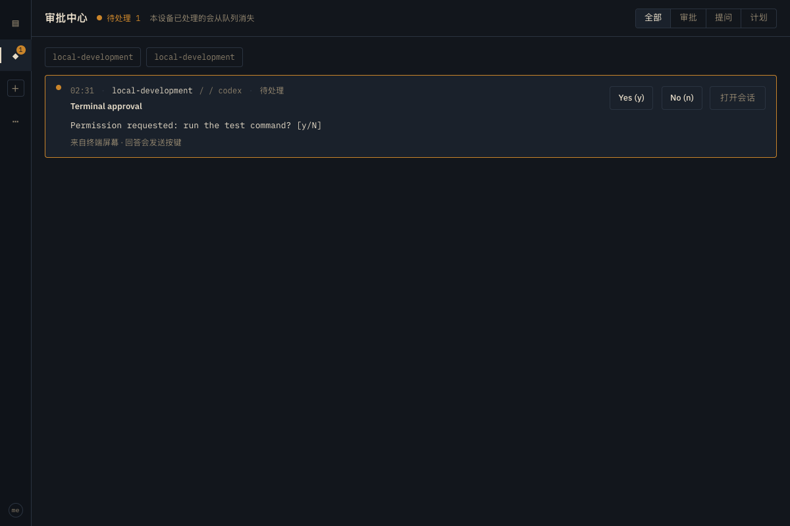
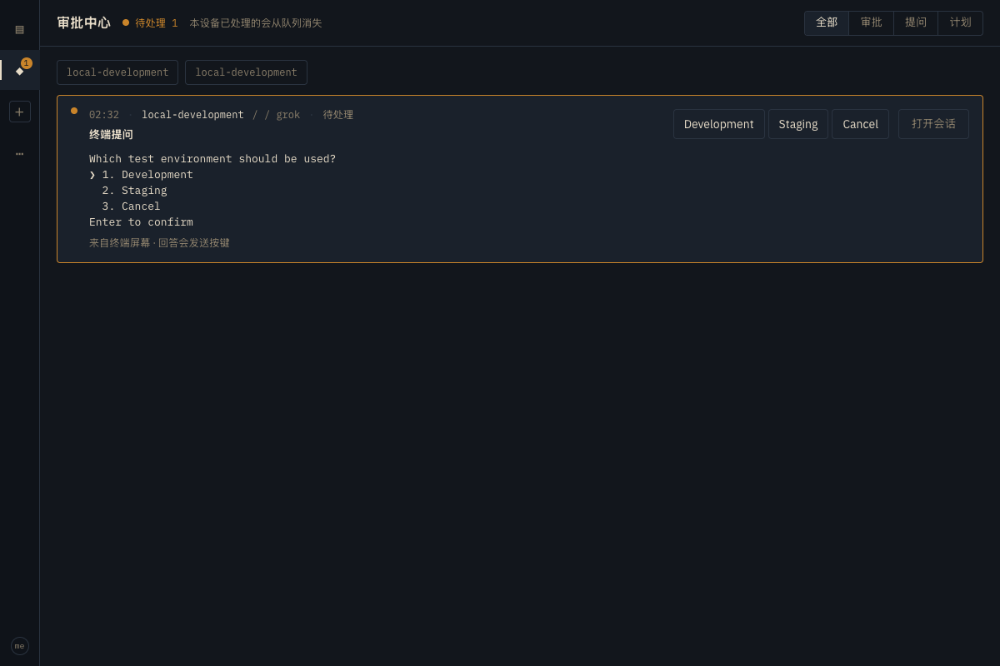

# PTY blocked interaction evidence

Verified on 2026-09-13 (Asia/Shanghai) in the c-blocked worktree, branch
`wt/c-blocked/pty-interactions`, based on `bf6af352594061408868c5d2cd9f49c62e9d2127`.
The checks below used a real Remuda dev Hub, Node, HTTP/WSS transport, CLI,
MCP server and browser, with handwritten fake-herdr native prompts. No model
requests or live Feishu messages were sent.

## Result

Both generic-pty and claude-pty turn a herdr `blocked` status and current pane
screen into an approval/question Interaction. The instance projects as blocked
(`running` lifecycle, `waiting-interaction` activity). An explicit answer goes
through the Node's first-answer-wins broker and the same `agent.send_keys`
transport as `tty.write`. Native clearing produces a resolved Interaction;
an old blocked journal event no longer satisfies a new blocked wait.

The executable used for the dev checks had SHA-256
`c4e54c60d60cc01ac69731ca04cee5dd7ce776883670bae96eda1bec98f7ca63`.
Hub listened on `127.0.0.1:58580`, Node on `127.0.0.1:58587`.
`REMUDA_COOKIE_SECURE=0` was set and login used a private access-code file.
Native homes, workspace, Node data, access code and device tokens were isolated
under a temporary run directory. Credentials and personal paths are omitted
from this report and the screenshots.

## Dev observations

The four approval runs used the exact fixture excerpt:

```text
Permission requested: run the test command? [y/N]
```

| Native kind | Driver | Answer entry point | Blocked wait | Answer | Idle wait | Later blocked wait |
| --- | --- | --- | --- | --- | --- | --- |
| codex | generic-pty | `instance respond --option y` | condition-met | accepted | condition-met | timeout |
| grok | generic-pty | MCP `remuda_instance_respond`, option `n` | condition-met | accepted | condition-met | timeout |
| agy | generic-pty | Hub POST answer, option `y` | condition-met | accepted | condition-met | timeout |
| claude | claude-pty | Hub POST answer, option `y` | condition-met | accepted | condition-met | timeout |

Each run emitted `answer-committed` followed by `resolved`, and left no pending
Interaction for that instance. CLI waits used 5000 ms for blocked/idle and
300 ms for the later blocked check. The CLI also listed the pending ticket
before answering. MCP ran over its actual stdio protocol.

A second Codex instance then produced exactly one approval card while the
original Codex stayed idle. Clicking **Yes (y)** in the browser returned HTTP
200 / `accepted` and emptied the approvals queue.



The question run used a new grok instance and this fixture:

```text
Which test environment should be used?
❯ 1. Development
  2. Staging
  3. Cancel
Enter to confirm
```

The browser displayed Development, Staging and Cancel buttons with IDs 1, 2
and 3. Clicking **Staging** returned HTTP 200 / `accepted`. A direct read of
the owned fake-herdr pane showed `KEYS down enter` and native status `idle`.
The CLI idle wait succeeded, the journal contained `answer-committed` and
`resolved` / `native-cleared`, and the pending queue was empty.



[Redacted machine-readable results](pty-blocked-1-results.json) record the
instance/interaction IDs, answer channels, excerpts, state transitions and
browser results. Both screenshots were visually inspected. All fixture
instances were closed and the two owned dev/fixture processes were stopped
after verification.

## Automated verification

The per-agent target directory was used with `CARGO_INCREMENTAL=0`. Commands
below use the Git common directory to avoid embedding a developer home path.

```sh
export CARGO_TARGET_DIR="$(git rev-parse --path-format=absolute --git-common-dir)/../target-c-blocked"
export CARGO_INCREMENTAL=0
cargo fmt --all
cargo build --locked -p remuda-driver -p remuda-node -p remuda-hub -p remuda-journal -p remuda-testing -p remuda-feishu -p remuda
cargo test --locked -p remuda-driver -p remuda-node -p remuda-hub -p remuda-journal -p remuda-testing -p remuda-feishu -p remuda -- --test-threads=2
cargo clippy --locked -p remuda-driver -p remuda-node -p remuda-hub -p remuda-journal -p remuda-testing -p remuda-feishu -p remuda -- -D warnings
cargo check --workspace --all-targets --locked
(cd web && pnpm build && pnpm test && pnpm lint)
./scripts/ci/secret-scan.sh
git diff --check
```

- Rust build, tests and clippy passed: **321 tests passed**, 9 existing live
  model/local binary tests remained ignored. Only touched crates were tested.
- Web build and **91 tests across 32 files** passed. Lint exited successfully
  with two existing `set-state-in-effect` warnings in `NewSessionPage.tsx`;
  that file was not changed. Vite retained its existing large-chunk advisory.
- The workspace all-targets check, formatting, secret scan and
  `git diff --check` passed. Evidence links, result JSON and one trailing
  newline were checked; the registry lockfile contained zero private-registry
  matches and was unchanged.
- `crates/remuda-driver/tests/pty_interactions.rs` covers codex y/n approval,
  grok numbered question, agy Enter-to-continue and claude-pty text question.
  It verifies exact key receipts, no duplicate polling cards, rejection of a
  second answer, and settlement on native idle.
- The same test file creates two Codex and two Claude PTY instances on the
  same host. Their agent names and ticket IDs differ; answering one leaves
  the other blocked, and a ticket from the other instance is rejected.
- `crates/remuda-node/tests/interactions.rs` exercises the actual PTY driver,
  fake-herdr and Hub/Node WSS: invalid option returns 400 without consuming
  the CAS; accepted answer returns 200; same-command retry is idempotent;
  competing answer returns 409; resolved state reaches the Hub; restarting
  the interaction runtime does not resurrect the consumed ticket.
- Shared adapter unit tests cover UTF-8 excerpt bounds, ambiguous duplicate
  menu IDs, exact candidate navigation and rejection of control input.
  Feishu card tests check the native option IDs/labels and excerpt; web tests
  check choice payloads, text replies and disabled controls.

## Reproducing the isolated dev fixture

With the binaries built above, create a short temporary `RUN_DIR`, mode-600
access-code file and isolated `workspace`, `native-home`, `bin` and `xdg`
directories. Populate `bin/{codex,grok,agy,claude}` with version-only executable
stubs. These are used only for discovery/pinning; fake-herdr does not invoke
models. Start the owned fixture and dev processes in separate terminals:

```sh
export XDG_CONFIG_HOME="$RUN_DIR/xdg"
export REMUDA_DATA_DIR="$RUN_DIR/data"
export REMUDA_CLAUDE_CONFIG_DIR="$RUN_DIR/native-home"
export REMUDA_COOKIE_SECURE=0
export REMUDA_HERDR_BIN="$CARGO_TARGET_DIR/debug/fake-herdr"
export PATH="$RUN_DIR/bin:$PATH"
"$REMUDA_HERDR_BIN" --socket "$RUN_DIR/xdg/herdr/sessions/remuda-node/herdr.sock" --script approval
```

```sh
"$CARGO_TARGET_DIR/debug/remuda" dev \
  --hub-listen 127.0.0.1:58580 --listen 127.0.0.1:58587 \
  --access-code-file "$RUN_DIR/access-code" \
  --workspace "$RUN_DIR/workspace" --web-root "$PWD/web/dist"
```

Log in using the access-code file; create each named native kind with the
matching driver, wait for blocked, list with `instance respond <instance>`,
then answer a displayed option. To reproduce the numbered browser case,
close the approval fixture instances, restart only the owned fake-herdr with
`--script question`, and create a new grok instance. Fixtures live in
`crates/remuda-testing/tests/fixtures/pty-{approval,question}.txt`.

## Scope and evidence limits

The excerpt is bounded to 32 lines / 4096 UTF-8 bytes. Empty, truncated or
duplicate-number menus remain visible but unanswerable. Other prompts accept
one nonempty line of at most 1024 bytes with no control characters. Every
reply rechecks blocked status, native state sequence and screen contents.
Changed prompts get new IDs; a possibly written answer is never replayed.
Restarted pending rows without a proven native waiter are unanswerable.

The concurrency check found that old generic names used UUID timestamp
prefixes and old Claude names used a shared host prefix. Both now use fresh
random UUID suffixes, and interaction observation/write targets use exact
pane IDs. This is needed to preserve prompt ownership across instances.

Minimal integration changes outside the drivers cover Node CAS/routing and
instance activity, Hub pending projection/answer routing, journal settlement,
CLI/MCP response entry points, and Feishu/web presentation. Hub list items
retain their existing wrapper while exposing the complete Interaction entity.
NativeTty schema validation is applied before CAS without changing the legacy
Claude print answer schema. The protocol note explicitly replaces its old
prohibition on screen-derived human answers for this requested feature.

These tests prove the Remuda paths against the stated fixtures. They do not
prove recognition of every native CLI version or a live Feishu delivery.
`delivery=written` proves a key transport write; `native-cleared` proves the
old prompt cleared, not that an approved tool succeeded. A separate herdr or
local terminal writer can still change a pane between the check and the key
write; no cross-process atomic input lease is claimed.

## Rebase follow-up (2026-09-13)

The original feature commit `2071fd417b3407b4614e1475678c4ded7ea0e8a9` was
rebased onto `origin/main` at `c0093209ad9e73bd03fe757222cbb0bb93c9292f`.
This includes tty streaming (`677a908`), Herdr reclamation (`052f0ae`),
Claude gateway launch threading (`6b379d8`), and the later Feishu ticket
scoping fix (`12e9967`).

The two text conflicts were resolved by retaining both `pty_resource` and
`pty_interaction` modules, and recording the Claude pane's ownership before
creating its unique agent name and starting the blocked-aware launch. The
raw tty bridge, resource tracker, shell PTY and Node driver factory remain
unchanged from the new main. Interaction routing remains in the Node broker.

Shutdown needed one integration adjustment: both PTY drivers stop their
observation tasks before closing the interaction adapter. Its final
invalidation notification has the same 250 ms bound as main's carrier-close
notification, so a disconnected or stalled optional observer cannot prevent
Herdr resource reclamation. A regression test covers both observer cases
and rejects key writes after adapter closure.

The rebase checks use the existing shared target directory, as requested for
this follow-up, with incremental compilation disabled:

```sh
export CARGO_TARGET_DIR="$(git rev-parse --path-format=absolute --git-common-dir)/../target"
export CARGO_INCREMENTAL=0
export RUSTFLAGS="--cfg remuda_c_blocked_rebase_validation"
cargo fmt --all
cargo check --workspace --locked
cargo clippy --workspace --all-targets --locked -- -D warnings
cargo test -p remuda-driver -p remuda-node -p remuda-hub --locked
./scripts/ci/secret-scan.sh
```

The unused cfg gives this worktree distinct artifact fingerprints within the
same target directory. An earlier shared-target run was rejected because
its Node test executable listed two tests absent from this source and omitted
this branch's PTY broker test, indicating concurrent artifact replacement.

The run with distinct fingerprints passed every gate: **190 tests passed**,
9 existing live/local binary tests ignored, and workspace clippy with zero
warnings. Its output includes this branch's Node PTY broker test and excludes
the foreign tests. Passing coverage also includes blocked-answer isolation,
observer shutdown, Node SIGTERM, raw mouse input, terminal snapshots,
resource reclamation and Hub/Node WSS integration. Formatting, secret scan
and diff whitespace checks passed.

The screenshots and executable digest earlier in this report remain the
original isolated dev evidence; this follow-up validates the rebased source
through compilation, lint and tests, without claiming a new dev screenshot
or live native-model run.
