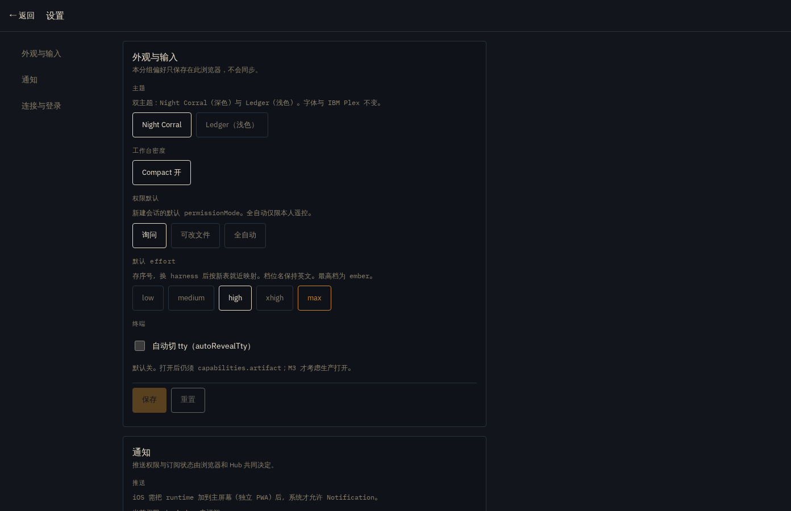
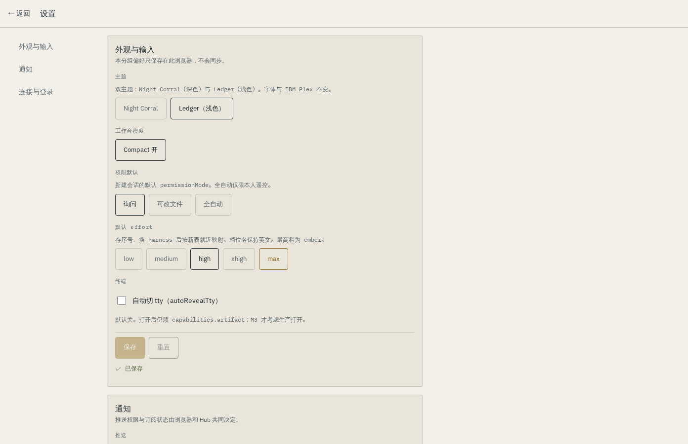
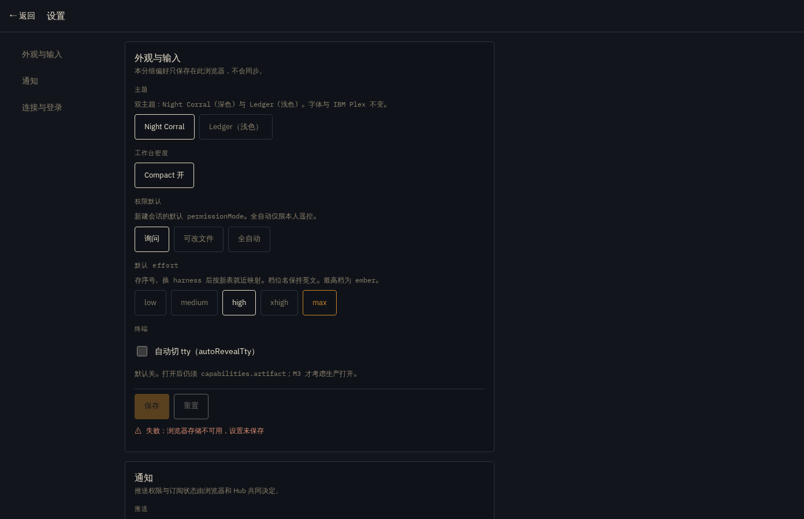
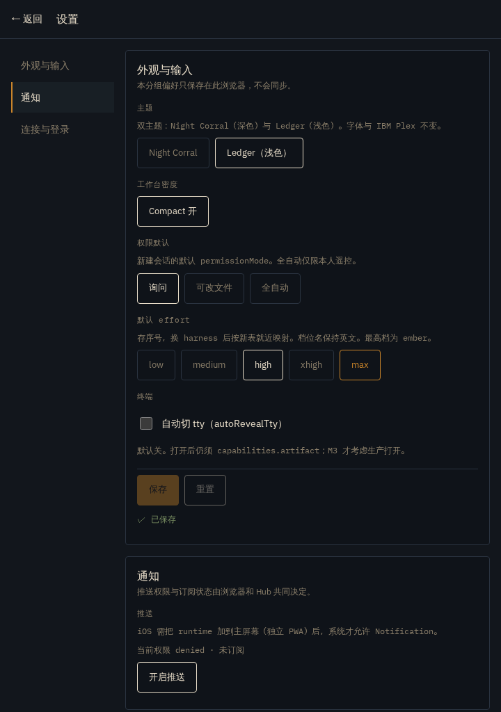
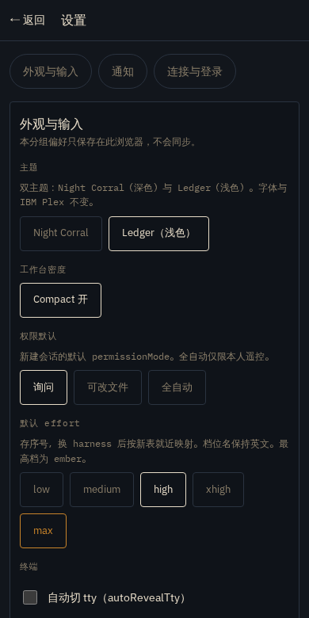
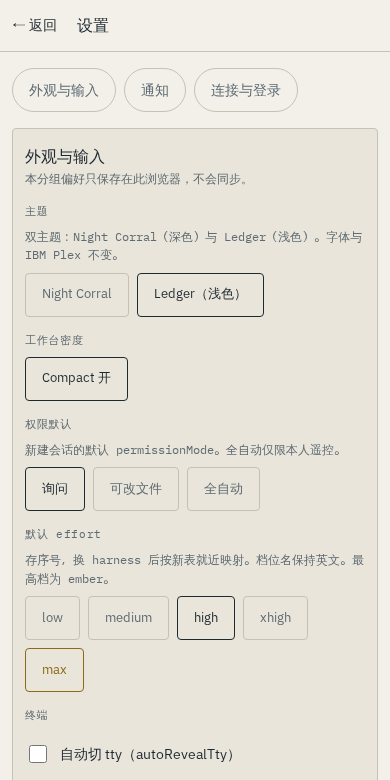

# Workbench F — settings groups, theme/zoom/touch, shared-style consolidation

- Date: 2026-09-14
- Branch: `wt/ux-f/settings-and-tokens`
- Requirement: [workbench-ux-exploration.md](../workbench-ux-exploration.md) §5 **P1-3** and its acceptance row (§5): 双主题、200% 缩放、390/768/1440、触摸模式、焦点可见、设置失败回滚旧有效值、深链/返回有效、不新增默认权限.
- Consumed contracts: the A overlay contract (`components/Sheet.tsx` + `useFocusTrap.ts`) and the C notify interface (`lib/notify.ts`) were both already on `main`.
- All frames below come from the **synthetic in-browser fixture in mock mode** (`VITE_MOCK=1`, Playwright against `127.0.0.1:4177`). No Hub, no real model call, no personal path — capture is clipped to the settings element itself so no Shell inventory can enter the frame. Capture is gated: `REMUDA_EVIDENCE=1 playwright test -c playwright.config.ts ux-settings -g evidence`; a normal run writes nothing.

## What landed

### 1. Anchored groups with real deep links

`/settings` keeps one route (per the plan's risk-table default: 保留路由，锚点分组) and gains three groups:

| Anchor | Group | Contents |
| --- | --- | --- |
| `#appearance` | 外观与输入 | theme, compact, permission default, default effort, autoRevealTty |
| `#notifications` | 通知 | push permission/subscription |
| `#connection` | 连接与登录 | device name, access code, logout, paired devices, pair code, Passkeys, management links |

- The left rail is a real `<nav>`; links are `/settings#<id>`, so a deep link opens, reloads and shares with the group intact. The active group carries `aria-current` and the section receives focus on navigation.
- `← 返回` returns to the originating route when in-app history exists; a direct deep link (`history.idx === 0`) has nowhere to go back to, so it falls back to `/sessions` rather than leaving the workbench.
- Phones get a horizontal chip strip (sticky under the page header) instead of the rail — the 页内分类入口 the spec asks for.
- Hosts, workspaces and Providers keep their own management pages; the "更多管理" list links to them unchanged. The shipped provider bulk select-all / group toggles ([providers-3.md](./providers-3.md)) are untouched.



### 2. Explicit save with three states and field rollback

Persistence was previously an implicit write on every click. Local-only prefs are now drafts inside a group, committed by an explicit 保存, and every save reports its phase in a `role="status"` line:

- **保存中…** — shown for a minimum 450 ms. A localStorage write settles in under a frame, so without the floor the state would be *visited* without ever being *visible*; the saving affordance has to be observable, not merely internal.
- **✓ 已保存** — settles the draft against new committed values; 保存 then disables until another edit.
- **⚠ 失败：<原因>** — persistent (no timeout, never covered by a later success, matching the C1 notification rule), and the rejected **field** rolls back to its last committed value while unrelated edits keep theirs. An empty device name rejects `deviceName` only; a denied theme write rejects only `theme`.

The push toggle has the same cycle; on failure it re-reads `readPushStatus()` so the button can never show a state the browser does not have.





Local-only preferences say so in each group ("本分组偏好只保存在此浏览器，不会同步") — local storage is never labelled as synced.

### 3. No new default permissions

The defaults are byte-for-byte the pre-existing ones from `features/settings/prefs.ts`: `permissionDefault: "manual"`, `autoRevealTty: false`, effort index 2 (`high`), device `this-device`. The storage type still contains `bypassPermissions` for back-compat but the UI offers exactly the same three chips as before (询问 / 可改文件 / 全自动) — there is no fourth option. A unit test pins all of this.

### 4. Theme

Both palettes already existed in `tokens.css`; only the switch was missing ("v1 无浅色开关" is gone). The choice is stored under `runtime.theme.v1` (this browser) and applied to `<html data-theme>`. Ledger additionally sets `color-scheme: light` so native form controls and scrollbars follow the surface. Fonts, radius and the brand accent are unchanged.

### 5. Shared-style consolidation (additive/token-level only)

`styles/tokens.css` and `styles/ui.module.css` had one writer in this wave (F), so the scattered 10/11/12 px text and 32/40/44 px targets are now driven by tokens:

- New tokens (all additive): `--text-lg/-body/-aux/-label` (16/14/12/11), `--space-1…5`, `--touch: 44px`, `--focus-ring/-offset`, and a per-theme `--danger-strong` for status text that has to read on either ground.
- Every settings control sits on `--touch`. `ui.module.css` keeps desktop density exactly as it was and only promotes `.btn*` and `.chip` to 44 px inside `@media (max-width: 767px)`; `.touchTarget` is added for opt-in callers. Existing class names and desktop rendering are unchanged.
- Space chips (`features/spaces/spaces.module.css .chip`, the phone's primary space switcher) go 32 → 44 px at **all** widths, and ActionSheet buttons go 40 → 44 px. The 10 px-only meta/count/hint texts move to the 11 px `--text-label` token; important status text was never at 10 px.
- Hit areas, not glyphs, grew: a 28 px close icon keeps its visual size inside a 44 px target where touch applies.







## Verification

- **Unit** (`pnpm --dir web test`): new `pages/SettingsPage.test.tsx`, 13 tests — group rendering and nav hrefs, deep-link `aria-current` + section focus, back-to-origin vs. direct-link fallback, the three save phases, field rollback (denied storage and invalid name), push rollback, reset, unchanged passkey/management sections, and the pinned "no new defaults" row. Full suite: **612 passed**.
- **E2E, mock mode** (`playwright.config.ts`): new `tests/e2e/ux-settings.spec.ts` — deep-link/back, anchor navigation, 保存中→已保存 with reload persistence, 失败 + rollback with the failing write injected at the `Storage` boundary, empty-name rejection; 390/768/1440 with no sideways overflow; **200 % zoom** modelled through the CDP device-metrics override (1440 physical → 720 CSS px at dsf 2; the spec is chromium-only and skips on webkit); both themes; 44 px targets measured with `boundingBox()` on real buttons. `mobile-qa.spec.ts` gains Space-chip and ActionSheet 44 px measurements. All hit-area assertions read layout boxes rather than CSS declarations.
- **E2E, hub-live** (`playwright.hub.config.ts`): full suite run once under `flock`; the passkey and pairing specs exercise the kept Passkeys section and paired-devices/pair-code rows unchanged.
- Existing `providers-bots-settings.spec.ts` assertions (device name default, iOS hint, Night mention, autoReveal off, permission chip, push) keep passing under the new layout, and `composer-effort.spec.ts` still drives the settings effort chips into the new-session slider.

## Reproducing

```bash
# unit
pnpm --dir web test
# mock-mode browser checks (both projects)
pnpm --dir web exec playwright test ux-settings mobile-qa
# refresh the committed frames only
REMUDA_EVIDENCE=1 pnpm --dir web exec playwright test ux-settings -g evidence --project=chromium
```
