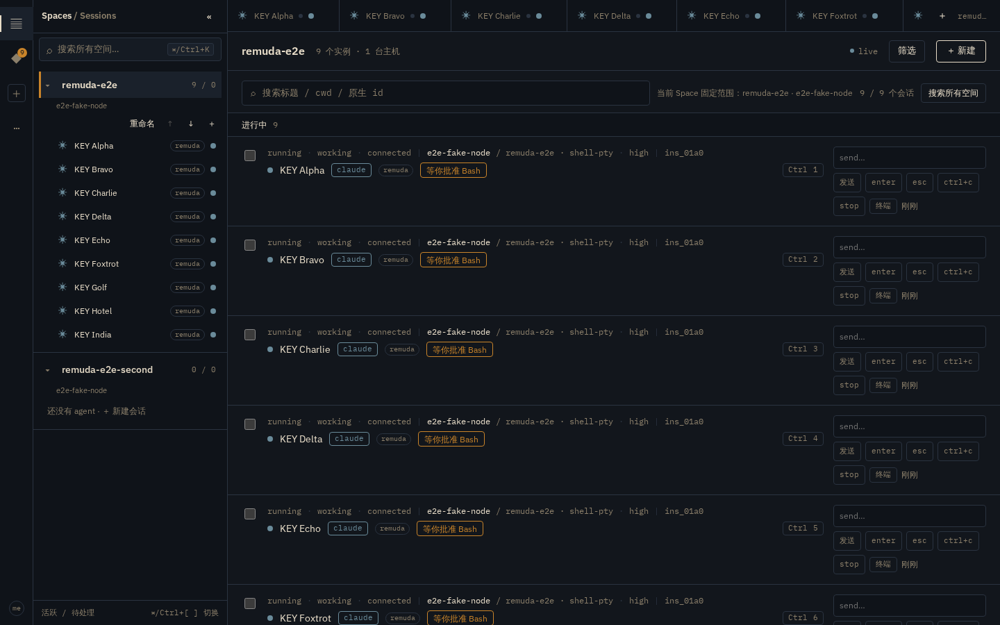

# Workbench — hold-modifier session switch (⌘/Ctrl + 1–9 badges + hint)

Owner nit: 「这种 tab 切换我觉得不错，按住 command 之后才显示，按数字键可以快捷切换」。
Branch `wt/ux-keys/cmd-number-switcher`, base `origin/main` = `9df9099`.

All browser verification runs against the in-process **fake node** in
`crates/remuda-hub/examples/hub_e2e.rs` through `playwright.hub.config.ts`,
with `playwright` driven over the shared `ws://127.0.0.1:3177/` browser
server. No real model, no real PTY; all sessions in the screenshot are
synthetic "KEY Alpha…India" fixtures.

## What the interaction is

The ⌘/Ctrl+1–9 switch already existed as a bare handler in `Shell.tsx`; what
was missing was any way to *discover* it. The addition is visual only on top
of the existing behaviour:

1. **Hold to reveal.** While the platform-primary modifier is held, the first
   nine rows of the current Space's tab ordering show a small trailing-edge
   badge "⌘ 1"…"⌘ 9" (macOS) or "Ctrl 1"…"Ctrl 9" (Windows/Linux). Releasing
   the modifier hides every badge; the reveal fades in over 80 ms.
2. **Permanent, discreet hint.** The list footer always shows
   「按住 ⌘ 快捷切换」/「按住 Ctrl 快捷切换」 on a desktop with at least two
   tabs. Touch platforms (iPadOS/iOS/Android) and the ≤767 px phone layout
   show neither hint nor badges — there is no held-modifier flow there.
3. **Accessibility without the hold.** The badge itself is `aria-hidden`;
   instead each numbered row link permanently carries
   `aria-keyshortcuts="Meta+3"` / `"Control+3"`, so a screen reader learns
   the shortcut without the user discovering (or being able to perform) the
   hold gesture.



## Why the badge and the action cannot disagree

The prior handler indexed `workbench.tabs[Number(key)-1]` — the tab strip —
while the session list paints a **status-grouped** view
(待处理 → 进行中 → 最近 → 已退出). The badge the brief asks for would
therefore have been painted on rows in a different order than the action:
holding ⌘ over the board would show "⌘ 1" on a row that ⌘1 did not open.

Both sides now resolve digits through one pure helper,
`web/src/lib/sessionSlots.ts`:

```
switchSlots(activeSpace, prefs) === visibleTabs(space, prefs).slice(0, 9)
```

— the Space's instances in their stable tab order (createdAt, then id),
minus dismissed tabs (a blocked dismissed tab resurfacing still claims its
original position, exactly as the tab strip shows), capped at nine. The
Shell keydown handler calls it at keypress; the SessionList calls it once
per render and attaches `aria-keyshortcuts`/badge content from the
resulting id→slot map. Filters and status groups only change *where* a
slotted row is painted, never its number.

## Platform detection, once (`web/src/lib/platform.ts`)

Components do no UA sniffing. One module detects, one cached
`PlatformInfo` is consumed:

- `navigator.userAgentData?.platform` first, `navigator.platform` fallback;
- macOS → Meta/⌘/`Meta+n`; Windows/Linux → Control/Ctrl/`Control+n`;
- iPhone/iPad/iPod/Android and the iPadOS desktop-Mac masquerade
  (`MacIntel` + `maxTouchPoints > 1`, the same tell `lib/pwa.ts` already
  uses), plus legacy `Linux armv*` Android WebViews → `touch`, where
  `heldModifiersSupported` is false and every consumer renders nothing;
- `primaryModifierHeld(event)`, `modifierBadgeText(slot)` and
  `modifierAriaShortcut(slot)` render the glyph/token consistently in the
  badge, the footer hint and the aria attribute. Tests inject the platform
  via `detectPlatform({...})` / `setPlatformForTest(...)`; an e2e spoofs the
  macOS UA through `addInitScript`.

## Robustness of the hold gesture (`web/src/lib/useModifierHeld.ts`)

- `window` **blur clears** the gesture — releasing ⌘ over another window or
  browser chrome never sends keyup to the page, so without this the badges
  stick forever.
- Auto-**repeat** modifier keydowns are idempotent; keyup of either
  modifier settles a chord.
- **IME composition** is ignored (`isComposing`, `"Process"`, keyCode 229).
- Focus inside `input/textarea/select/[contenteditable]/.xterm` hides the
  badges even while the key is physically down (recomputed on capture-phase
  focus/blur), reusing batch A's `keyboardScope` guard. The digit handler
  applies the same guard to the keystroke target. QuickFind's ⌘/Ctrl+K is
  unaffected: different key, and when the finder input owns focus the guard
  blocks digits too (asserted in e2e).

## Routes

The handler previously armed only on `/sessions`; it now arms on every
desktop session route where the behaviour makes sense (`isSessionRoute` =
`/sessions`, `/sessions/*`, `/s/:id…`), except `/sessions/new`. On
`/s/:id` the list is not visible but switching tabs by number is the same
primitive; ⌘B and ⌘[ / ⌘] behaviour is untouched. At phone widths the
listener never attaches.

## Files

- `web/src/lib/platform.ts` (+ test): platform detection and glyph/token
  helpers.
- `web/src/lib/useModifierHeld.ts` (+ test): the hold state.
- `web/src/lib/sessionSlots.ts` (+ test): the shared 1–9 ordering.
- `web/src/lib/keyboardScope.ts`: additive `isTypingFocusActive` export.
- `web/src/features/session/SessionList.tsx` + `.module.css`: badge,
  permanent `aria-keyshortcuts`, footer hint (styles added at module tail;
  `styles/ui.module.css` untouched).
- `web/src/app/Shell.tsx`: shared ordering + keyboardScope guard; route
  scope widened to session detail.
- `web/tests/e2e/ux-keys.hub.spec.ts`: the five hub-backed scenarios.
- `web/playwright.hub.config.ts`: `testMatch` in array form so the
  `.hub.spec.ts` suffix is picked up without touching the historical
  per-file regex.

## Verification

- `pnpm --dir web lint`: clean (the six remaining oxlint warnings are all on
  pre-existing files).
- `pnpm --dir web exec tsc -b`: clean.
- `pnpm --dir web test`: 674/674 unit suites green, including new cases for
  the platform (Mac/Win/Linux/iPad/Android), the hook (hold/release, blur,
  repeat, IME, typing-focus, touch, disable) and the slot ordering
  (cap at nine, dismissed tabs, blocked resurface), plus SessionList cases
  asserting the visible-row/group-order distinction and both platform
  glyphs.
- `pnpm --dir web run test:e2e:hub` under `flock /tmp/remuda-agents/e2e.lock`
  with the fake node: **the five ux-keys scenarios pass (5/5)** in both a
  standalone file run and the full serial suite. The full suite was observed
  with one unrelated failure (`providers-discovery` gateway probe), a known
  host-contention flake on this shared devbox — it passes in isolation
  (`-g`, 1/1) and never touches the surfaces changed here.
- `./scripts/ci/secret-scan.sh`: clean.

Test-isolation note: the hub config runs every spec against one serial Hub
whose fake node ships `maxInstances 8`, and some earlier files intentionally
leave sessions live (e.g. `spaces-hub-live` has no cleanup). The spec's
`beforeAll` therefore sweeps the board with `?force=1` deletes and waits for
three consecutive empty reads, and raises the fixture cap to 32 for the run
(the same technique `ux-status.spec.ts` uses), restoring 8 in `afterAll`.
The wire list field is `instanceId`, not `id`.

## Out of scope

- No change to tab order, dismissal, grouping or filtering semantics.
- No badge on the phone drawer's SpacesPanel session rows (batch D's file);
  touch has no hold gesture.
- Numbering stays capped at nine. There is no ⌘0 or second-page convention.
