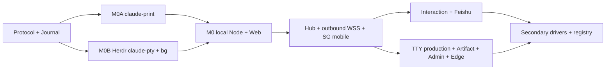

# Remuda Phase 0 实施计划 v0.2（Rust，PR 粒度）

> 状态：可直接派工，2026-09-12。本文只规划 M0–M4；M4 通过 release gate 后才称 Phase 0 完成。  
> 产品：**Remuda**，二进制 `remuda`，仓库目录在改名前继续使用 `hybrid-harness`。  
> 权威顺序：`docs/design/decisions.md` > `docs/design/protocol.md` > 本计划 > `docs/design/ui-spec.md` / `docs/design/proposal.md`。若实现发现冲突，先提交规范与 fixture 的小 PR，再写 adapter，不能在代码里暗藏第二套语义。

## v0.2 changelog

| 相对 v0.1 | v0.2 决定 |
| --- | --- |
| 项目名和后端 | 暂名 `runtime` 改为已拍板的 **Remuda**；Go package 树改成 Rust Cargo workspace，单一生产二进制仍保留。 |
| M0 执行面 | `claude-print` 与 Herdr headless 承载的 `claude-pty` 两条泳道并行；`claude-bg` 与 print 同期完成，显式 attach 通过 Herdr pane 中的 `claude attach`。 |
| Herdr 边界 | Herdr 管 PTY、渲染、pane 和状态信号；`remuda-journal` 自己 tail Claude JSONL；Remuda 持久化完整 launch recipe 并关闭 Herdr 自动 resume，恢复时由 Node 重建。 |
| 权限阶段 | M0/M1 仅允许受限 `dontAsk` 无副作用任务并登记技术债；M2 切到 Interaction broker，print 固定 host+stdio control，hook 只作旁路。 |
| 前端节奏 | 吸收 `ui-spec.md` v0.2 的信息架构、状态和移动算法；因 D-004 更新，M0 增加 dev-only terminal lab，M3 才把终端入口、Artifact 和移动体验 promotion 到生产。 |
| 代码复用 | 明确可 lift 的 vibe-kanban Rust 文件、官方 ACP crate、Codex protocol crates 与 Herdr detect 备用边界，并加入 Apache-2.0/MIT NOTICE 纪律。 |
| M4 备选 | Codex 默认 spawn 用户已安装的 `codex app-server`；增加直接嵌入 `codex-rs` 的评估分支。Claude 手写 wire 漂移时，可启用最小 TypeScript `@anthropic-ai/claude-agent-sdk` sidecar，但不得在活会话中自动换 carrier。 |
| 构建部署 | Go build 改为 Cargo locked build；Hub 使用多阶段 Web+Rust build 后进入 distroless；Node 同时验证 GNU/glibc 2.28 与 musl 静态候选。 |

本次只改写计划，没有创建 Cargo workspace、启动 Claude/Herdr、调用模型、改凭据或部署服务。Rust 1.94.1 / Cargo 1.94.1 与本机 `aarch64-apple-darwin` 来自本轮 `rustc -Vv` / `cargo -V`；这是 bootstrap 默认，不是远端兼容性已通过的声明。

## 0. 结果、已拍板边界与冲突收口

Phase 0 的交付结果是：用户可从手机 PWA 或飞书私聊，通过 SG Hub 选择登记的 Node，启动、观察和控制远端原生 Claude Code；结构化 print 与原生 TUI 都从 M0 起有真实 carrier；Hub、浏览器或 Node WSS 断线不会重放不明输入；AsterGate 是自动化路径的唯一 Anthropic-Messages endpoint；Codex app-server 与 Grok ACP 是 M4 才 promotion 的次级 driver。

以下决定关闭旧文档中的同名待决策：

- Remuda **不是 agent harness，不造 agent loop**。原生 Claude/Codex/Grok 拥有推理、历史、compaction、tools、Workflow、hooks、MCP 与 skills；Remuda 只做进程托管、输入、观察、Interaction、凭据物化和远程 UI。依据：`docs/design/decisions.md D-001–D-003`、`docs/design/protocol.md §0`。
- Claude Code 第一等；跨模型默认由 Claude dynamic Workflow `agent(prompt, {model})` 完成。普通 Agent/Task 的 `model` 仍不得注入任意 gateway ID。Codex/Grok 失败不能降级 Claude 主路径。依据：`docs/design/decisions.md D-002, D-007`。
- 后端固定 Rust：Tokio async runtime，Axum HTTP/WSS，`tokio-tungstenite` Node outbound WSS，Serde wire，SQLite；前端固定 React + TypeScript + Vite + xterm.js。依据：`docs/design/decisions.md D-003`。
- M0 固定两条并行主线：`claude-print` 和 `claude-pty`；`claude-bg` 同期交付。`docs/design/ui-spec.md` 中“M0 只暴露 print/M3 才实现 PTY”的里程碑句，以及 `docs/research/review-consistency.md §5–§6` 中旧的 Go/无 Herdr 建议，被更晚的 `decisions.md D-003, D-004, D-010` 覆盖；UI 的路由、状态投影、单实例双视图、移动交互仍是权威输入。
- PTY 的 Phase 0 生产 carrier 是每台 Node 同 UID 运行的 Herdr headless server；不复制 Herdr server、不把 Herdr socket 暴露到网络，也不把 pane 状态当任务终态。`portable-pty` 只作为隔离测试工具与未来显式 fallback feature，不是 M0 生产 carrier。依据：`decisions.md D-010`、`docs/research/herdr-herdrx.md §0, §9, §12`、`docs/research/pty-driver-spike.md §5`。
- Provider 层很薄：自动化 profile 只指向登记的 AsterGate ingress；Remuda 不复制其 upstream account pool、priority、weight、affinity、cooldown。`native-login` 是人工订阅登录 profile，不是第二个网关。依据：`decisions.md D-007`。
- Hub 固定在 `devbox-sg-host` 的 Docker/Caddy/Cloudflare Tunnel 后；Node 只主动出站 WSS；第一台远端 Node 是 `devbox-sg`，CN 后置。依据：`decisions.md D-006`。
- 飞书首个 dispatcher 固定为独立企业自建 app；M2 由 Hub 管理 `lark-cli event consume` 子进程，不与其它 app 的长连接争抢；Telegram 后置。依据：`decisions.md D-008` 与 `docs/research/bot-dispatcher.md §0–§1`。

Phase 0 明确不做：自研推理 loop、通用 workflow engine、AsterGate 内部账号池管理、多人组织/RBAC、Telegram、agy/Gemini ingress、Desktop 原生壳、多 pane 工作台、在线插件市场、跨 Hub federation、自动 CN↔SG failover、任意文件系统浏览。Herdr 的 102 方法只消费本计划列出的稳定子集。

## 1. 总体实现选择

### 1.1 一个 Rust 二进制，两个长期角色

Cargo workspace 只发布一个业务二进制：

```text
remuda hub       # Axum HTTPS/WSS、auth、索引、dispatcher、嵌入 Web
remuda node      # 原生进程、Herdr client、journal、token broker、出站 WSS
remuda dev       # loopback Hub+Node、fixture/live 本地实验入口
remuda migrate   # 对指定 Hub/Node SQLite 做显式 additive migration
remuda backup    # SQLite online backup + blob manifest + archive encryption
remuda restore   # 只向验证为空的目录恢复，不覆盖现有 DB/blob
remuda doctor    # 只读检查 binary、Herdr、native home、权限、网络和 gate
remuda mcp       # 给已授权主 agent 的本地 stdio MCP server（M4）
remuda instance  # create/send/wait/read/stop 的 machine-readable 薄客户端（M4）
remuda version   # semver、commit、rustc、target、wire/schema major
```

`remuda hub` 和 `remuda node` 来自同一个 `crates/remuda` composition root。测试用 `fake-claude` 是 `remuda-driver` 的 feature-gated bin target，不进入 release image。可选 `sidecars/claude-agent-sdk` 不是第二后端：它只有手写 Claude wire drift gate 触发后才安装，并由 Node 经本地 UDS 托管。

Web 由 pnpm/Vite 构建，`remuda-hub` 用 `rust-embed` 嵌入 `web/dist`。生产容器无需 Node.js；sidecar 若启用则是 Node 主机上的独立、digest-pinned 产物，不塞进 Hub 镜像。

### 1.2 SQLite、blob 与 async 边界

Hub 一份 SQLite WAL，Node 每 Host 一份 SQLite WAL，互不共享文件。Node 保存 Command receipt/dispatch intent、Instance/Run/Interaction、完整 launch recipe、Observation journal、source cursor 和 replication outbox；Hub 保存 durable inbox、跨 Host projection、认证、Provider/Bot 配置、审计与 ACK cursor。大原始对象使用同数据根的 SHA-256 content-addressed blob store，DB 只存 `RawRef`。

选择 `rusqlite` 的 `bundled` 特性，理由是它能直接控制 transaction、WAL checkpoint、busy timeout、online backup 和 fsync 证据，并能为 musl 静态候选编译 SQLite。所有 DB 操作进入每库一个有界 writer actor，使用 `tokio::task::spawn_blocking`；Axum/Tungstenite task 不可持有 `rusqlite::Connection` 跨 `await`，也不可让慢查询堵 Tokio worker。若 M0-06 证明该模型无法满足并发/取消，再以相同 repository trait 评估 `sqlx`；禁止两个 DB stack 同时进入 v0.2。

Node journal 遵循 `protocol.md §5.1`：raw bytes先原子落 blob，再与 Observation、seq、实体 revision、outbox在同一 DB transaction 提交，提交后才 broadcast/ACK。原生 session 是 resume 权威；Remuda journal只负责多设备看到一致的已观察事实。

### 1.3 三个 Claude driver 与 Herdr 分工

| DriverKind | 原生进程 | M0 控制面 | 结构化权威 | TTY carrier |
| --- | --- | --- | --- | --- |
| `claude-print` | `claude -p` 双向 stream-json | `remuda-claude-wire` 持 stdin/stdout，启动即 `initialize` | stdout NDJSON + transcript + Workflow journal | 无 |
| `claude-pty` | 原生 `claude` TUI | `remuda-herdr` 调 `agent.start/prompt/wait/send_keys/read` 和 `events.subscribe` | `remuda-journal` tail transcript/Workflow JSONL；hook只提供路径和旁路事件 | Herdr `terminal session observe/control` → Node WS binary，`representation=rendered-ansi` |
| `claude-bg` | 原生 `claude --bg` job | 首次输入按安全例外 deferred argv；状态来自 `agents --json`/transcript | transcript/Workflow JSONL；job状态只作 lifecycle evidence | 只有用户显式“打开终端”后，Node 在 Herdr pane 运行 `claude attach <native-id>`；普通 `tty.attach` 不会创建或唤醒它 |

三者互斥，同一 Instance 不热切 driver。Herdr pane ID 不是 Instance/native session ID，Herdr `idle/done` 不是 Run success。`agent.read` / `pane.read` 只作诊断或 screen-snapshot；工具、Workflow、批准、终态不得从屏幕字符串推导。

`claude-bg` 仍有不可隐藏的原生限制：首次 prompt 是 positional argv。只允许显式 opt-in、单个被标记为非敏感的 text block；manifest/log 只存 input object ID 与 digest；bot/自动 route默认禁用。Remuda 无法证明任意自然语言“不敏感”，因此 UI 必须展示 OS process-list 暴露风险。attach 是独立有副作用 Command：只有显式用户动作可启动 `claude attach` pane；浏览器刷新、只读 terminal订阅或 Node reconciliation 都不得自动 attach/wake。

### 1.4 接管 Herdr 的两个坑

**结构化缺口。** Herdr 的 rendered screen、`agent_status` 与 OSC title只作可用性信号。M0 安装非阻塞 `SessionStart` observation hook取得 `session_id + transcript_path`；`remuda-journal` 按 file identity/generation/byte offset tail完整 JSONL行，同时 tail `subagents/workflows/wf_*/journal.jsonl`。没有稳定 native ID 时保留两份 partial/opaque observation，不以文本相等去重。依据：`docs/research/herdr-herdrx.md §4, §9, §12`。

**恢复参数缺口。** Herdr `session.json` 不保存 `--settings`、env 或原始 argv，内建 restore会硬编码 `claude --resume <id>`。Node 因而持久化 `LaunchRecipe {binary path/version/digest, argv template, cwd, controlled env names/sources, settings object/digest, nativeHomeRef, ProviderSelection/credentialVersion, permission preset, carrier, native session}`；secret值与 prompt正文不进 recipe。生产 Herdr配置固定 `resume_agents_on_restore=false`。restore时 Node必须先取得owner fence、证明旧进程不存在、重新物化同一recipe并以完整flags + exact native `--resume`启动；不重放 prompt。进程是否仍活不明时保持 `unknown`，不建替身。依据：`docs/research/herdr-herdrx.md §6.1–§6.3`。

### 1.5 传输和安全基线

- Browser→Hub：same-origin HTTPS + Secure/HttpOnly/SameSite cookie；一条 WSS 复用 JSON-RPC control、snapshot/follow、object和TTY binary；PWA离线只缓存壳，不排队 mutation。
- Node→Hub：`tokio-tungstenite` + rustls主动连接 `wss://<hub>/node/v1/connect`；首请求仍为protocol定义的 `runtime.hello`。品牌改名不在v1擅改wire method。连接断开只改connectivity，不杀原生进程。
- Node enrollment：一次性短期 bootstrap token换每Host独立256-bit Node token；Hub只存verifier。长期token不进URL/argv；Node用0600文件或OS keychain。
- Provider、飞书、Cloudflare secret持久层只存 `secretRef`/envelope密文；Hub master key来自宿主0600只读文件。Claude优先通过Node本地0600 UDS `apiKeyHelper`取短租约；Codex/Grok无helper时仅注入专用native child env，不进入Hub/Node父进程env。
- Herdr server、Node和其agent panes同UID；Herdr UDS目录0700/socket0600，不做TCP转发。所有公网身份、scope、CSRF与owner fence在Remuda验证。
- launch目录0700、文件0600；argv/env审计只保留redacted值与digest。HTML Artifact使用独立origin+sandbox；rendered ANSI只进xterm，不进普通DOM。

### 1.6 权限分阶段，不把 M0 临时值带进生产

M0/M1 的技术债编号为 `TD-M0-PERM-01`：仅loopback/LAN受控演示与M1无副作用read-only canary可用 `--permission-mode dontAsk --permission-prompts none`；不允许bot、不允许写任务、不允许把工具拒绝误报成成功。print仍必须完成 `initialize` 控制握手，以便wire接口从第一天稳定。该债由M2-02/M2-03关闭；CI届时禁止非dev profile出现 `dontAsk`。

M2 起 `claude-print` 固定：

```text
--permission-mode default
--permission-prompts host
--permission-prompt-tool stdio
--input-format stream-json
--output-format stream-json
```

先完成 `control_request.initialize`，stdin保持打开；`can_use_tool` 中普通工具变approval，`AskUserQuestion`变问题表单，均以request ID + tool-use ID进入同一Interaction broker，allow返回完整`updatedInput`。M2 print路径的PermissionRequest hook只观察，不能成为第二responder。

`claude-pty` / `claude-bg` 的stdin不归stream-json host所有：远程结构化批准只能走经冲突探测的blocking `PermissionRequest` hook；无稳定request ID的TUI提示只显示`answerable:false`，不得按屏幕坐标盲发Enter。所有profile使用显式、可审计的`--setting-sources`列表和Remuda私有overlay；自动化print默认排除未经审核的user hook源，再显式物化需要的MCP/skills/hooks。若有效配置仍包含用户全局Flux `PermissionRequest`（timeout 86400）等第二decision hook，remote approval为unknown并fail closed，不能让它截走broker。依据：`docs/research/claude-interaction-probe.md §0, §5–§6`。

## 2. Cargo workspace 与职责

### 2.1 目标目录

```text
.
├── Cargo.toml
├── Cargo.lock
├── rust-toolchain.toml
├── deny.toml
├── crates/
│   ├── remuda-protocol/
│   │   ├── src/
│   │   ├── schema/v1/
│   │   └── tests/fixtures/
│   ├── remuda-claude-wire/
│   ├── remuda-herdr/
│   ├── remuda-driver/
│   │   └── src/bin/fake-claude.rs
│   ├── remuda-journal/
│   ├── remuda-node/
│   ├── remuda-hub/
│   └── remuda/
├── web/
│   ├── src/{app,pages,features,components,lib,styles,types}/
│   └── tests/e2e/
├── sidecars/claude-agent-sdk/       # optional, default-off
├── deploy/{docker,compose,caddy,cloudflared,systemd}/
├── scripts/{ci,acceptance,canary,dev}/
├── testdata/{claude,protocol,herdr,failures}/
└── docs/{design,operations,research}/
```

Cargo resolver固定v3，edition固定2024，`rust-toolchain.toml`初始pin本轮已安装的1.94.1；`Cargo.lock`对binary workspace提交。所有workspace依赖在根`Cargo.toml`集中pin，生产构建必须`--locked`。crate依赖方向固定为`protocol ← claude-wire/herdr/journal/driver ← node/hub ← remuda`；Hub不能依赖具体driver，Node不能依赖Hub实现。

### 2.2 `remuda-protocol`

职责：把`protocol.md`的branded IDs、`Knowledge<T>`、Instance/Run/Command/Interaction、Observation、Hub↔Node JSON-RPC、TTY/object header、错误码与版本协商固化成无IO类型；生成JSON Schema和TypeScript类型；拒绝重复JSON key、number形态U64与未知成功枚举。

主要依赖：`serde`、`serde_json`（自定义严格deserializer）、`uuid` v7、`time`、`schemars`、`ts-rs`、`thiserror`、`bytes`。不依赖Tokio/Axum/SQLite/vendor SDK。

代码来源：不lift第三方domain model，逐字段实现`docs/design/protocol.md`；只把`vibe-kanban/crates/executors/src/logs/mod.rs`与`logs/utils/patch.rs`当归一化/patch设计参考，不能把其看板类型带入wire。

### 2.3 `remuda-claude-wire`

职责：实现Claude print NDJSON双工、单stdin writer、initialize握手、user echo/partial/result/task/hook事件解析、`can_use_tool`/`AskUserQuestion` response、interrupt与unknown frame保留；只输出vendor-neutral parse event和raw frame，不决定Run成功或写数据库。

主要依赖：`tokio`（process/io/sync/time）、`tokio-util`、`futures`、`bytes`、`serde`、`serde_json`、`thiserror`、`tracing`。parser必须以line-size上限和UTF-8错误显式失败，不能无界buffer。

代码来源：以Apache-2.0的`vibe-kanban/crates/executors/src/executors/claude/{protocol,client,types}.rs`为lift起点，记录源commit`4deb7eca8f381f7cbc1f9d15515a9ab8f8009053`；用`docs/research/claude-interaction-probe.md`已验证的2.1.268帧覆盖其旧行为，并以`docs/research/claude-stream-json-protocol.md §1, §8`补全flags/unknown/Workflow。不得复制其npx钉版本、看板状态或默认bypass策略。

### 2.4 `remuda-herdr`

职责：连接指定session的Herdr UDS，完成NDJSON request/response与event同流分流、`session.snapshot` bootstrap、`events.subscribe`缓冲、agent/pane稳定子集、terminal observe/control子进程桥、rendered-ANSI frame与server/pane epoch映射；绝不把socket开放到网络。

主要依赖：`tokio`（UnixStream/process/io/sync）、`serde`、`serde_json`、`bytes`、`base64`、`thiserror`、`tracing`。终端bridge产出内部byte stream，由`remuda-node`的`tokio-tungstenite` multiplexer封成protocol 32-byte header。

代码来源：按`docs/research/herdr-herdrx.md §1, §3, §6, §9, §12`和`docs/research/cli-help/herdr-api-schema.json`写client，不复制server。`herdr/src/detect`与`herdr/src/detect/manifests`仅在未来`self-pty-fallback`获批时lift；M0不import、不vendor detect。Herdr HEAD证据为`1a7c691559bb6ea8ad366bce68f87f8c3f6db098`，发布version 0.9.0仍需每Host重取binary digest。

### 2.5 `remuda-driver`

职责：定义async`Driver` trait、CallContext/DriverAck、launch materializer、process supervisor、capability snapshot，以及`claude-print`、`claude-pty`、`claude-bg`；M4在同crate增加Codex/Grok adapter。`src/bin/fake-claude.rs`是feature`test-stub`下的测试binary，不随release安装。

主要依赖：`tokio`、`async-trait`、`serde`/`serde_json`、`remuda-protocol`、`remuda-claude-wire`、`remuda-herdr`、`tracing`、`sha2`、`nix`（Unix process identity）；`portable-pty = 0.9.0`只在test与默认关闭的`self-pty-fallback`feature。M4的Grok adapter用官方`agent-client-protocol = 0.8`起步并按实际negotiation gate；Codex默认spawn路径用精简JSON-RPC adapter。

代码来源：Claude部分lift vibe-kanban Claude三文件；Interaction等待/CAS接口参考`crates/executors/src/approvals.rs`；Codex spawn adapter参考`executors/codex.rs`与`executors/codex/jsonrpc.rs`，协议类型对照Codex仓库`codex-rs/app-server-protocol`；ACP参考`executors/acp/{client,harness,mod,normalize_logs,session}.rs`。只liftexecutor机制，不lift其issue/worktree/remote-cloud领域。

### 2.6 `remuda-journal`

职责：Node/Hub SQLite migration、单writer actor、Command账本、append-only Observation seq、raw/blob store、source cursor、Claude transcript/Workflow JSONL tail、projection fold、replication outbox/ACK与online backup；它不启动原生agent。

主要依赖：`rusqlite`（`bundled`, `backup`, `functions`按需）、`tokio`（sync与spawn_blocking）、`serde`/`serde_json`、`notify`或带poll fallback的文件watcher、`sha2`、`zstd`、`tracing`、`thiserror`。文件tail不能依赖notify不丢事件，wake后仍按持久offset读取。

代码来源：实体与顺序只来自`protocol.md §2.5, §5.1, §7`；projection/patch思路可lift Apache-2.0`logs/mod.rs`与`logs/utils/patch.rs`，但event IDs、raw-first、unknown语义必须按Remuda重写。Claude JSONL样本来自`docs/research/cli-help/*.jsonl`，复制进testdata时保存源路径和SHA-256 manifest。

### 2.7 `remuda-node`

职责：组合store、materializer、drivers、Herdr session、token broker、hook UDS、Instance manager、owner fence、reconciliation、outbound Hub WSS；`remuda dev`时还提供loopback-only Axum HTTP/WSS，生产Node不监听网络。

主要依赖：`tokio`、`axum`（仅dev router/health）、`tokio-tungstenite`+rustls、`serde`/`serde_json`、`tower`、`tracing`、`rustls`、`secrecy`、`zeroize`、上述内部crates。每个Instance task通过bounded channel与store/driver交互；WSS reconnect task无权直接spawn第二个native command。

代码来源：不lift Herdrx Go server；连接与恢复按`protocol.md §7`自写。Herdrx只提供行为证据，PTY字节永远经Remuda协议重新鉴权/分帧。

### 2.8 `remuda-hub`

职责：Axum HTTPS/WSS API、单用户auth、Node enrollment/connection、Hub durable inbox、跨Host索引、snapshot/follow/object relay、Interaction投影、Provider/Bot配置、飞书dispatcher、审计与静态前端embed；不import具体native driver。

主要依赖：`tokio`、`axum`/`axum-extra`、`tower-http`、`serde`/`serde_json`、`rust-embed`、`rusqlite`经`remuda-journal`、`argon2`、`cookie`、`tokio-tungstenite`共享frame类型、`tracing`、`secrecy`。飞书首版用受管`lark-cli`subprocess，不把Node SDK/Go SDK拉进Hub。

代码来源：auth/dispatcher不lift参考产品实现；按protocol和bot报告自写。飞书process supervision只参考`docs/research/bot-dispatcher.md`已验证契约：每event key一个consumer、stdin pipe保活、SIGTERM清理、message_id去重、card callback三秒内返回。

### 2.9 `remuda`

职责：唯一composition root与CLI parser；选择hub/node/dev/运维子命令、加载strict config、初始化tracing、安装signal handler并返回machine-readable exit。不得承载driver、DB query或HTTP handler业务逻辑。

主要依赖：`clap`derive、`tokio`、`tracing`/`tracing-subscriber`、`serde`配置、`remuda-hub`、`remuda-node`、`remuda-journal`。release启用panic abort与LTO前必须保留crash evidence路径；stdout JSON与stderr诊断分开。

代码来源：无第三方业务代码；命令契约来自本计划和`protocol.md §8`。

### 2.10 非 Rust 目录与可选 sidecar

| 目录 | 职责 |
| --- | --- |
| `web/src/app,pages` | React Router、AuthGate、Night Corral shell和`ui-spec.md`路由；M0 dev terminal是会话第二视图，不做pane工作台。 |
| `web/src/features/session` | React-free snapshot/follow fold、structured transcript、tool registry、composer和TTY view。 |
| `web/src/features/approvals` | M2 Interaction inbox、CAS表单、双设备终态。 |
| `web/src/features/hosts,providers,bots` | M3 Host/AsterGate/Bot管理；secret始终write-only。 |
| `web/src/lib` | schema生成的client、WSS/TTY/object framing、IME/viewport/PWA/push；可lift Herdrx MIT算法但重接Remuda API。 |
| `web/tests/e2e` | Chromium/WebKit/mobile Playwright，不复制Rust状态机测试。 |
| `sidecars/claude-agent-sdk` | 默认不构建；锁定Node与`@anthropic-ai/claude-agent-sdk`版本的最小UDS adapter，仅在Claude wire drift gate触发后启用。 |
| `deploy/docker` | Web+Cargo多阶段构建、distroless Hub和Node artifact pipeline。 |
| `deploy/compose,caddy,cloudflared,systemd` | SG edge、Hub、Node与Herdr守护模板。 |
| `scripts/ci` | fmt/clippy/test/schema/license/architecture/cross-target/secret gates。 |
| `scripts/acceptance,canary` | 默认stub验收与必须显式`--live`的外部canary。 |
| `testdata` | 脱敏、带来源commit/version/digest的Claude/Herdr/protocol/failure fixtures。 |
| `docs/operations` | install/enroll/drain/upgrade/backup/restore/Herdr恢复与事故runbook。 |

Claude SDK sidecar协议只允许`{launchRef, operation, inputRef, commandId, generation}`等opaque引用；UDS路径位于0700 launch目录，握手使用单次capability，禁止TCP监听。Node仍是Command/Interaction唯一裁决者，sidecar不得拥有自己的重试队列、journal或Hub token。启用时Node把允许的secret env直接赋给该专用sidecar/native child进程，不把secret通过JSON socket传回父进程日志。

### 2.11 许可证与来源保留

- Remuda默认按Apache-2.0工程纪律bootstrap（最终仓库许可证仍列在§16待决策默认项）；任何从vibe-kanban、Herdr或Codex复制/修改的文件保留原copyright/SPDX头，在根`NOTICE`写来源仓库、commit、原路径和修改摘要，并随binary/source distribution带Apache-2.0文本。
- 仅经process/socket调用Herdr不构成代码lift；一旦复制`src/detect`或manifest，就按Herdr Apache-2.0加入NOTICE与源头。Codex git依赖同样保留其Apache-2.0`LICENSE`/`NOTICE`；不得只在Cargo.lock里隐藏来源。
- 从Herdrx复制terminal touch/fit/viewport/Composer算法时保留其MIT copyright/license notice；不逐字复制AGPL claudecodeui。
- `cargo deny check licenses bans sources`、`cargo metadata --locked`和前端/sidecar npm license inventory是mandatory gate。未审查的git dependency、moving branch或npm postinstall脚本不能进release。

## 3. 测试策略（Rust）

1. **Rust单元/属性测试**：每crate table-driven + `proptest`；重点是strict Serde、ID/U64、Command/Interaction状态机、projection、redaction、Herdr/Claude frame parser、SQLite transaction。常规入口为`cargo test --workspace --all-features`；CI另跑`cargo clippy --workspace --all-targets --all-features -- -D warnings`。
2. **Rust假Claude二进制**：`cargo build -p remuda-driver --bin fake-claude --features test-stub`。它回放`docs/research/cli-help/claude-*.jsonl`的脱敏副本，模拟`--version`、print initialize/can_use_tool/AskUserQuestion、partial/bad line、Workflow多result、`--bg` lifecycle/agents/stop/rm、attach TUI和可控crash；不联网、不读真实home。
3. **真实进程边界集成**：测试必须用`tokio::process::Command`、pipe/UDS和临时目录，不能mock掉spawn。killpoint覆盖receipt前、intent后、stdin write后、首assistant byte、tool result和Interaction response write。
4. **Herdr隔离session**：串行测试固定`herdr --session remuda-test`，启动前清除继承的`HERDR_SOCKET_PATH/HERDR_ENV/HERDR_PANE_ID`，使用独立config/data/cwd，关闭auto-resume和manifest update；覆盖snapshot+subscribe、agent start/prompt/wait/send_keys/read、rendered-ANSI full/incremental、detach、server restart与完整recipe restore。finally必须SIGTERM并证明无pane/process/socket泄漏，绝不连接用户默认session。
5. **Web**：Vitest验证React-free fold、gap与unknown；Playwright至少Chromium desktop、WebKit和iPhone viewport，覆盖structured/terminal切换、IME、断线补页、双设备审批、admin和PWA。
6. **Live canary**：普通PR不调用付费模型。只有显式`LIVE_CANARY=1`与脚本`--live --confirm-external-calls`才运行真实Claude/AsterGate/飞书/Codex/Grok；输出只含ID、版本、digest、status和最多前4位脱敏值。
7. **兼容/供应链**：Linux产物在GNU glibc 2.28容器和musl候选分别执行；`cargo audit`、`cargo deny`、lockfile diff、SBOM和NOTICE检查是release gate。

## 4. 协议增量与实现不变量

`protocol.md`的ID、`Knowledge<T>`、Command三态、Interaction first-writer-wins、raw-first Observation、Run completion scope、snapshot/follow、TTY 32-byte header、object transfer、错误码与“不知道”结算全部照抄成schema fixture，不因换Rust重解释。

M0-02必须在wire v1发布前提交三个显式规范增量：

1. `DriverKind`增加**`claude-bg`**（不是v0.1计划里的`claude-background`），launch carrier增加`{type:"claude-bg", inputDelivery:"deferred-argv", argvInputPolicy:"explicit-non-secret"}`；更新所有schema/TS生成/矩阵。
2. `claude-pty`的Phase 0 carrier固定记录Herdr`{binaryPath,version,digest,protocolVersion,serverIdentity,serverEpoch,representation:"rendered-ansi"}`；Herdr重连换streamEpoch且必须以full frame重建，`pane.read`不冒充增量TTY。
3. 区分有副作用的“创建`claude attach`pane”与只读`tty.attach`。前者是显式Command且标明可能wake background job；后者只订阅已经存在的terminal stream，断线/reload绝不触发前者。

Claude SDK sidecar仍使用`driverKind=claude-print`，以`adapterTransport=native-rust-wire|claude-sdk-sidecar`进入CapabilitySnapshot/CanaryKey；同理Codex direct embed若将来promotion，使用不同adapter identity，不能在同一Instance中替换spawn carrier。

Rust实现继续满足：U64在JSON中是十进制字符串；未知enum不能默认成功；同principal+commandId+digest幂等、不同digest冲突；Node intent durable后transport不明禁止native重发；TTY input与Interaction response也遵守相同规则；所有结构化source缺稳定ID时保留opaque/partial。

## 5. 里程碑、规模与合并图

规模：`S`约1–2个专注开发日；`M`约3–5日或跨两个crate；`L`约1–2周或涉及持久协议/driver/前后端。表中每个“验收命令”必须进入该PR CI；`--live`命令只由授权operator手动跑并附脱敏artifact。



M0内部按“协议/账本”“print”“Herdr PTY/bg”“Web”四泳道并行，最后只在M0-15汇合。M1–M4除表中明确可并行外按前置PR执行；任何L级PR若同时改schema、migration、两个driver和UI，必须再拆。

## 6. M0：Rust 骨架 + print / Herdr PTY 双线 + bg + 本地 Web

### 6.1 目标与退出条件

在开发机运行 `remuda dev`，同一个本地 Node 至少创建三个互斥 Instance：`claude-print` 完成 stream-json `initialize → user → result`；`claude-pty` 在隔离 Herdr headless session中启动原生TUI并把rendered-ANSI桥到WebSocket/xterm；`claude-bg`只spawn一次，并在用户显式动作后通过Herdr pane运行`claude attach`。三者的结构化事实都进入同一协议形状的Observation journal，Web刷新/断线后按seq恢复。

M0可以用fake-claude全自动验收；真实Claude canary只跑无副作用、无工具任务。M0不开放公网、不接bot、不声称有远程审批；`TD-M0-PERM-01`保持可见。

### 6.2 两条并行泳道

- **A / print**：M0-02 + M0-03 + M0-04 + M0-06 + M0-07 → M0-08。它不依赖Herdr，可先把control/wire/journal跑绿。
- **B / PTY + bg**：M0-02 + M0-05 + M0-06 + M0-07 → M0-09 + M0-10。它必须使用隔离Herdr session，并验证Node接管restore。
- **Web / local Node**：M0-11与M0-12先按fixture并行，M0-13/14分别接structured和terminal，最后M0-15汇合。

### 6.3 PR 列表

| PR | crate / 目录 | 标题 | 改动范围 | 前置 PR | 可并行性 | 验收命令 | 规模 |
| --- | --- | --- | --- | --- | --- | --- | --- |
| M0-01 | 根目录、`crates/remuda` | Cargo workspace与CI骨架 | 建八个已定crate、edition 2024、toolchain/lock、workspace依赖、`remuda version/dev`空composition root、fmt/clippy/test/deny jobs；不加业务逻辑。 | 无 | 阻塞所有代码PR；文档/CI镜像准备可并行。 | `cargo metadata --locked --format-version 1 && cargo fmt --all -- --check && cargo check --workspace --all-targets` | M |
| M0-02 | `remuda-protocol` | Protocol v1 Rust类型与三个M0增量 | 实现strict Serde、ID/U64、Command/Interaction/Observation、JSON-RPC、TTY header、schema/TS生成；加入`claude-bg`、Herdr carrier和显式bg attach Command。 | M0-01 | 可与M0-03/05/06/12并行；wire review后各adapter才合并。 | `cargo test -p remuda-protocol --test wire_golden && ./scripts/ci/check-generated.sh` | L |
| M0-03 | `remuda-driver/src/bin`、`testdata/claude` | Rust `fake-claude` stub与样本清单 | feature-gated binary回放`cli-help`脱敏样本；模拟print/control、TUI、bg/agents/attach/stop/rm、Workflow多result、bad line和killpoint；生成来源SHA manifest。 | M0-01 | 与protocol/wire/Herdr/journal完全并行。 | `cargo test -p remuda-driver --features test-stub --test fake_cli_contract` | M |
| M0-04 | `remuda-claude-wire` | Claude stream-json双工与initialize | lift并收窄vibe-kanban Claude parser/client/types；实现单writer、bounded NDJSON、initialize、user echo、partial、result、task、unknown、interrupt；M0不实现allow。 | M0-01、M0-02、M0-03 | 与M0-05/06/07并行；M0-08消费。 | `cargo test -p remuda-claude-wire --all-features && cargo test -p remuda-claude-wire --test fixture_parity` | L |
| M0-05 | `remuda-herdr`、`testdata/herdr` | Herdr UDS client与terminal bridge | 实现request/event同流分流、snapshot-before-replay、agent stable subset、events订阅、observe/control rendered-ANSI、epoch/offset/backpressure；固定测试session。 | M0-01、M0-02 | 与M0-03/04/06/07/12并行；阻塞PTY/bg。 | `cargo test -p remuda-herdr && ./scripts/acceptance/herdr-isolated.sh --session remuda-test --fixture-only` | L |
| M0-06 | `remuda-journal` | SQLite journal、blob、tail与launch ledger | additive migration、bounded writer actor、raw-first seq、outbox、Command intent、LaunchRecipe、transcript/Workflow tail、projection fold、crash scan；rusqlite不得跨await。 | M0-01、M0-02 | 与M0-03/04/05/07/12并行；所有driver依赖。 | `cargo test -p remuda-journal && cargo test -p remuda-journal --test crash_matrix -- --test-threads=1` | L |
| M0-07 | `remuda-driver` | Driver trait、materializer与AsterGate薄profile | 实现Driver contract、binary pin、native home、controlled setting sources、0600 overlay、env allowlist、token-broker interface、process identity、`dontAsk` dev preset；持久recipe不含secret/prompt。 | M0-01、M0-02 | 与wire/Herdr/journal并行，联调依赖M0-06。 | `cargo test -p remuda-driver --test materializer && ./scripts/acceptance/launch-secret-scan.sh --mode stub` | L |
| M0-08 | `remuda-driver::claude_print` | `claude-print` driver | spawn绝对Claude binary，完成initialize后才send；把stdout/transcript/Workflow映射到journal；实现resume/cancel/close与native-turn边界；M0权限固定deny/dontAsk。 | M0-03、M0-04、M0-06、M0-07 | 与M0-09/10并行。 | `cargo test -p remuda-driver --test claude_print_process --features test-stub && ./scripts/acceptance/claude-print.sh --binary target/debug/fake-claude` | L |
| M0-09 | `remuda-driver::claude_pty` | Herdr-backed `claude-pty` driver | 以专用pane启动完整launch recipe；用agent.prompt/wait观测、SessionStart hook定位JSONL；terminal bridge接Node；restore关闭Herdr auto-resume并由Node用exact session重建。 | M0-05、M0-06、M0-07 | 与print/bg并行；M0-14可用fixture提前。 | `cargo test -p remuda-driver --test claude_pty_herdr --features test-stub && ./scripts/acceptance/herdr-restore.sh --session remuda-test` | L |
| M0-10 | `remuda-driver::claude_bg` | `claude-bg`与显式attach pane | 实现prepared→首次send deferred argv、job/native ID分离、agents观察、stop不rm；显式open-terminal Command才在Herdr pane运行`claude attach`，只读reattach不wake。 | M0-03、M0-05、M0-06、M0-07 | 与print/pty并行。 | `cargo test -p remuda-driver --test claude_bg_process --features test-stub && ./scripts/acceptance/claude-bg-attach.sh --session remuda-test` | L |
| M0-11 | `remuda-node`、`crates/remuda` | 本地Node HTTP/WSS与多路复用 | `remuda dev`组合Node/store/driver，默认loopback；实现create/send/read/follow、TTY binary、object fixture和dev访问码；driver task有界隔离。 | M0-02、M0-06、M0-07 | router可先对fake driver并行；最终接M0-08/09/10。 | `cargo test -p remuda-node --test local_api && ./scripts/acceptance/node-local.sh --mode stub` | L |
| M0-12 | `web/` | React/Vite/PWA骨架 | 建React Router、Night Corral tokens、React-free store、schema client、session routes、mobile shell、Vitest/Playwright；不引入Cordis/Typert。 | M0-01 | 可与所有Rust core并行；用golden JSON开发。 | `pnpm --dir web install --frozen-lockfile && pnpm --dir web lint && pnpm --dir web test && pnpm --dir web build` | M |
| M0-13 | `web/src/features/session` | 最小结构化会话页 | list/detail、message/tool/Workflow/opaque、三维status投影、composer、snapshot/follow/gap；手机new session仍默认print。 | M0-02、M0-11、M0-12 | 可先用M0-03/06 fixtures；最终依赖print。 | `pnpm --dir web exec playwright test tests/e2e/session-structured.spec.ts --project=mobile-webkit` | L |
| M0-14 | `web/src/features/session/tty` | Dev-only xterm terminal lab | 实现`/s/:id/tty`、32-byte binary frame、rendered-ANSI reset、writer lease、detach、resize；入口只对dev flag和tty-capable fixture显示，不做pane分屏/Artifact。 | M0-02、M0-05、M0-11、M0-12 | xterm可对recorded frame并行；最终依赖M0-09/10。 | `pnpm --dir web exec playwright test tests/e2e/session-terminal-lab.spec.ts --project=chromium` | L |
| M0-15 | `scripts/acceptance`、全workspace | M0双泳道集成与清理gate | 串起fake print/pty/bg、本地Web、journal replay、Herdr server restart/recipe restore、进程泄漏与secret scan；另提供显式live canary。 | M0-01–M0-14 | 最后合并；fault fixtures可从M0-03开始累积。 | `cargo test --workspace --all-features && ./scripts/acceptance/m0.sh --mode stub --herdr-session remuda-test && pnpm --dir web exec playwright test` | L |

### 6.4 M0 手机可演示结果

开发机运行`remuda dev --dev-bind-lan --access-code-file <private-file>`，手机在可信LAN打开会话页：默认创建print会话并看structured transcript；一个预先由dev lab创建的pty会话可切到Terminal看真实Claude TUI；一个bg fixture/无敏感live job可在用户确认argv风险后创建，再显式打开attach terminal。刷新页面只补seq/TTY frame，不产生第二个prompt、pane或job。演示结束脚本按ID清理`remuda-test`，不碰用户默认Herdr session和原生历史。

### 6.5 M0 技术债与禁止项

- `TD-M0-PERM-01`：`dontAsk`只准dev/M1 read-only canary，owner=M2-02，删除门为M2 acceptance中非dev config零命中；不能借它做bot或写文件演示。
- M0 terminal是开发实验面，不表示`ui-spec.md`的生产终端体验已完成；M3前`autoRevealTty=false`，手机新建仍固定print。
- 不依赖Herdr screen推导tool/Workflow/approval/success；不依赖Herdr内建resume；不自动答workspace trust或权限对话框。测试目录预先登记可信，生产未知则阻塞。
- 不传`--bare`、`--safe-mode`、`--no-session-persistence`，不修改用户settings/OAuth，不杀共享Claude daemon，不调用`rm`删除bg transcript。
- 不把fake通过当live通过；真实canary记录binary path/version/digest、Herdr path/version/digest和profile revision。

## 7. M1：Hub、Node outbound WSS、SG 真会话与 PWA

### 7.1 目标与退出条件

`remuda hub`以独立容器运行在`devbox-sg-host`，`devbox-sg`中的`remuda node`主动WSS连接；登录后的手机从HTTPS preview创建一个明确无工具/无审批的真实AsterGate Claude print会话并看到transcript。Hub重启、Node WSS断开、手机切网均不重发prompt。M1只验收SG，CN保持未部署。

### 7.2 PR 列表

| PR | crate / 目录 | 标题 | 改动范围 | 前置 PR | 可并行性 | 验收命令 | 规模 |
| --- | --- | --- | --- | --- | --- | --- | --- |
| M1-01 | `remuda-hub`、`remuda-journal` | Hub durable store与单用户auth | Hub migrations、durable inbox、principal/device/session、Argon2id、cookie/CSRF/Origin、rate limit、audit；生产禁dev bypass。 | M0 | 与M1-02 transport core、M1-05 UI并行。 | `cargo test -p remuda-hub --test auth && cargo test -p remuda-hub --test inbox_restart` | L |
| M1-02 | `remuda-node`、`remuda-hub` | Node enrollment与outbound WSS | 一次性enroll、每Host Node token、`runtime.hello`、heartbeat、ownerFence、nodeEpoch、backoff、wire feature协商；Node生产无listener。 | M0、M1-01 schema | WSS codec可对fake Hub并行于auth实现。 | `cargo test -p remuda-node --test outbound_link && cargo test -p remuda-hub --test enrollment` | L |
| M1-03 | `remuda-node`、`remuda-hub`、`remuda-journal` | Command/Observation双账本与reconciliation | Hub inbox→Node receipt/intent，Node journal→Hub durable ACK，cursor/gap/snapshot，owner handoff与只读reconcile。 | M1-01、M1-02 | projection/UI可并行；账本最终单PR收口。 | `./scripts/acceptance/reconnect-matrix.sh --mode stub && cargo test -p remuda-journal --test replication` | L |
| M1-04 | `remuda-hub`、`remuda-protocol` | Session index、projection与object授权 | 可重建Host/Workspace/Instance/Run/Workflow索引；实现object stat/read/prepare/write/commit、范围/摘要/ownership。 | M1-03 | pure fold与object fixture可提前并行。 | `cargo test -p remuda-hub --test projection_replay && cargo test -p remuda-hub --test object_transfer` | L |
| M1-05 | `web/` | 登录、PWA壳与远端会话UX | Login、installable manifest/SW、Host/Session、connection/gap/unknown、mobile composer；offline仅缓存壳且Send disabled。 | M1-01 API contract | 与M1-03/04并行，最后联调。 | `pnpm --dir web exec playwright test tests/e2e/remote-session.spec.ts --project=mobile-webkit && pnpm --dir web build` | L |
| M1-06 | `deploy/docker`、`scripts/ci` | Linux兼容产物与preview镜像 | locked release、SBOM；Hub多阶段build；Node构建GNU target并验证GLIBC_2.28上限，同时尝试musl静态；失败时明确选择而非假兼容。 | M0-01、M1-01 | 可与业务PR并行；最终使用M1代码。 | `./scripts/ci/build-linux.sh --target x86_64-unknown-linux-gnu --glibc-max 2.28 && ./scripts/ci/build-linux.sh --target x86_64-unknown-linux-musl --optional` | L |
| M1-07 | `deploy/compose`、`docs/operations`、`scripts/canary` | SG preview部署与真实远端验收 | preview compose、SG Node/Herdr config、受认证HTTPS入口、backup/restore、binary/digest inventory与m1脚本。 | M1-01–M1-06 | runbook可提前；live gate最后执行。 | `./scripts/canary/m1-remote.sh --host devbox-sg --live --confirm-external-calls` | M |

### 7.3 手机可演示结果

手机蜂窝网打开短期preview HTTPS，选择`devbox-sg`与curated AsterGate model，提交仅总结prompt内文本且明确不用工具的任务。页面实时显示remote transcript；飞行模式再回来从watermark补齐，关页面不终止agent。M1仍受`TD-M0-PERM-01`约束，任何工具请求被native deny且UI不能把它画成成功。

### 7.4 M1 拓扑与构建限制

`devbox` CN到Cloudflare实测超时，M1不enroll；只有`remuda doctor --probe-hub`证明候选WSS的TLS/upgrade/heartbeat后才接。Node GNU产物必须在Debian 10/glibc 2.28测试容器实际运行；只看Rust target名不算兼容。musl候选只有`file`、`ldd`/ELF和真实smoke都通过才promotion；Herdr是独立binary，也需各Host单独兼容gate。

## 8. M2：Interaction broker + host control + 飞书闭环

### 8.1 目标与退出条件

非dev `claude-print`全部切到`default + host + stdio`，普通工具审批与AskUserQuestion进入同一个Node权威Interaction broker；Web/飞书并发回答只接受一次。PTY/bg保留人类TUI，只有唯一且已验证的hook responder才能远程答。独立飞书app完成“私聊任务→进度卡→审批/提问卡→完成卡”；bot永不bypass。M2完成时关闭`TD-M0-PERM-01`。

### 8.2 单一 responder 与 settings 规则

- print固定`--permission-mode default --permission-prompts host --permission-prompt-tool stdio`，先initialize；`request_id + tool_use_id + processGeneration + connectionEpoch + requestVersion`组成原生关联，Node CAS是唯一决定点。
- `can_use_tool.tool_name=AskUserQuestion`渲染问题/选项，其它工具渲染allow/deny；allow必须回完整`updatedInput`。多选、自由输入、plan-review、elicitation只有各自live fixture通过才supported。
- print的PermissionRequest hook只记录，不答；pty/bg只有检测不到第二decision hook且Claude输出schema验证后才用blocking hook。Herdr `blocked`与send_keys不构成结构化审批。
- automated profile使用受控`--setting-sources`和私有overlay，剔除全局Flux decision hook但保留显式登记的MCP/skills/非决策hooks；不能修改用户原文件。合并结果与hook命令digest进入LaunchRecipe/CapabilitySnapshot。
- Interaction超时默认deny/cancel；`answer-committed`不等于native resolved，直到write evidence/tool result才显示已处理。

### 8.3 PR 列表

| PR | crate / 目录 | 标题 | 改动范围 | 前置 PR | 可并行性 | 验收命令 | 规模 |
| --- | --- | --- | --- | --- | --- | --- | --- |
| M2-01 | `remuda-protocol`、`remuda-journal`、`remuda-node` | Interaction状态机与first-writer-wins CAS | pending→answer-committed→resolved/unknown/expired，requestVersion/generation/epoch/deadline、answer schema、response intent与reconcile。 | M1 | M2-04 Web、M2-05飞书可对fake API并行。 | `cargo test -p remuda-node --test interaction_race -- --test-threads=1 && cargo test -p remuda-journal --test interaction_crash` | L |
| M2-02 | `remuda-claude-wire`、`remuda-driver` | Claude print host-control adapter | 固定五个flags、initialize、`can_use_tool` allow/deny/question、cancel、单writer、完整updatedInput、runtime deadline；关闭M0固定deny responder。 | M2-01 | 与settings/hook PR并行；Web用fixture开发。 | `cargo test -p remuda-claude-wire --test interaction_fixtures && ./scripts/canary/claude-control.sh --live --confirm-external-calls` | L |
| M2-03 | `remuda-driver`、`remuda-node` | Controlled setting sources、overlay与hook旁路 | 生成0600 overlay、有效hook冲突分析、SessionStart/PermissionRequest bridge、UDS spool与Claude专属hook output；非dev拒绝dontAsk。 | M0-07、M2-01 | 与M2-02/04/05并行。 | `cargo test -p remuda-driver --test settings_overlay && ./scripts/acceptance/permission-policy.sh --assert-no-nondev-dontask` | L |
| M2-04 | `web/src/features/approvals` | Web审批中心与双设备UX | pending列表、approval/question form、deadline、stale/committed/resolved、完整CAS字段、IME；第二设备读权威终态。 | M2-01 API | 与native carrier/飞书并行。 | `pnpm --dir web exec playwright test tests/e2e/interaction-race.spec.ts --project=mobile-webkit` | M |
| M2-05 | `remuda-hub::dispatcher` | `lark-cli event consume`受管入站 | 独立app；分别托管IM/card consumer，stdin pipe保活，stdout schema、SIGTERM/backoff、app单leader lock；owner/chat allowlist、message_id去重、话题映射。 | M1 CommandService | 可用recorded lark events与M2-01并行。 | `cargo test -p remuda-hub --test lark_consumer && ./scripts/acceptance/lark-fixture.sh --mode stub` | L |
| M2-06 | `remuda-hub::dispatcher`、`web` | 飞书进度/审批/完成卡与outbound | 受管lark-cli send/reply/file、CardKit节流、三秒callback快速返回、opaque ticket、operator验证、长输出附件、静态卡fallback。 | M2-01、M2-04、M2-05 | renderer可并行；live闭环最后。 | `cargo test -p remuda-hub --test lark_cards && ./scripts/canary/lark-sandbox.sh --live --confirm-external-calls` | L |
| M2-07 | `scripts/acceptance`、全workspace | 审批/dispatcher fault与技术债关闭 | broker/Hub/Node/consumer crash、超时、旧card、重复event/click、native先本地答、Flux冲突；审计actor/device/command/interaction。 | M2-01–M2-06 | fixtures持续补，最后合并。 | `./scripts/acceptance/m2-interaction.sh --mode stub && ./scripts/acceptance/m2-lark.sh --mode stub && ./scripts/acceptance/permission-policy.sh --assert-debt-closed` | L |

### 8.4 手机可演示结果

owner在手机飞书私聊bot发一个只在测试Workspace内触发无害读取审批的任务。进度卡后出现Allow once/Deny或AskUserQuestion表单；点击后先显示“答案已记录”，收到native response/tool result再显示“已处理”，最终关闭streaming并给出PWA深链。Mac Web同时点击另一答案得到already-answered；Claude侧恰好一个control response。非owner、旧generation、重复callback与Flux冲突都不生效。

## 9. M3：M0 终端生产化 + Artifact + 管理页 + SG edge

### 9.1 目标与退出条件

M0 的dev-only Herdr/xterm路径在M3升级为受认证、可恢复、移动可用的production feature：多viewer单writer、bounded replay、完整full-frame重连、触控/IME、显式bg attach均通过故障测试；`/workflows`原生面板可用；至少一个已登记`native-login` profile真实通过Artifact。Host/Provider/Bot管理页可用，Hub通过命名Cloudflare Tunnel和现有Caddy正式上线。

### 9.2 PTY production invariants

- Herdr是carrier而非authority：`terminal session observe/control`输出为rendered-ANSI，不声称原始PTY bytes；Node生成streamEpoch/offset，Herdr连接重建必须从full frame开始。
- 一个Instance可多读者，但同时只有一个writer lease；每个`tty.write`带commandId、processGeneration、streamEpoch、leaseId与inputSeq。ACK只证明字节写入可能发生，不证明命令/工具/Run成功。
- `agent_status=idle`必须同时有`interactive_ready=true`，且Remuda结构化状态没有pending tool/interaction，才能接纳semantic prompt；screen detector失败偏idle时宁可unknown。
- Herdr binary path/version/digest/protocol、manifest策略与server identity进入canary key。生产关闭manifest自动更新；升级先在`remuda-test`跑fixture。
- bg“打开终端”可能唤醒job，UI必须显式确认；页面打开、push深链、浏览器重连只执行read-only `tty.attach`。

### 9.3 PR 列表

| PR | crate / 目录 | 标题 | 改动范围 | 前置 PR | 可并行性 | 验收命令 | 规模 |
| --- | --- | --- | --- | --- | --- | --- | --- |
| M3-01 | `remuda-herdr`、`remuda-node` | Herdr carrier production hardening | 多viewer/单writer、bounded ring、control优先级、full-frame reset、server/pane epoch、慢客户端、manifest pin、readiness复核、Node-owned restore。 | M1、M0-09/10 | 与M3-02 UI、M3-04 admin并行。 | `cargo test -p remuda-herdr --test terminal_faults -- --test-threads=1 && ./scripts/acceptance/herdr-production.sh --session remuda-test` | L |
| M3-02 | `web/src/features/session/tty` | xterm移动端生产UX | 从Herdrx MIT实现lift fit/touch/visualViewport/IME/aux keys/search；read/write模式、lease接管、reconnect banner、detach/close分离；移除dev-only gate。 | M3-01 frame contract | 可对recorded terminal fixture并行。 | `pnpm --dir web exec playwright test tests/e2e/terminal-mobile.spec.ts --project=mobile-webkit` | L |
| M3-03 | `remuda-driver`、`remuda-journal`、`web` | Workflow/Artifact profile gate | 分别探测AsterGate gateway与`native-login`的TUI Workflow/Artifact；记录settings/profile/binary/carrier证据；失败不以普通file viewer冒充。 | M3-01、M3-02 | canary runner可先写；live最后。 | `./scripts/canary/claude-pty.sh --live --confirm-external-calls --require-native-artifact` | L |
| M3-04 | `remuda-hub`、`web/src/features` | Host、Provider、Bot管理页 | Host enroll/revoke/inventory、AsterGate-only profile/model/health、write-only secret rotate、Bot allowlist/status；所有mutation revision/CAS。 | M1、M2 | 三个页面可分支并行，统一导航PR收口。 | `cargo test -p remuda-hub --test admin_cas && pnpm --dir web exec playwright test tests/e2e/admin.spec.ts` | L |
| M3-05 | `deploy/docker,compose,caddy,cloudflared,systemd` | Distroless生产部署与edge | 多阶段Web/Cargo build、digest-pinned Hub、Caddy独立hostname、named Tunnel、Node+Herdr units/no-systemd、health/migration/secret mounts；不碰AsterGate `/v1`。 | M1-06、M3-04 | 配置可从M1后并行；上线依赖auth/admin。 | `./scripts/ci/container.sh && docker compose -f deploy/compose/hub.compose.yaml config && ./scripts/acceptance/production-edge.sh --live` | L |
| M3-06 | `remuda-journal`、`crates/remuda`、`docs/operations` | Backup/restore与recovery escrow | 实现online backup、blob manifest、独立archive key、空目录restore、schema/digest验证、master-key recovery流程与rotation/drain runbook。 | M1-04、M3-05 storage shape | 可与terminal/admin并行。 | `cargo test -p remuda-journal --test backup_restore && ./scripts/acceptance/backup-restore.sh --mode stub` | L |
| M3-07 | `scripts/acceptance`、`docs/operations` | SG故障演练与手机验收 | 分别重启Caddy/cloudflared/Hub/Node/Herdr，切换网络、恢复DB、重建TTY；记录machine-readable结果与15分钟rollback演练。 | M3-01–M3-06 | M3最后合并。 | `./scripts/canary/m3-production.sh --live --confirm-external-calls --device mobile` | M |

### 9.4 手机可演示结果

手机从structured会话切到Terminal，取得writer lease后使用本地输入/辅助键进入`/workflows`，切网后以新streamEpoch/full frame恢复，detach不杀会话。用户另用已通过gate的`native-login` profile创建新PTY Instance并演示真实Artifact；gateway profile若不支持则明确unsupported并提供“新建订阅登录会话”，绝不切活session凭据。管理页只显示secret ref和最多前4位。

## 10. M4：Capability registry、Codex/Grok、跨模型 canary 与主 agent 控制

### 10.1 目标与退出条件

固定版本/路径/digest的Codex app-server与Grok ACP都通过至少一个目标profile的basic gate，且不影响Claude默认路径；所有driver/profile/model按versioned registry决定UI可见性；Claude Workflow在AsterGate上完成跨Claude、GPT/Codex、Grok、Gemini类别的并行/串行canary；主Claude可经受限MCP创建另一个Remuda Instance。

M4同时把两条用户点名的替代路径做成明确、可审计的选择：Codex direct embed做默认关闭的可行性spike；Claude Agent SDK sidecar建立兼容fallback。两者都不能在活Instance内热替换默认adapter。

### 10.2 Codex：默认 spawn，direct embed 是另一 adapter

| 方案 | 优点 | 代价/风险 | v0.2 决定 |
| --- | --- | --- | --- |
| Spawn已安装的`codex app-server` | 与用户实际订阅客户端的binary/auth/config/version一致；进程崩溃隔离；可按绝对路径/digest回滚；验证的是用户真正运行的行为 | 需要JSONL/JSON-RPC supervision；启动更慢；CLI schema变化会漂移；每Instance一个子进程 | **默认且Phase 0 mandatory**。钉绝对path/version/digest；每profile独立且不并发覆写的`CODEX_HOME`。 |
| Rust直接嵌入`codex-core`、`codex-protocol`、`codex-app-server-protocol` git deps | 同语言typed API；可少一层stdio与process supervisor；对turn/item/server-request有更直接控制；理论上启动更快 | `codex-core`会拉入很大的同仓workspace依赖；git API不稳定、compile/binary/SBOM显著增大；Remuda crash域与Codex合并；subscription/auth/config行为可能偏离用户安装客户端；Rust/MSRV和升级节奏被上游锁死 | M4-04只做default-off adapter/spike。必须pin精确`rev`且与目标client build可追溯；只有行为/订阅/安全/体积gate均不劣于spawn才可另开ADR申请promotion。 |

direct embed示例依赖形状只出现在M4 feature中，不使用branch或floating tag：

```toml
[dependencies]
codex-core = { git = "https://github.com/openai/codex.git", rev = "<reviewed-exact-commit>", optional = true }
codex-protocol = { git = "https://github.com/openai/codex.git", rev = "<same-commit>", optional = true }
codex-app-server-protocol = { git = "https://github.com/openai/codex.git", rev = "<same-commit>", optional = true }

[features]
codex-embedded = ["dep:codex-core", "dep:codex-protocol", "dep:codex-app-server-protocol"]
```

本地Codex源码HEAD`498d40b29f6028dec9ef80af672ba1258980b54a`只作本轮证据，不自动成为release pin；M4必须从目标installed binary/build metadata选择可复现commit。两种方案用相同Remuda Driver/Observation/Interaction contract，但CanaryKey的`adapterTransport`分别是`codex-appserver-spawn`与`codex-embedded`，capability evidence不能互借。

### 10.3 Claude Agent SDK TypeScript sidecar：只在 wire drift 时启用

| 项 | Native Rust wire（默认） | `@anthropic-ai/claude-agent-sdk` sidecar（fallback） |
| --- | --- | --- |
| 优点 | 单Rust部署、较小供应链、Node直接控制pipe与backpressure、故障域少 | 官方SDK跟随control/type变化，内建query/canUseTool/initialize适配，手写parser漂移时恢复速度快 |
| 代价 | 必须跟踪未知must-answer subtype与CLI版本；需维护golden/live parity | 增加Node runtime/npm供应链与SDK/CLI版本矩阵；多一层UDS和process lifecycle；SDK可能重建query或隐藏底层ACK，仍需no-replay验证 |
| 启用条件 | 当前binary/profile的mandatory wire canary全绿 | 同一Claude binary/profile下，Rust遇到未知必须回答frame或parity失败，而pin住的SDK通过fixture+live+no-replay；经operator选择只用于**新Instance** |
| 禁止 | 对未知control猜默认或静默跳过 | TCP监听、自有journal/重试队列、拿Hub root token、在活Run中自动切换、把SDK success替代native evidence |

`sidecars/claude-agent-sdk`只含locked package、UDS server和SDK adapter；Node生成0700 per-launch socket与single-use capability，并把每个SDK事件原样raw-first交给journal。sidecar的adapterVersion、Node版本、Node.js版本、SDK lock digest、Claude binary/profile/settings进入CanaryKey。若sidecar自身漂移，两条Claude carrier都unknown时仍保留PTY人工路径，不回退自动重放。

### 10.4 PR 列表

| PR | crate / 目录 | 标题 | 改动范围 | 前置 PR | 可并行性 | 验收命令 | 规模 |
| --- | --- | --- | --- | --- | --- | --- | --- |
| M4-01 | `remuda-protocol`、`remuda-driver`、`remuda-hub` | Versioned capability registry | key含runtime contract、driver/adapter transport、binary、Herdr、host platform、settings/permission/profile、gateway build/model；实现expiry/invalidation/requiredCapabilities和admin evidence。 | M2、M3 | Codex/Grok adapters可先对fixture并行。 | `cargo test -p remuda-driver --test capability_registry && cargo test -p remuda-hub --test capability_gate` | L |
| M4-02 | `remuda-driver::codex` | Codex app-server spawn默认driver | lift vibe-kanban Codex JSON-RPC；每profile独立CODEX_HOME；initialize、thread start/resume/fork、turn start/steer/interrupt、item、server-request Interaction；Responses retry为零。 | M4-01 contract | 与Grok、embed spike、sidecar并行。 | `cargo test -p remuda-driver --test codex_appserver && ./scripts/canary/codex-appserver.sh --live --confirm-external-calls` | L |
| M4-03 | `remuda-driver::grok` | Grok ACP driver | 用`agent-client-protocol`与liftedACP harness实现initialize、session new/load、prompt/update、permission、cancel；固定`--no-leader`且不always-approve。 | M4-01 contract | 与Codex并行。 | `cargo test -p remuda-driver --test grok_acp && ./scripts/canary/grok-acp.sh --live --confirm-external-calls` | L |
| M4-04 | `remuda-driver` feature `codex-embedded`、`docs/design` | Codex direct-embed spike与ADR evidence | 精确rev引入三个codex-rs crates，实现最小同contract adapter；测auth/config/turn/tool/interrupt、并发、panic隔离、binary/compile size与MSRV；保持default-off。 | M4-01 | 与M4-02并行；不得阻塞spawn交付。 | `cargo test -p remuda-driver --features codex-embedded --test codex_embed_parity && ./scripts/ci/codex-embed-budget.sh` | L |
| M4-05 | `sidecars/claude-agent-sdk`、`remuda-node` | Claude SDK sidecar兼容fallback | pnpm lock、最小UDS contract、per-launch supervision、raw frame forward、capability identity、native-vs-SDK parity与drift injection；feature默认off。 | M4-01、M0 Claude wire | 与secondary drivers并行。 | `pnpm --dir sidecars/claude-agent-sdk test && cargo test -p remuda-node --test claude_sidecar && ./scripts/acceptance/claude-wire-drift.sh --mode stub` | L |
| M4-06 | `scripts/canary`、`remuda-journal` | Claude Workflow跨模型canary runner | 只读Workflow脚本显式请求curated model IDs；捕获requested/resolved、member/journal/tool/text/stream/终态；保留普通Agent arbitrary ID rejection。 | M4-01 | 与driver PR并行；不依赖Codex/Grok native adapter。 | `./scripts/canary/claude-workflow-multimodel.sh --live --confirm-external-calls` | L |
| M4-07 | `web/` | 次级driver与capability UX | 按gate过滤driver/model；Codex/Grok共用统一transcript node但保留native raw/plan；显示spawn/embed/SDK transport evidence；切换driver总是新Instance。 | M4-01–M4-03 | UI可按fixtures提前；embed/sidecar仅显示default-off状态。 | `pnpm --dir web exec playwright test tests/e2e/secondary-drivers.spec.ts --project=mobile-webkit` | M |
| M4-08 | `remuda-node`、`remuda-hub`、`crates/remuda` | 主agent MCP与machine-readable CLI | 实现`remuda mcp`和`remuda instance create/send/wait/read/stop --json`，共享typed client；capability限制host/workspace/profile/depth/children，child不能自批权限。 | M1 API、M4-01 | 与M4-02/03/06并行。 | `cargo test -p remuda-node --test control_mcp && ./scripts/canary/main-agent-mcp.sh --live --confirm-external-calls` | L |
| M4-09 | 全workspace、`scripts/acceptance` | Phase 0 RC与全量fault/canary | 执行§11全套、license/SBOM/cross-target/restore/secret/no-replay；固定image/web/native/carrier/sidecar digests和capability snapshots。 | M4-01–M4-08 | 最后合并并打RC；embed保持default-off不阻塞。 | `./scripts/acceptance/phase0.sh --mode stub && ./scripts/canary/phase0-live.sh --confirm-external-calls` | L |

### 10.5 手机可演示结果

手机管理页显示每个driver/model、adapter transport与supported/unsupported/unknown证据；用户启动一个spawned Codex和一个Grok只读会话，再回Claude运行跨模型Workflow，页面按真实workflow/member ID展示。Codex embed与Claude SDK sidecar默认标“实验/关闭”，不会抢占默认path。任一gate过期时新建入口立即隐藏，历史transcript仍可读。

## 11. Phase 0 验收清单

### 11.1 验收约定

- 默认命令只跑stub、fixture、隔离临时目录和`herdr --session remuda-test`，不得触发真实模型调用。所有外部调用脚本必须同时要求`--live --confirm-external-calls`，缺任一参数即fail closed。
- 每个脚本输出一个JSON结果，至少含`schemaVersion`、`caseId`、`startedAt`、`finishedAt`、`result`、`observedVersions`、`artifactRefs`和已脱敏的`failure`；人类可读日志写stderr。
- 验收不得读取或打印token、cookie、完整Authorization header、Claude/Codex home中的凭据。日志只保留secret ref、provider profile ID和不可逆digest。
- 所有需要故障注入的测试使用新Instance、新临时workspace和独立Herdr session；不向真实用户会话注入kill、断网或重复输入。
- 表中“必须”表示RC阻塞；“条件必须”表示相应feature/profile启用后阻塞。仅有历史报告、screen文本、进程存在或HTTP 200均不能代替本次证据。

### 11.2 可脚本化验收矩阵

| ID | 关卡 | 模式 | 命令 | 通过条件 | RC级别 |
| --- | --- | --- | --- | --- | --- |
| A-001 | Rust workspace | 离线 | `cargo build --workspace --locked` | 八个crate与`remuda`单二进制编译成功；默认feature不含Codex embed或Claude SDK sidecar。 | 必须 |
| A-002 | 格式与静态检查 | 离线 | `cargo fmt --all -- --check && cargo clippy --workspace --all-targets --locked -- -D warnings` | 无格式差异、无warning。 | 必须 |
| A-003 | Rust单测 | stub | `cargo test --workspace --locked` | protocol/wire/driver/journal/node/hub的单测与性质测试全绿。 | 必须 |
| A-004 | Web构建 | 离线 | `pnpm --dir web install --frozen-lockfile && pnpm --dir web lint && pnpm --dir web build` | lockfile无改写，PWA与embedded asset产物可复现。 | 必须 |
| A-005 | Schema兼容 | fixture | `cargo test -p remuda-protocol --test schema_compat` | `protocol.md`全部envelope/command/event golden样本可decode；未知非关键字段保留，未知必须处理variant拒绝。 | 必须 |
| A-006 | 许可证与来源 | 离线 | `./scripts/ci/licenses.sh` | Apache-2.0/MIT依赖准入；lifted文件保留来源、commit、license/header；NOTICE/SBOM完整；无AGPL代码。 | 必须 |
| A-007 | Fake Claude | stub | `cargo test -p remuda-claude-wire --test fake_claude` | Rust stub可回放从`docs/research/cli-help/*.jsonl`脱敏复制到`testdata/claude/`的样本、分片NDJSON、stderr、未知帧、延迟ACK和异常退出。 | 必须 |
| A-008 | Claude print | stub | `./scripts/acceptance/claude-print.sh --mode stub` | `initialize`先完成；prompt、tool/interaction、interrupt、终态及raw-first journal顺序正确。 | 必须 |
| A-009 | Claude PTY | stub | `./scripts/acceptance/claude-pty.sh --mode stub --session remuda-test` | 通过Herdr完成start/prompt/wait/send_keys/read、events与terminal binary bridge；结构化真相来自JSONL tail。 | 必须 |
| A-010 | Claude bg | stub | `./scripts/acceptance/claude-bg.sh --mode stub --session remuda-test` | bg由print启动；普通attach只读且不唤醒；显式“打开交互终端”在新pane执行`claude attach`并形成审计事件。 | 必须 |
| A-011 | Herdr隔离与恢复 | stub | `./scripts/acceptance/herdr-isolated.sh --session remuda-test` | 不接触默认session；`resume_agents_on_restore=false`；server重启后由Node按持久化LaunchRecipe恢复且不重放prompt。 | 必须 |
| A-012 | Journal崩溃恢复 | fault | `cargo test -p remuda-journal --test crash_recovery -- --test-threads=1` | torn tail截断到最后完整frame；seq单调；同一eventId幂等；未知dispatch保持unknown。 | 必须 |
| A-013 | LaunchRecipe与secret | fixture | `cargo test -p remuda-driver --test materialization` | 非secret参数完整持久化；secret只以ref存在；settings overlay确定性；诊断包无凭据。 | 必须 |
| A-014 | 命令面 | stub | `./scripts/acceptance/cli-contract.sh` | `hub/node/dev/migrate/backup/restore/doctor/mcp/instance/version`帮助、退出码和`--json`稳定。 | 必须 |
| A-015 | 本地HTTP/WS | stub | `cargo test -p remuda-node --test local_api && cargo test -p remuda-node --test ws_frames` | control走JSON、terminal走协议二进制帧；限流、frame上限、origin与loopback约束有效。 | 必须 |
| A-016 | Web结构化会话 | stub | `pnpm --dir web exec playwright test tests/e2e/session.spec.ts` | timeline/interaction/reconnect/unknown/terminal占位在窄屏与桌面通过。 | 必须 |
| A-017 | M0端到端 | stub | `./scripts/acceptance/m0-local.sh --mode stub --session remuda-test` | 同一Node可分别创建print、pty、bg Instance；三者互不串流、可停止、重启后projection一致。 | 必须 |
| A-018 | Hub鉴权 | fixture | `cargo test -p remuda-hub --test authz` | password/session/CSRF、Node token、scope、revoke、revision/CAS和审计均fail closed。 | 必须 |
| A-019 | Node注册与出站WSS | fault | `cargo test -p remuda-node --test hub_link` | enroll、mTLS或token身份、心跳、退避、reconnect、generation fencing和control优先级正确。 | 必须 |
| A-020 | Journal复制 | fault | `cargo test -p remuda-journal --test replication_faults` | ACK loss、断连、乱序、重复、Hub重启时按seq补洞；不把transport ACK当Run完成。 | 必须 |
| A-021 | Object/blob | fixture | `cargo test -p remuda-hub --test object_store` | content digest、原子提交、去重、范围读、大小上限、孤儿GC和租户作用域正确。 | 必须 |
| A-022 | 远程浏览 | stub | `./scripts/acceptance/m1-remote.sh --mode stub` | Hub重启/Node断连后手机可读历史；live流恢复不重复，host离线状态准确。 | 必须 |
| A-023 | Interaction broker | stub | `cargo test -p remuda-driver --test interaction_broker` | permission与AskUserQuestion统一进broker；单决策者、超时、取消、重复响应与晚到响应有确定结果。 | 必须 |
| A-024 | Claude受控权限 | live | `./scripts/canary/claude-interaction.sh --live --confirm-external-calls` | 使用`default`、`host`、`stdio`；allow/deny/ask、hook旁路检测与settings source证据全绿。 | 必须 |
| A-025 | M0权限债关闭 | 静态+live | `./scripts/ci/no-dontask-production.sh && ./scripts/canary/claude-interaction.sh --live --confirm-external-calls` | `dontAsk`只留在显式dev/stub fixture；bot与生产profile无法启用。 | 必须 |
| A-026 | 飞书consumer | stub | `./scripts/acceptance/lark-consumer.sh --mode stub` | 单leader、stdin保活、SIGTERM清理、message_id幂等、3秒callback和无双回复。 | 必须 |
| A-027 | 飞书手机链路 | live | `./scripts/canary/lark-mobile.sh --live --confirm-external-calls` | allowlisted用户可创建/查看/回复交互；非allowlist拒绝；超时给深链，不泄露secret。 | 必须 |
| A-028 | Terminal生产链路 | fault | `./scripts/acceptance/herdr-production.sh --session remuda-test` | 多读单写、lease fencing、慢读者、full-frame reset、epoch与Node-owned restore通过。 | 必须 |
| A-029 | Artifact与订阅profile | live | `./scripts/canary/claude-pty.sh --live --confirm-external-calls --require-native-artifact` | Artifact仅在`native-login` profile通过；gateway profile明确unsupported而非伪造。 | 必须 |
| A-030 | Edge与容器 | live | `./scripts/acceptance/production-edge.sh --live` | 无公开Hub端口，Caddy+named Tunnel 443可达；health、升级、rollback、Node出站连接通过。 | 必须 |
| A-031 | Backup/restore | fault | `cargo test -p remuda-journal --test backup_restore && ./scripts/acceptance/backup-restore.sh --mode stub` | 新空目录可恢复DB/blob/capability证据；错误key/digest/schema安全失败。 | 必须 |
| A-032 | Capability registry | fixture | `cargo test -p remuda-driver --test capability_registry` | key任一维度变化使证据过期；unknown不提升为supported；UI/API一致。 | 必须 |
| A-033 | Codex spawn | live | `./scripts/canary/codex-appserver.sh --live --confirm-external-calls` | 目标installed app-server的init/turn/item/request/interrupt/resume通过，且无响应重放。 | 必须 |
| A-034 | Grok ACP | live | `./scripts/canary/grok-acp.sh --live --confirm-external-calls` | initialize/new/load/prompt/update/permission/cancel通过，不启用always-approve。 | 必须 |
| A-035 | Codex embed | fixture+live | `cargo test -p remuda-driver --features codex-embedded --test codex_embed_parity` | 只有feature启用时才要求；git rev、auth/config/行为、安全、体积证据独立于spawn。 | 条件必须 |
| A-036 | Claude SDK sidecar | fixture+live | `./scripts/acceptance/claude-wire-drift.sh --mode stub` | 只有fallback启用时才要求；unknown control注入、UDS权限、raw-first、no-replay与native parity通过。 | 条件必须 |
| A-037 | Workflow跨模型 | live | `./scripts/canary/claude-workflow-multimodel.sh --live --confirm-external-calls` | curated IDs的requested/resolved/member/journal/终态都有证据；arbitrary ID继续拒绝。 | 必须 |
| A-038 | 主agent MCP | live | `./scripts/canary/main-agent-mcp.sh --live --confirm-external-calls` | 主Claude只能在授予的host/workspace/profile/depth/child额度内创建、发送、等待、读取和停止。 | 必须 |
| A-039 | 跨目标二进制 | build+host | `./scripts/ci/cross-target.sh` | Hub容器可运行；Node在目标Debian 10级主机证明glibc兼容，或经批准使用全静态musl且依赖测试全绿。 | 必须 |
| A-040 | Secret扫描 | 离线 | `./scripts/ci/secrets.sh` | 源码、fixture、Web bundle、image layer、日志、诊断包和backup样本无真实凭据。 | 必须 |
| A-041 | Phase 0总验收 | stub+live | `./scripts/acceptance/phase0.sh --mode stub && ./scripts/canary/phase0-live.sh --confirm-external-calls` | 汇总以上mandatory证据；任何缺失/过期/跳过均非绿色。 | 必须 |

### 11.3 No-replay 故障矩阵

以下每格都要验证“先reconcile，后决定；不因没有收到ACK而重复发送”。`prompt`、permission decision、AskUserQuestion答案、`tty.write`与interrupt均使用稳定commandId；但幂等键不能假装下游动作本身可重入。无法证明未发送时，状态进入`dispatch_unknown`或`decision_unknown`，阻止自动retry并要求用户/operator reconcile。

| 故障点 | 必须保留的证据 | 恢复动作 | 禁止动作 |
| --- | --- | --- | --- |
| 写入子进程stdin之前崩溃 | journal中只有intent、无write-attempt | 由同一generation的supervisor确认pipe未写后才可发送。 | 仅凭客户端超时直接重发。 |
| stdin write返回后、ACK前崩溃 | intent+write-attempt，结果未知 | 重连并从Claude session/JSONL或Codex thread/item状态对账；不能证明则保持unknown。 | 自动重放prompt或批准。 |
| Node到Hub ACK丢失 | Node本地seq、Hub最高连续ACK | Hub按seq去重并补洞；Node重传Observation envelope。 | 重做底层agent动作。 |
| Hub提交command后断连 | commandId、target generation、Node receipt未知 | 查Node command journal；只有明确`not_seen`且generation未变才可重新dispatch同一commandId。 | 创建新commandId掩盖不确定状态。 |
| Herdr server重启 | server/pane epoch、LaunchRecipe、JSONL offset | 先证明旧进程不存在，再由Node新generation重建；从full frame开始terminal流。 | 依赖Herdr自动resume或重放初始prompt。 |
| browser在`tty.write`后掉线 | leaseId、inputSeq、write ACK状态 | 重连后只刷新screen与lease；若ACK未知，向用户显示unknown。 | 重发按键、Enter或粘贴内容。 |
| permission回复时断连 | interactionId、decision revision、driver receipt | broker CAS只接受一个决定；查询driver/session状态，晚到回复作为审计。 | 默认allow、重复allow或转交hook再答一次。 |
| Lark callback超时 | event/message ID、callback attempt、Instance commandId | 立即返回已受理/深链；后台只查询同一command结果。 | 因平台retry再建Instance或再发prompt。 |
| SDK sidecar或app-server退出 | adapter process generation、最后raw frame、native session ID | 在新Instance上回退adapter；旧Instance仅在上游明确支持resume且reconcile成功时恢复。 | 活Run中自动切native/SDK/embed/spawn并重放。 |

## 12. Canary 与版本 gate

### 12.1 CanaryKey与证据状态

Capability不是静态配置。每条证据以如下完整key索引；缺字段或任一字段变化都视为新key，不能复用旧结论：

```text
CanaryKey = sha256(
  runtimeProtocolVersion,
  remudaBuildDigest,
  driverKind,
  driverVersion,
  adapterTransport,
  adapterArtifactDigest,
  upstreamBinaryAbsolutePath,
  upstreamBinaryVersion,
  upstreamBinaryDigest,
  hostOsArchLibc,
  herdrVersionDigestProtocol,
  settingsSourcesAndOverlayDigest,
  permissionTuple,
  providerProfileKindAndRevision,
  gatewayBuildAndRouteRevision,
  requestedModel,
  resolvedModel,
  optionalDependencyLockDigest
)
```

`adapterTransport`至少区分`claude-rust-wire`、`claude-agent-sdk-sidecar`、`claude-pty-herdr`、`claude-bg-herdr-attach`、`codex-appserver-spawn`、`codex-embedded`和`grok-acp`。`optionalDependencyLockDigest`用于Codex git rev/Cargo.lock或sidecar Node.js/pnpm/SDK lock；不适用时写显式`none`而非省略。

状态只有`unknown`、`running`、`supported`、`unsupported`、`expired`和`revoked`。只有同key、未过期、最近一次mandatory case全绿、artifact可读取且未被operator revoke时才是`supported`。进程启动、API ACK、terminal出现文本、历史成功、别的transport成功均不是能力证明。默认TTL为24小时；binary/profile/gateway/settings/permission/Herdr/remuda部署一变立即失效，不等TTL。

### 12.2 Claude与AsterGate mandatory矩阵

每个准备开放的新建入口，都必须在目标host上分别跑对应行。AsterGate只作为Anthropic Messages endpoint；runtime不得持有或实现account-pool调度。gateway profile永远不宣称Artifact/Remote Control，订阅`native-login` profile不经AsterGate。

| Profile / carrier | Mandatory case | 关键断言 | 失败后的产品状态 |
| --- | --- | --- | --- |
| AsterGate + `claude-print` | init、单轮、多轮、stream、tool、interrupt、permission、AskUserQuestion、resume | requested/resolved model、route revision与终态可核对；`default/host/stdio`生效。 | 该model/profile/transport新建入口隐藏；既有记录可读。 |
| AsterGate + `claude-bg` | print全部case、background completion、read-only attach、显式wake attach | attach行为可区分；JSONL完成证据不依赖screen。 | bg入口隐藏；print能力不被连带提升或降级。 |
| AsterGate + `claude-pty` | native TUI启动、prompt、permission、resize、detach/reconnect、interrupt、Herdr restart | 多读单写、epoch/full frame与Node-owned restore通过。 | PTY入口隐藏；允许已验证print作为**新Instance**替代。 |
| `native-login` + `claude-pty` | 上述PTYcase、`/workflows`、Artifact | login状态来自本机订阅；Artifact为原生TUI能力。 | Workflow/Artifact各自标unsupported；不回落gateway冒充。 |
| 任一Claude profile + bot | allowlist、interaction timeout、重复event、无在线浏览器 | bot不能bypass；深链与唯一决策者规则成立。 | bot创建/回复禁用，Web仍可用。 |

live canary每次使用新空workspace、唯一sentinel文本和有上限的只读工具；有写副作用的case使用临时目录并清理。AsterGate token只从secret ref注入。报告记录网关health/routing元数据但永不调用或暴露`/api/admin`，也不把account切换当runtime retry机制。

### 12.3 Herdr gate

Herdr独立于Claude binary gate：固定绝对path、version、digest、socket protocol与session名；在`remuda-test`验证`agent.start/prompt/wait/send_keys/read`、`events.subscribe`、terminal observe/control、多viewer/单writer、resize、慢读者、server/pane epoch和restore。生产配置必须证明`resume_agents_on_restore=false`且manifest自动更新关闭。若目标Herdr与已验证digest不符，所有PTY/bg-wake能力立即expired；print不受影响。

### 12.4 M4 adapter gate与fallback规则

- Spawned Codex是Phase 0默认且mandatory：证据绑定用户安装的`codex app-server`绝对path/version/digest、独立`CODEX_HOME` revision和订阅配置。对thread/turn/item/server-request/interrupt/resume逐项验收。
- Codex embedded证据绝不能借用spawn证据。它绑定精确git rev、Cargo.lock、Rust toolchain、feature set与最终binary digest；panic边界、内存/体积、auth/config parity或subscription version parity任一失败就保持default-off。
- Grok绑定ACP binary/version/digest、`agent-client-protocol` crate版本、profile和model；`--no-leader`必须出现在证据，always-approve必须为false。
- Claude SDK sidecar只有在§10.3触发条件满足后才成为候选。启用前必须在同一Claude binary/profile/settings/permission tuple上跑native-vs-SDK golden、live和no-replay矩阵；只切新Instance。若两条路径都无有效证据，该Claude transport为unknown，不能“尽力运行”。
- Workflow的跨模型结果只证明Claude原生Workflow在该profile上的能力，不自动证明Remuda的Codex/Grok native driver；反向亦然。

每次release生成`capability-snapshot.json`，列出每个key的状态、case集、运行时间、失效时间和artifact digest。Hub只加载与当前deployment digest匹配并通过签名/完整性校验的snapshot；运行期新证据追加，绝不手改supported。

## 13. 部署清单

### 13.1 构建产物与多阶段镜像

Phase 0发布一个`remuda`二进制、embedded Web assets、迁移元数据、NOTICE/SBOM和配置schema。`web/dist`由`rust-embed`编入`remuda-hub`；最终Hub镜像没有Node.js、pnpm、Cargo、shell或包管理器。构建上下文使用`.dockerignore`排除`.git`、credentials、journals、数据库、coverage和本地homes。

下面是`deploy/docker/Dockerfile.hub`的目标形状；`<..._DIGEST>`不是可发布值，M3-05必须用CI验证过的真实sha256替换，`scripts/ci/container.sh`发现placeholder或floating base即失败：

```dockerfile
FROM node:24-bookworm-slim@sha256:<NODE_IMAGE_DIGEST> AS web-build
WORKDIR /src/web
COPY web/package.json web/pnpm-lock.yaml ./
RUN corepack enable && pnpm install --frozen-lockfile
COPY web/ ./
RUN pnpm build

FROM rust:1.94.1-bookworm@sha256:<RUST_IMAGE_DIGEST> AS rust-build
WORKDIR /src
COPY Cargo.toml Cargo.lock ./
COPY crates/ crates/
COPY --from=web-build /src/web/dist web/dist
RUN cargo build --locked --release --bin remuda

FROM gcr.io/distroless/cc-debian12:nonroot@sha256:<DISTROLESS_IMAGE_DIGEST>
COPY --from=rust-build /src/target/release/remuda /usr/local/bin/remuda
USER nonroot:nonroot
ENTRYPOINT ["/usr/local/bin/remuda"]
CMD ["hub"]
```

真实实现可用cargo-chef或BuildKit cache加速，但cache不能替代`Cargo.lock`，且最终binary、embedded asset manifest、base image、Rust version和build flags都进入release manifest。Distroless没有shell；health/readiness由`remuda doctor --component hub --json`和HTTP探针实现，不能写`CMD-SHELL` healthcheck。

### 13.2 Hub Compose

`deploy/compose/hub.compose.yaml`只管理Remuda，不接管现有Caddy或AsterGate。迁移是单次、向前兼容的job；Hub在迁移成功后启动。示意配置如下，实际image必须是digest而非tag：

```yaml
services:
  remuda-migrate:
    image: ghcr.io/<owner>/remuda@sha256:<REMUDA_IMAGE_DIGEST>
    command: ["migrate", "--database", "/data/remuda.db"]
    user: "65532:65532"
    read_only: true
    volumes:
      - /data00/remuda/hub:/data
    secrets:
      - remuda_master_key
    environment:
      REMUDA_MASTER_KEY_FILE: /run/secrets/remuda_master_key
    restart: "no"
    networks: [deploy_default]

  remuda-hub:
    image: ghcr.io/<owner>/remuda@sha256:<REMUDA_IMAGE_DIGEST>
    command: ["hub", "--config", "/etc/remuda/hub.toml"]
    user: "65532:65532"
    read_only: true
    tmpfs: [/tmp]
    volumes:
      - /data00/remuda/hub:/data
      - ../config/hub.toml:/etc/remuda/hub.toml:ro
    secrets:
      - remuda_master_key
      - remuda_web_password
      - lark_app_secret
    environment:
      REMUDA_MASTER_KEY_FILE: /run/secrets/remuda_master_key
      REMUDA_WEB_PASSWORD_FILE: /run/secrets/remuda_web_password
      LARK_APP_SECRET_FILE: /run/secrets/lark_app_secret
    depends_on:
      remuda-migrate:
        condition: service_completed_successfully
    restart: unless-stopped
    networks: [deploy_default]

networks:
  deploy_default:
    external: true

secrets:
  remuda_master_key:
    file: /data00/remuda/secrets/master-key
  remuda_web_password:
    file: /data00/remuda/secrets/web-password
  lark_app_secret:
    file: /data00/remuda/secrets/lark-app-secret
```

Compose不声明`ports`。数据目录在首次启动前由operator建为目标UID可写、mode 0700；secret文件mode 0400。升级流程为：备份并验证 → 拉取digest → 单独跑`migrate --check`和migration job → 启动新Hub → health/canary → 再清理旧image。迁移必须expand/contract跨一版兼容，才能在应用rollback时继续读旧schema；不能用破坏性down migration回滚。

### 13.3 Caddy与Cloudflare Tunnel

Remuda使用独立hostname，例如待定的`remuda.example.com`，不会复用或改写AsterGate的`/v1` route。现有Caddy仅新增一个精确站点块并加入同一Docker external network：

```caddyfile
remuda.example.com {
    encode zstd gzip
    reverse_proxy remuda-hub:8080
    header {
        Strict-Transport-Security "max-age=31536000; includeSubDomains"
        X-Content-Type-Options "nosniff"
        Referrer-Policy "same-origin"
    }
}
```

若证书由Caddy的Cloudflare DNS challenge签发，`CF_API_TOKEN`继续由现有Caddy secret注入且只授予目标zone DNS edit；Remuda容器不得读取它。若TLS终止在Cloudflare Tunnel，仍保持Caddy到Hub的私网边界和Host校验，避免意外把Hub端口暴露到宿主机。

`deploy/cloudflared/config.yml`使用named tunnel与显式ingress，末尾必须404：

```yaml
tunnel: <REMUDA_TUNNEL_UUID>
credentials-file: /etc/cloudflared/<REMUDA_TUNNEL_UUID>.json
ingress:
  - hostname: remuda.example.com
    service: http://caddy:80
  - service: http_status:404
```

Tunnel credential只挂给cloudflared；不能进入Hub环境、image layer或backup。上线前验证DNS、Access策略、WebSocket upgrade、最大连接时长、手机蜂窝网络和源站不可公网直连。Cloudflare返回成功只证明edge接收，不证明Node或agent完成。

### 13.4 Node与Herdr systemd

第一台Node为`devbox-sg`。Node和Herdr必须以同一个专用非root Unix用户运行，确保UDS与pane访问一致；Claude/Codex订阅凭据仍属于该用户的既有受控home。Remuda只把launch所需secret通过短生命周期materialization或token broker交给目标进程，不把Hub master key放到Node。

`deploy/systemd/remuda-herdr.service`目标形状：

```ini
[Unit]
Description=Remuda Herdr carrier
After=network.target

[Service]
Type=simple
User=remuda-agent
Group=remuda-agent
Environment=HERDR_SESSION=remuda
ExecStart=/opt/herdr/herdr server
Restart=on-failure
RestartSec=3
NoNewPrivileges=true
PrivateTmp=true
ProtectSystem=strict
ReadWritePaths=/var/lib/remuda /run/remuda

[Install]
WantedBy=multi-user.target
```

配套Herdr配置固定binary digest/socket protocol，`resume_agents_on_restore=false`、manifest auto-update=false。若Herdr实际版本的配置键或启动参数不同，M0-05先用目标binary probe确定后再生成unit；不得按示意文本猜测上线。

`deploy/systemd/remuda-node.service`目标形状：

```ini
[Unit]
Description=Remuda Node Agent
Requires=remuda-herdr.service
After=network-online.target remuda-herdr.service
Wants=network-online.target

[Service]
Type=simple
User=remuda-agent
Group=remuda-agent
ExecStart=/opt/remuda/remuda node --config /etc/remuda/node.toml
Environment=REMUDA_NODE_TOKEN_FILE=/etc/remuda/secrets/node-token
Restart=always
RestartSec=3
NoNewPrivileges=true
PrivateTmp=true
ProtectSystem=strict
ProtectHome=read-only
ReadWritePaths=/var/lib/remuda /run/remuda /workspaces

[Install]
WantedBy=multi-user.target
```

Node只主动连接Hub WSS；本地开发HTTP默认绑定loopback，生产关闭。`ExecStartPre`不执行联网安装或自动迁移；binary/config先由发布流程原子放置。systemd credential支持可用时优先`LoadCredential=`，否则token文件root写入、group可读且定期轮换。实际workspace白名单替换`/workspaces`，不授权整个home。

### 13.5 无systemd主机

优先顺序固定：宿主Docker/Compose（Node仍需访问明确bind-mounted workspace与Herdr UDS）→ 已安装的supervisord/s6/runit → operator明确接受的临时前台或`nohup`运行。最后一种只用于短期canary，必须写PID、日志、binary digest和清理命令，不算生产验收通过；禁止用cron每分钟重启或多个shell循环制造双Node/双Herdr。无论哪种supervisor，都维持同UID、单session、单Node identity和`resume_agents_on_restore=false`。

### 13.6 Linux目标与glibc 2.28

Hub镜像按其pinned Debian/distroless运行时构建并在镜像内验收。Node必须兼容目标机Debian 10级glibc 2.28，路线按下列顺序执行：

1. 首选评估`x86_64-unknown-linux-musl`静态产物。只有`rusqlite` bundled SQLite、rustls、UDS、Herdr client、文件观察与所有目标依赖均在真实目标机通过时才采用；确认没有动态glibc/OpenSSL依赖。
2. 若musl不通过，使用受控、digest-pinned Debian 10/glibc 2.28 builder或等价sysroot编译`x86_64-unknown-linux-gnu`，并以`readelf`/`objdump`检查不存在高于`GLIBC_2.28`的符号。
3. 两种产物都必须在目标Node跑`remuda doctor --json`、SQLite crash、WSS、Herdr socket、Claude stub和真实只读canary。仅仅cross build成功不算兼容。

`portable-pty`只用于stub/test和将来显式feature，本期生产PTY始终由目标机Herdr承载，因此它不能悄悄引入第二套生产libc/PTY行为。arm64开发机产物不可上传冒充x86_64 release。

### 13.7 区域推进

- SG先行：Hub在`devbox-sg-host`，首个Node在`devbox-sg`；完成M0本地、M1远程、M2飞书、M3 edge/restore和M4全量canary后才标Phase 0 RC。
- CN后置：先做出站443/WSS、DNS/TLS、Cloudflare可达性、AsterGate路由、上游模型访问和包/镜像分发探测。任一项不稳定时只部署只读Node探针，不把SG成功外推为CN supported。
- 每个Node有唯一hostId/token/capability key；不得复制SG数据库、Node token、Claude/Codex home或Herdr state到CN。

### 13.8 Secret与权限清单

| Secret / authority | 所在位置 | 消费者 | 轮换与限制 |
| --- | --- | --- | --- |
| Hub master key | SG host secret file或credential store | Hub、显式migration/restore job | 不进Node/浏览器/Tunnel；双key读、单key写的受控rotation；独立escrow。 |
| Archive/backup key | 独立离线或对象存储KMS ref | backup/restore命令 | 不与master key相同；restore演练验证；最小操作员集合。 |
| Web password/session signing key | Hub secret file | Hub auth | password只存强KDF；session可逐个revoke；浏览器只收HttpOnly cookie。 |
| Node enrollment/token | 每Node独立文件 | 对应Node | scope到hostId；可revoke；轮换时generation fencing；不复制。 |
| AsterGate credential | Node或目标provider secret ref | 新建Claude gateway Instance | runtime不查看account池；日志只记profile/revision；不访问admin API。 |
| Claude/Codex native auth | `remuda-agent`受控home | 对应原生CLI | 不同步到Hub/backup；profile切换只对新Instance；诊断包排除。 |
| Lark app ID/secret | Hub secret file | 唯一lark consumer | 独立app、allowlist、单leader；回调日志脱敏。 |
| Cloudflare DNS token | 现有Caddy secret | Caddy | 仅目标zone DNS edit；Remuda不可读。 |
| Tunnel credential | cloudflared secret mount | cloudflared | 一tunnel一credential；Hub/backup不可读；泄露即rotate。 |
| Sidecar launch capability | Node运行期0700目录 | 单个TS sidecar | single-use、短TTL、scope到Instance/socket；sidecar没有Hub root token。 |

## 14. 风险、缓解与回滚

| 风险 | 最早探测 | 缓解 | 回滚/降级 |
| --- | --- | --- | --- |
| Claude stream-json/control协议漂移 | golden出现未知must-answer subtype；live initialize/parity失败 | raw-first；严格decoder；binary/profile绑定canary；维护最小SDK sidecar fallback。 | 禁用受影响的Rust wire key；仅对新Instance启用已验证sidecar，或保留PTY人工路径；不重放旧Run。 |
| Herdr API/terminal语义漂移 | socket probe、epoch/frame fixture、目标binary digest变化 | 子集client、固定digest、独立session、关闭manifest更新；结构化真相归journal。 | PTY/bg-wake expired；保留print。Node先证明旧进程消失再恢复，不开Herdr auto-resume。 |
| LaunchRecipe不完整导致恢复异形 | crash/restore fixture的argv/env/settings/model digest不一致 | 持久化全部非secretrecipe；secret ref版本化；materializer golden。 | 停止自动恢复，标`recovery_required`；用户显式以新Instance重建。 |
| SQLite阻塞Tokio或写竞争 | load test观察event-loop lag、busy timeout、queue depth | `rusqlite` bundled放单writer actor与`spawn_blocking`；bounded queue；短事务/WAL/checkpoint。 | 降低并发、只读服务继续；关闭新建Instance；不在线换SQLx。SQLx只在独立ADR后替换。 |
| 出站WSS断连/ACK丢失 | fault matrix、seq gap、generation mismatch | 本地journal权威、连续ACK、幂等Observation、control优先、指数退避。 | Hub只读历史；Node本地继续journal；reconcile后恢复，不重发agent动作。 |
| Interaction双答或权限旁路 | duplicate decision、hook/Flux probe、bot retry | revision/CAS、单决策者、stdio broker、受控setting sources和自有overlay。 | 新interaction fail closed；禁用bot；Web人工处理；绝不默认allow。 |
| 用户全局Flux hook截走请求或挂86400秒 | launch effective-settings证据与timeout canary | 生产排除未审核user settings/hooks；overlay固定permission hook策略。 | profile标unsupported；不临时切`dontAsk`绕过。 |
| Lark多consumer/平台重试造成双任务 | leader lease、message_id冲突、3秒callback监控 | 一app一leader、幂等表、stdin保活、SIGTERM drain。 | 停Larkconsumer，Web保持；按既有commandId查状态，不再创建。 |
| Terminal writer冲突、粘贴重放或慢客户端拖垮 | lease/inputSeq/queue/epoch fault tests | 多读单写、短lease、bounded ring、control优先、full-frame reset。 | 撤销writer lease并降只读；detach而非kill；未知输入不补发。 |
| Artifact在gateway profile被误报 | profile-specific native canary | Artifact只认native-login+PTY证据；UI区分unsupported/unknown。 | 隐藏Artifact入口并提供新建订阅profile，不改活session。 |
| Edge误配置暴露Hub或破坏AsterGate | compose无ports检查、Caddy route diff、外网端口扫描 | 独立hostname、external network、named tunnel、精确配置scope。 | 回滚仅Remuda站点块/tunnel ingress与image digest；AsterGate route保持不变。 |
| Backup可写不可恢复或key同源 | 空目录restore与错误key/digest case | SQLite online backup、blob manifest、独立archive key、定期演练。 | 冻结写入，保留原data与backup；不覆盖原目录；由新目录恢复后切换。 |
| Codex app-server版本漂移 | absolute path/version/digest与protocol canary变化 | 默认spawn目标用户installed client；typed JSON-RPC、raw evidence、每profile独立home。 | 该key过期，禁新建；保留历史。不能无证据自动转embed。 |
| Codex direct embed扩大崩溃域/供应链 | compile/SBOM/size/MSRV/panic/auth parity gate | 精确git rev、optional feature、独立adapter与ADR。 | feature关闭并回到spawn的新Instance；旧embedded Run不自动迁移。 |
| Claude SDK sidecar增加Node/npm攻击面 | lock/audit、UDS权限、process leak与parity tests | 最小包、frozen lock、无TCP、single-use capability、Node监督。 | default-off或禁用对应key；Rust wire/PTY按各自证据继续。 |
| musl或glibc产物在老主机不兼容 | 真实Debian 10级host doctor与symbol scan | musl优先评估，失败用glibc2.28 builder；两条均跑完整host gate。 | 不部署该产物；保留上一digest。cross build本身不触发切换。 |
| Lifted代码许可证/来源丢失 | license CI、SBOM/NOTICE diff | 记录repo/path/commit/license/header；AGPL来源只作行为参考。 | 阻止合并/发布；移除无法证明来源的lift并重写。 |

所有rollback都以“停止接新工作 → drain → 保存journal/backup → 切回上一binary/image/config digest → 跑read-only reconciliation和canary”为顺序。不得`git reset --hard`、删除数据库/日志、执行破坏性down migration，或为恢复绿色而手工把capability改成supported。Caddy与Tunnel的回滚只撤Remuda精确配置，不触碰共享服务。

## 15. PR、合并与发布纪律

### 15.1 每个PR的最小证据

每个PR必须：

- 只覆盖表中声明的crate/目录和可解释的lockfile/NOTICE变化；若跨越边界，拆PR或在描述中更新依赖关系。
- 链接对应protocol/UI/ADR段落，列出从哪个source path、commit和license lift；不能只写“参考vibe-kanban”。
- 附表中验收命令的本次输出摘要与machine-readable artifact digest；外部canary明确标live、host、binary/profile key，fixture结果不能冒充live。
- 新增协议字段时同时更新Rust类型、JSON schema/golden、compat test、Web decoder和`protocol.md`；不在实现里偷偷发明wire行为。
- 新增secret/config时同时更新redaction test、example schema、deployment mount和rotation说明；示例只能用placeholder。
- 新增异步queue/重试时写出容量、backpressure、取消、崩溃和no-replay语义；禁止无界channel和隐藏retry。
- 保持`cargo fmt`、clippy `-D warnings`、workspace tests、Web lint/build以及相关Playwright通过；不得用skip把目标gate变绿。

### 15.2 合并顺序与并行窗口

M0-01/02建立workspace与protocol后，fake Claude、Claude wire、Herdr client、journal可并行；三driver在各自依赖满足后并行；Node HTTP/WS与Web fixture UI并行，最后由M0集成PR收口。M1先合并Hub auth/schema与Node link，再并行journal replication、object store和远程UI。M2的broker/permission是Bot前置。M3的terminal contract先于生产xterm和Artifact gate。M4的capability registry先于native adapters；Codex spawn、Grok、embed spike、SDK sidecar和Workflow runner可并行，但RC只认mandatory/default路径。

任何PR不得以尚未合并分支的非稳定细节为隐含依赖；需要共享fixture/schema时先抽出小PR。所有数据库变化单独编号、可在旧应用版本读写的expand阶段先落；contract清理留到下一发布而非同一RC。

### 15.3 Release流程

1. 锁定Rust toolchain、Cargo.lock、pnpm lock、lift source commits、Herdr/Claude/Codex/Grok绝对path/version/digest和base image digests。
2. 在干净checkout跑离线/stub全套，生成binary/image/Web asset/SBOM/NOTICE/schema digests。
3. 在目标SG host执行cross-target、Herdr隔离、backup/restore与mandatory live canary；每项使用新Instance。
4. 生成并校验`release-manifest.json`与`capability-snapshot.json`，签名或放入受控不可变artifact store。
5. 备份生产数据，在canary端口启动新Hub，验证edge/WSS/mobile/Lark；drain旧Node link后切流。
6. 观察一个完整canary窗口；异常按§14切回上一digest，同时保留新journal供诊断。

release manifest至少记录git commit、dirty=false、Rust/Cargo版本、target triple、Cargo.lock digest、feature set、binary digest、Web asset manifest、container/base digests、SQLite version、协议版本、schema migration head、SBOM/NOTICE digest与各外部adapter/carrier版本。Codex embed未启用时feature set必须明确为false；sidecar未启用时不得把其package塞入主image。

## 16. 待决策与默认值

以下问题不阻塞计划写作；在对应最晚PR前没有新决定就采用“默认”，并把最终选择追加到`decisions.md`。改变默认若会影响protocol、security boundary或已发布数据，需要ADR而不是直接改代码。

| 决策 | 默认 | 最晚确认点 | 影响 |
| --- | --- | --- | --- |
| Remuda仓库自身license | Apache-2.0，并生成NOTICE | M0-01 | 与lifted Apache-2.0代码一致；若改license需重新审查兼容性。 |
| Runtime wire方法命名 | 保留已发布设计的`runtime.*` namespace | M0-02 | 项目叫Remuda不要求破坏protocol兼容。 |
| Node Linux链接策略 | 先证明musl；失败采用glibc 2.28 builder的GNU产物 | M1-07 | 影响SQLite/TLS依赖、artifact矩阵和运维。 |
| Herdr release与session | 目标probe通过后pin；候选0.9.0；生产session `remuda`、测试`remuda-test` | M0-05 | 未probe前不把本地观察当release承诺。 |
| 公网hostname | 独立`remuda.<approved-zone>` | M3-05 | Caddy、Tunnel、cookie origin、WebAuthn/Access。 |
| Cloudflare Access | 默认在Hub自身auth之外再启用；service/WebSocket策略单独canary | M3-05 | 双层登录UX和Node WSS service token。 |
| CN部署 | Phase 0不承诺；SG完成后只做read-only网络探针 | M3-07 | 网络、镜像/包分发、上游模型可达性。 |
| Backup对象存储与escrow责任人 | 先用SG受控本地加密目录+离线独立key；上线前指定第二位置/责任人 | M3-06 | 灾难恢复RPO/RTO与key可用性。 |
| 生产`--setting-sources` | 只含项目/Remuda审核overlay；排除未审核user/global hooks | M2-02 | 防Flux hook截走stdio permission；需要用户设置时逐项allowlist。 |
| Lark app/allowlist | 独立自建app、单consumer、显式用户allowlist | M2-05 | scopes、callback、审计与轮换。 |
| Artifact profile | 仅`native-login`+PTY，逐host canary | M3-03 | gateway profile继续unsupported。 |
| Codex direct embed | default-off实验feature；Phase 0默认spawn installed app-server | M4-04 | 只有新ADR和完整独立gate可promotion。 |
| Claude SDK sidecar触发阈值 | Rust wire遇未知must-answer或同key parity失败，且pinned SDK独立全绿 | M4-05 | 只作用新Instance；不自动切换活Run。 |
| Journal与raw frame保留期 | 本地7天、Hub 30天；敏感Artifact按更短策略，之后按manifest GC | M1-04 | 存储、隐私、故障追踪；正式政策可收紧。 |
| Capability TTL | 24小时，配置或digest变化立即失效 | M4-01 | UI可见性与live canary频率。 |
| Interaction超时 | 人类Web 10分钟、Lark 3秒先ACK后深链；上游decision在期限后deny/cancel | M2-01 | 必须与Claude控制帧deadline实测对齐，不默认allow。 |

## 17. Phase 0 完成定义

Phase 0只有在同一个候选release上满足以下全部条件才完成：

- 八crate Rust workspace与`remuda`单二进制可从locked source重建；Web经`rust-embed`进入distroless Hub；NOTICE、SBOM、schema和release manifest完整。
- M0的`claude-print`、Herdr承载`claude-pty`和`claude-bg`都通过stub及目标profile live gate；Herdr两个责任缺口分别由journal tail和Node持久化LaunchRecipe/恢复接管，`resume_agents_on_restore=false`有证据。
- M0允许的`dontAsk`技术债`TD-M0-PERM-01`已在M2关闭：生产和Bot只能走`--permission-mode default --permission-prompts host --permission-prompt-tool stdio`，`can_use_tool`统一permission与AskUserQuestion，settings overlay阻断未审核hook旁路。
- Hub/Node出站WSS、auth、journal复制、object store、断线恢复和手机Web在SG真实拓扑运行；Hub重启与Node离线时历史可读，未知dispatch不会自动重放。
- 独立Lark app由唯一`lark-cli event consume`子进程消费；allowlist、message_id幂等、3秒callback、SIGTERM drain和手机interaction深链通过。
- Herdr生产terminal满足多读单写、writer lease、binary WS frame、epoch/full-frame reset、慢客户端与显式bg wake；Artifact只在通过canary的`native-login` profile展示。
- Caddy独立hostname、named Cloudflare Tunnel、无公开Hub端口、digest-pinned Compose、Node/Herdr supervision、backup/空目录restore与回滚演练全部通过；AsterGate现有`/v1`与admin边界未被改变。
- spawned installed `codex app-server`和Grok ACP的mandatory gate通过；Claude原生Workflow跨curated模型canary与受限主agent MCP通过。失败的driver/profile/model只显示unsupported/unknown，不拖累已验证Claude默认路径。
- Codex direct embed不属于Phase 0默认完成条件，保持default-off；若构建或部署启用，则它的精确git rev、auth/config/behavior/panic/size/live parity独立gate自动变成mandatory，不能借spawn证据。
- Claude Agent SDK sidecar只在§10.3阈值触发后需要。如果Rust wire失败而sidecar尚未完整gate，对应print/bg profile保持disabled；若启用，UDS、single-use capability、lock digest、raw-first和no-replay证据全部mandatory。
- `x86_64-unknown-linux-gnu`的glibc 2.28兼容产物或获准的musl静态产物在真实目标Node通过doctor/SQLite/WSS/Herdr/stub/live检查；arm64开发结果不替代此gate。
- §11所有“必须”项在本次release artifact上为绿色，没有skip、过期CanaryKey、真实secret泄露或未记录的手工步骤；所有条件feature只要启用，其“条件必须”项也为绿色。
- no-replay故障矩阵、断电/断网/ACK loss/Herdr restart/Hub rollback/backup restore均产生可审计artifact；screen diff、transport ACK或进程存在从未被当作Run完成证明。

满足上述条件后，Phase 0的交付物是可在SG持续运行、可从手机控制、可审计恢复且对未知协议/权限/dispatch状态fail closed的Remuda RC。CN扩展、Codex embed promotion、Telegram、更广driver集合和通用自动恢复属于后续里程碑，不应通过扩大Phase 0定义偷偷进入本次发布。
